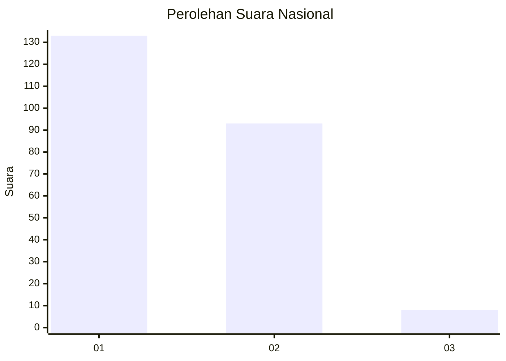
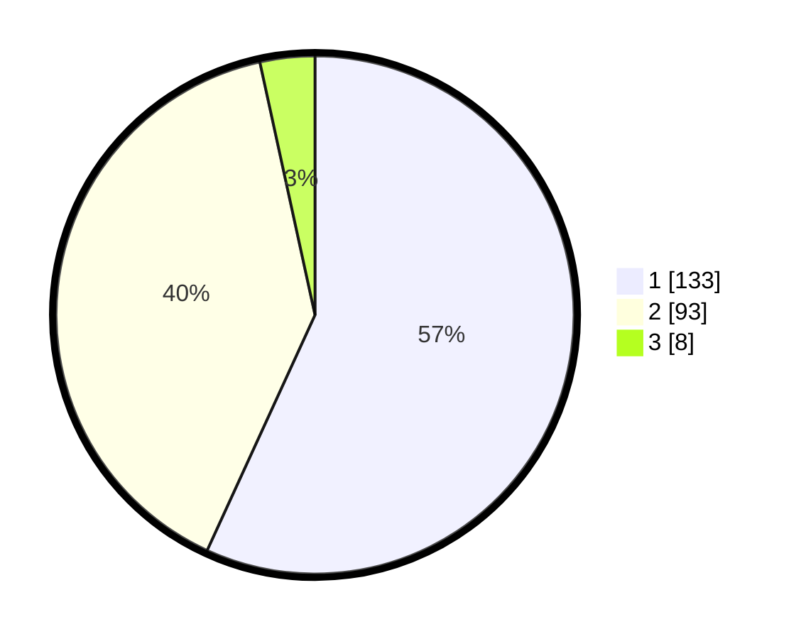

# Hasil

## Grafik

## Tabel

| No. | Nama Paslon    | Suara | Suara (raw) | Persentase |
|:--- |:-------------- | -----:| -----------:| ----------:|
| 1   | ANIES MUHAIMIN | 133   | [133][p-1]  | 56,84      |
| 2   | PRABOWO GIBRAN | 93    | [93][p-2]   | 39,74      |
| 3   | GANJAR MAHFUD  | 8     | [8][p-3]    | 3,42       |

[p-1]: https://github.com/gigit-pemilu/pemilu-2024/blob/main/pilpres/hitung-suara/sub/11-aceh/sub/04-aceh-tengah/sub/03-bebesen/sub/2001-blang-kolak-i/sub/004-tps/sub/paslon-1.txt
[p-2]: https://github.com/gigit-pemilu/pemilu-2024/blob/main/pilpres/hitung-suara/sub/11-aceh/sub/04-aceh-tengah/sub/03-bebesen/sub/2001-blang-kolak-i/sub/004-tps/sub/paslon-2.txt
[p-3]: https://github.com/gigit-pemilu/pemilu-2024/blob/main/pilpres/hitung-suara/sub/11-aceh/sub/04-aceh-tengah/sub/03-bebesen/sub/2001-blang-kolak-i/sub/004-tps/sub/paslon-3.txt

## Foto C Plano

https://sirekap-obj-formc.kpu.go.id/d64b/pemilu/ppwp/11/04/03/20/01/1104032001004-20240216-161738--6e502078-ee14-44b2-9d51-64bd143dcc78.jpg

https://sirekap-obj-formc.kpu.go.id/d64b/pemilu/ppwp/11/04/03/20/01/1104032001004-20240216-161739--78fb4f91-7129-4b18-986d-99b4be4d39bb.jpg

https://sirekap-obj-formc.kpu.go.id/d64b/pemilu/ppwp/11/04/03/20/01/1104032001004-20240216-161738--ec119c65-382d-4c96-a26d-546ebc545be6.jpg

## Metadata

| Key        | Value               |
| ---------- | ------------------- |
| Time Stamp | 2024-02-17 07:00:02 |

## DATA PEMILIH TETAP

Jumlah pemilih dalam DPT: **282**.
 * L: **134**.
 * P: **148**.

## DATA PENGGUNA HAK PILIH

Jumlah pengguna hak pilih dalam DPT: **232**.
 * L: **105**.
 * P: **127**.

Jumlah pengguna hak pilih dalam DPTb: **3**.
 * L: **1**.
 * P: **2**.

Jumlah pengguna hak pilih dalam DPK: **0**.
 * L: **0**.
 * P: **0**.

Jumlah pengguna hak pilih: **235**.
 * L: **106**.
 * P: **129**.

## JUMLAH SUARA SAH DAN TIDAK SAH

JUMLAH SELURUH SUARA SAH: **234**.

JUMLAH SUARA TIDAK SAH: **1**.

JUMLAH SELURUH SUARA SAH DAN SUARA TIDAK SAH: **235**.

