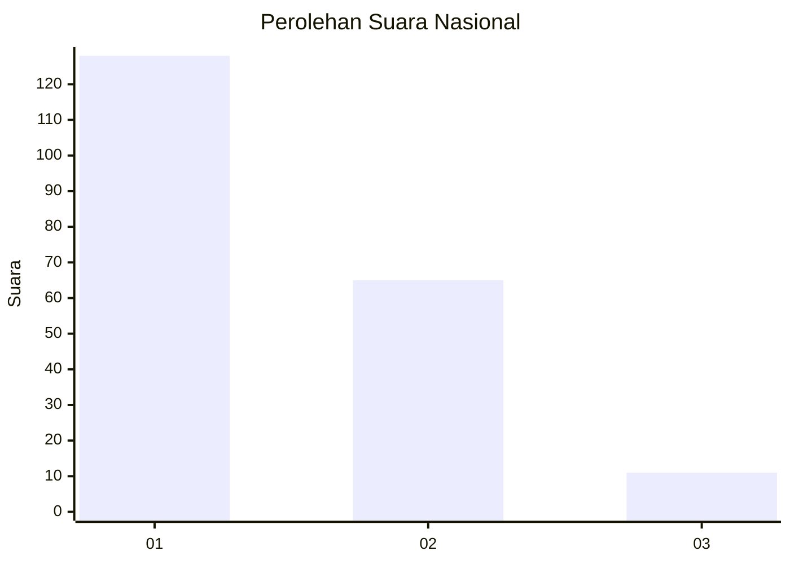
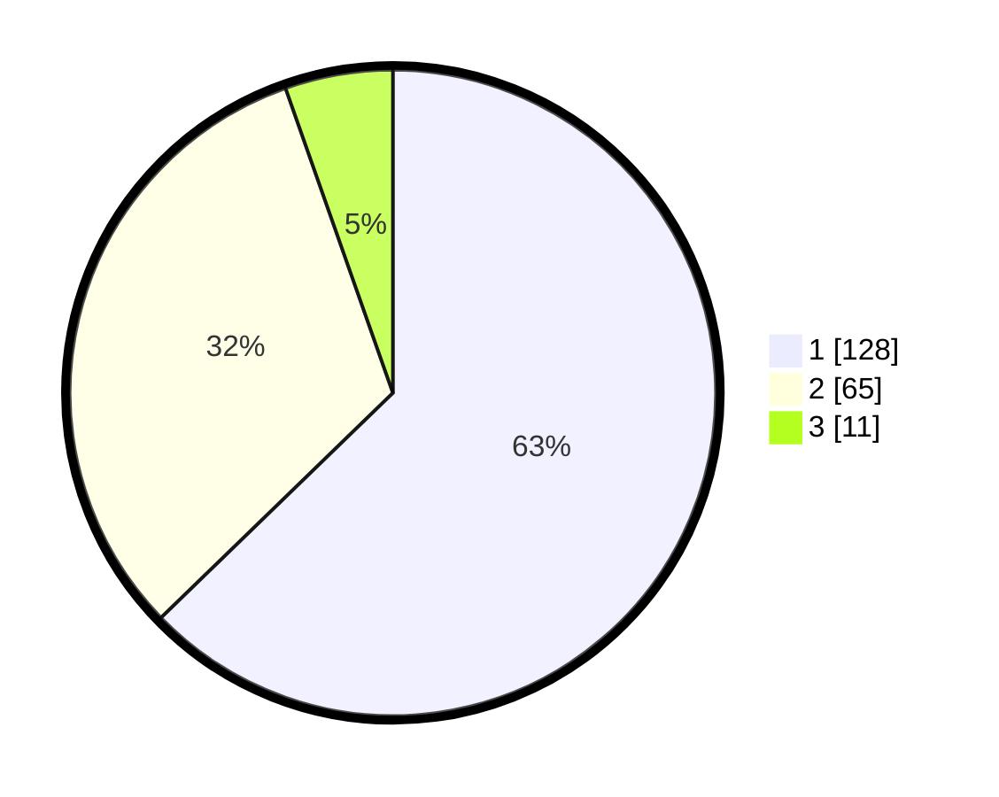

# Hasil

## Grafik

## Tabel

| No. | Nama Paslon    | Suara | Suara (raw) | Persentase |
|:--- |:-------------- | -----:| -----------:| ----------:|
| 1   | ANIES MUHAIMIN | 128   | [128][p-1]  | 62,75      |
| 2   | PRABOWO GIBRAN | 65    | [65][p-2]   | 31,86      |
| 3   | GANJAR MAHFUD  | 11    | [11][p-3]   | 5,39       |

[p-1]: https://github.com/gigit-pemilu/pemilu-2024/blob/main/pilpres/hitung-suara/sub/11-aceh/sub/04-aceh-tengah/sub/03-bebesen/sub/2001-blang-kolak-i/sub/005-tps/sub/paslon-1.txt
[p-2]: https://github.com/gigit-pemilu/pemilu-2024/blob/main/pilpres/hitung-suara/sub/11-aceh/sub/04-aceh-tengah/sub/03-bebesen/sub/2001-blang-kolak-i/sub/005-tps/sub/paslon-2.txt
[p-3]: https://github.com/gigit-pemilu/pemilu-2024/blob/main/pilpres/hitung-suara/sub/11-aceh/sub/04-aceh-tengah/sub/03-bebesen/sub/2001-blang-kolak-i/sub/005-tps/sub/paslon-3.txt

## Foto C Plano

https://sirekap-obj-formc.kpu.go.id/ada6/pemilu/ppwp/11/04/03/20/01/1104032001005-20240214-190629--34e4729a-2648-4104-a215-c4aaa9ecfe64.jpg

https://sirekap-obj-formc.kpu.go.id/ada6/pemilu/ppwp/11/04/03/20/01/1104032001005-20240214-191814--b06fcd1a-e5fb-42fc-9add-0522ed673d99.jpg

https://sirekap-obj-formc.kpu.go.id/ada6/pemilu/ppwp/11/04/03/20/01/1104032001005-20240214-191944--d2d0c0b7-7083-4145-97c2-585123641aca.jpg

## Metadata

| Key        | Value               |
| ---------- | ------------------- |
| Time Stamp | 2024-02-15 17:00:25 |

## DATA PEMILIH TETAP

## DATA PENGGUNA HAK PILIH

Jumlah pengguna hak pilih dalam DPT: **250**.
 * L: **124**.
 * P: **126**.

Jumlah pengguna hak pilih dalam DPTb: **204**.
 * L: **104**.
 * P: **100**.

Jumlah pengguna hak pilih dalam DPK: **7**.
 * L: **3**.
 * P: **4**.

Jumlah pengguna hak pilih: **211**.
 * L: **107**.
 * P: **104**.

## JUMLAH SUARA SAH DAN TIDAK SAH

JUMLAH SELURUH SUARA SAH: **204**.

JUMLAH SUARA TIDAK SAH: **7**.

JUMLAH SELURUH SUARA SAH DAN SUARA TIDAK SAH: **211**.

