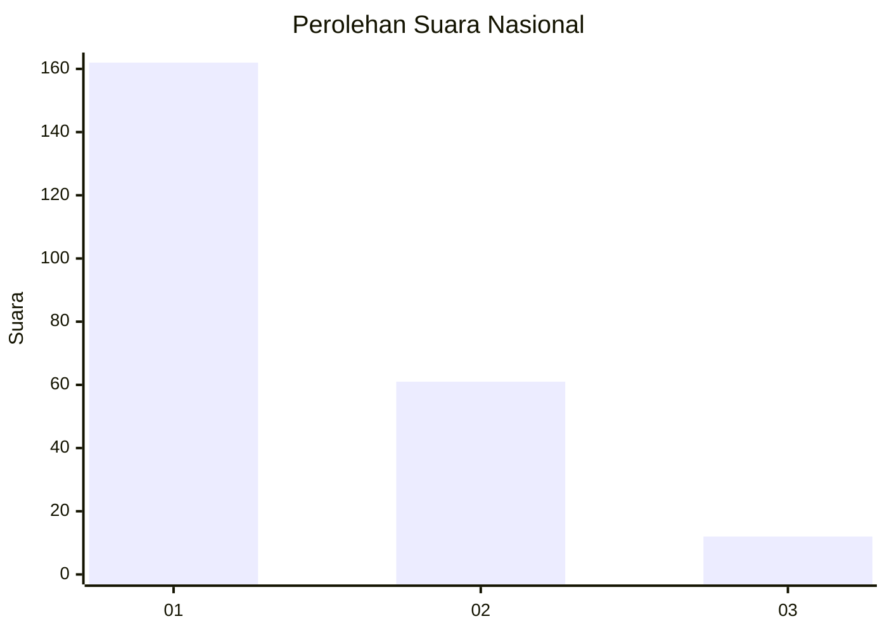
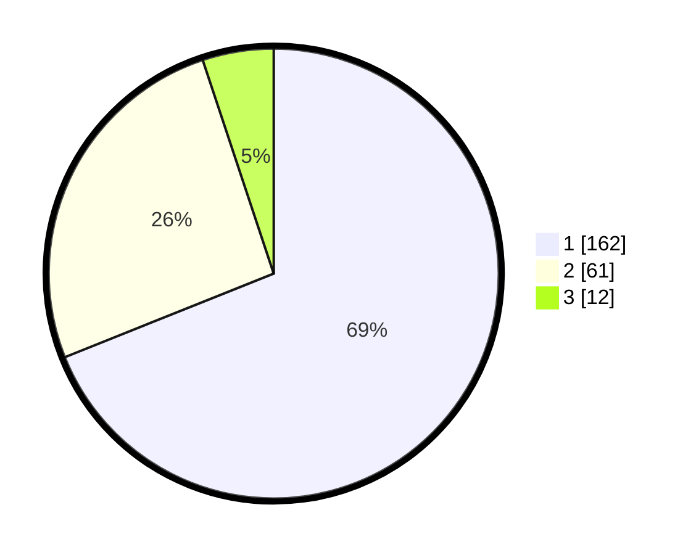

# Hasil

## Grafik

## Tabel

| No. | Nama Paslon    | Suara | Suara (raw) | Persentase |
|:--- |:-------------- | -----:| -----------:| ----------:|
| 1   | ANIES MUHAIMIN | 162   | [162][p-1]  | 68,94      |
| 2   | PRABOWO GIBRAN | 61    | [61][p-2]   | 25,96      |
| 3   | GANJAR MAHFUD  | 12    | [12][p-3]   | 5,11       |

[p-1]: https://github.com/gigit-pemilu/pemilu-2024/blob/main/pilpres/hitung-suara/sub/11-aceh/sub/04-aceh-tengah/sub/03-bebesen/sub/2001-blang-kolak-i/sub/006-tps/sub/paslon-1.txt
[p-2]: https://github.com/gigit-pemilu/pemilu-2024/blob/main/pilpres/hitung-suara/sub/11-aceh/sub/04-aceh-tengah/sub/03-bebesen/sub/2001-blang-kolak-i/sub/006-tps/sub/paslon-2.txt
[p-3]: https://github.com/gigit-pemilu/pemilu-2024/blob/main/pilpres/hitung-suara/sub/11-aceh/sub/04-aceh-tengah/sub/03-bebesen/sub/2001-blang-kolak-i/sub/006-tps/sub/paslon-3.txt

## Foto C Plano

https://sirekap-obj-formc.kpu.go.id/21fc/pemilu/ppwp/11/04/03/20/01/1104032001006-20240223-211256--7d8f6d9f-881d-4ee3-9cf9-bafba4a8df25.jpg

https://sirekap-obj-formc.kpu.go.id/21fc/pemilu/ppwp/11/04/03/20/01/1104032001006-20240216-223815--b5742abd-e541-4802-8be8-a42e3167a4a5.jpg

https://sirekap-obj-formc.kpu.go.id/21fc/pemilu/ppwp/11/04/03/20/01/1104032001006-20240223-211256--6a481a8a-de43-42e8-b29b-bb72be301002.jpg

## Metadata

| Key        | Value               |
| ---------- | ------------------- |
| Time Stamp | 2024-02-24 22:31:28 |

## DATA PEMILIH TETAP

Jumlah pemilih dalam DPT: **275**.
 * L: **106**.
 * P: **169**.

## DATA PENGGUNA HAK PILIH

Jumlah pengguna hak pilih dalam DPT: **221**.
 * L: **86**.
 * P: **135**.

Jumlah pengguna hak pilih dalam DPTb: **18**.
 * L: **6**.
 * P: **12**.

Jumlah pengguna hak pilih dalam DPK: **5**.
 * L: **1**.
 * P: **4**.

Jumlah pengguna hak pilih: **244**.
 * L: **93**.
 * P: **151**.

## JUMLAH SUARA SAH DAN TIDAK SAH

JUMLAH SELURUH SUARA SAH: **240**.

JUMLAH SUARA TIDAK SAH: **4**.

JUMLAH SELURUH SUARA SAH DAN SUARA TIDAK SAH: **244**.

