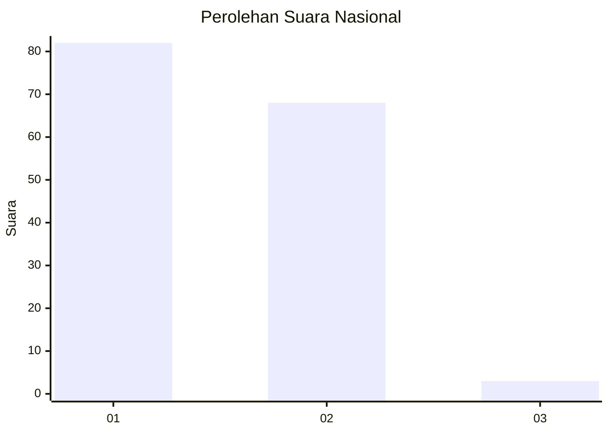
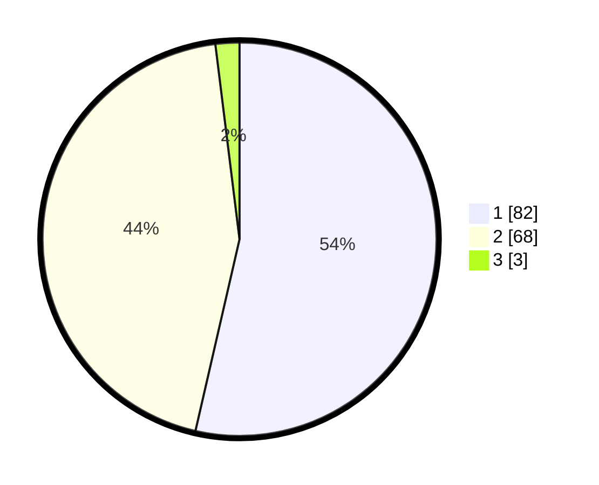

# Hasil

## Grafik

## Tabel

| No. | Nama Paslon    | Suara | Suara (raw) | Persentase |
|:--- |:-------------- | -----:| -----------:| ----------:|
| 1   | ANIES MUHAIMIN | 82    | [82][p-1]   | 53,59      |
| 2   | PRABOWO GIBRAN | 68    | [68][p-2]   | 44,44      |
| 3   | GANJAR MAHFUD  | 3     | [3][p-3]    | 1,96       |

[p-1]: https://github.com/gigit-pemilu/pemilu-2024/blob/main/pilpres/hitung-suara/sub/11-aceh/sub/04-aceh-tengah/sub/03-bebesen/sub/2006-lelabu/sub/001-tps/sub/paslon-1.txt
[p-2]: https://github.com/gigit-pemilu/pemilu-2024/blob/main/pilpres/hitung-suara/sub/11-aceh/sub/04-aceh-tengah/sub/03-bebesen/sub/2006-lelabu/sub/001-tps/sub/paslon-2.txt
[p-3]: https://github.com/gigit-pemilu/pemilu-2024/blob/main/pilpres/hitung-suara/sub/11-aceh/sub/04-aceh-tengah/sub/03-bebesen/sub/2006-lelabu/sub/001-tps/sub/paslon-3.txt

## Foto C Plano

https://sirekap-obj-formc.kpu.go.id/390a/pemilu/ppwp/11/04/03/20/06/1104032006001-20240216-160041--f4313e01-3697-425f-b4ca-c12e74aca02d.jpg

https://sirekap-obj-formc.kpu.go.id/390a/pemilu/ppwp/11/04/03/20/06/1104032006001-20240216-160042--9f2e0de4-e3df-479f-a4b2-a360c3c23c54.jpg

https://sirekap-obj-formc.kpu.go.id/390a/pemilu/ppwp/11/04/03/20/06/1104032006001-20240216-160041--16ae7597-eab5-46bb-b43a-5bf8ec3ff292.jpg

## Metadata

| Key        | Value               |
| ---------- | ------------------- |
| Time Stamp | 2024-02-17 07:00:02 |

## DATA PEMILIH TETAP

Jumlah pemilih dalam DPT: **162**.
 * L: **74**.
 * P: **88**.

## DATA PENGGUNA HAK PILIH

Jumlah pengguna hak pilih dalam DPT: **146**.
 * L: **67**.
 * P: **79**.

Jumlah pengguna hak pilih dalam DPTb: **0**.
 * L: **0**.
 * P: **0**.

Jumlah pengguna hak pilih dalam DPK: **12**.
 * L: **6**.
 * P: **6**.

Jumlah pengguna hak pilih: **158**.
 * L: **73**.
 * P: **85**.

## JUMLAH SUARA SAH DAN TIDAK SAH

JUMLAH SELURUH SUARA SAH: **153**.

JUMLAH SUARA TIDAK SAH: **5**.

JUMLAH SELURUH SUARA SAH DAN SUARA TIDAK SAH: **158**.

