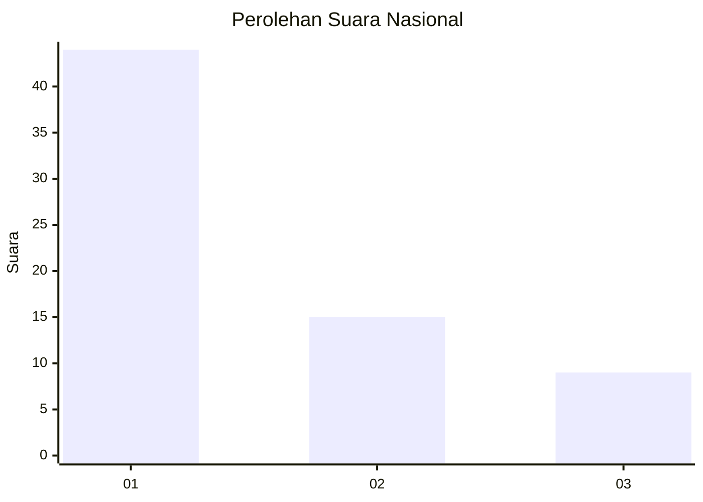
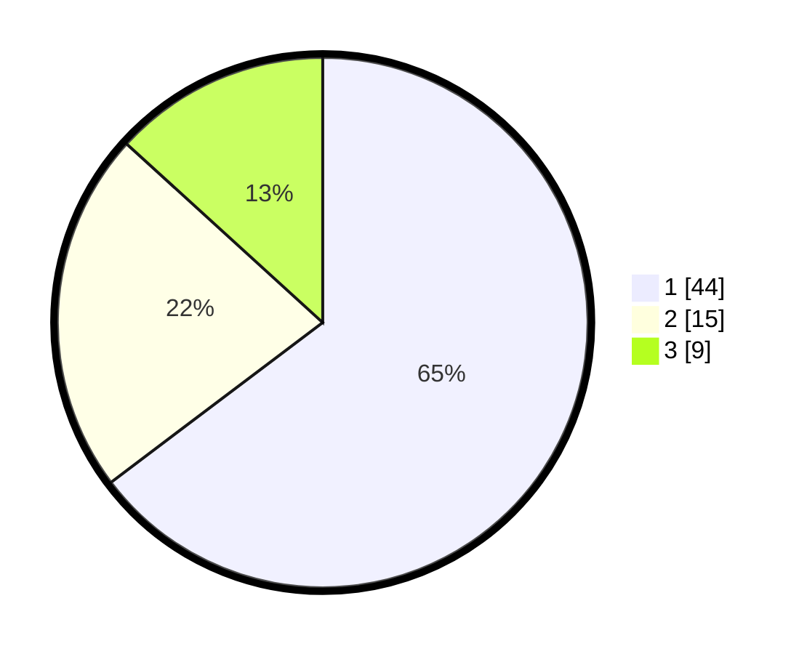

# Hasil

## Grafik

## Tabel

| No. | Nama Paslon    | Suara | Suara (raw) | Persentase |
|:--- |:-------------- | -----:| -----------:| ----------:|
| 1   | ANIES MUHAIMIN | 44    | [44][p-1]   | 64,71      |
| 2   | PRABOWO GIBRAN | 15    | [15][p-2]   | 22,06      |
| 3   | GANJAR MAHFUD  | 9     | [9][p-3]    | 13,24      |

[p-1]: https://github.com/gigit-pemilu/pemilu-2024/blob/main/pilpres/hitung-suara/sub/11-aceh/sub/04-aceh-tengah/sub/03-bebesen/sub/2008-kemili/sub/013-tps/sub/paslon-1.txt
[p-2]: https://github.com/gigit-pemilu/pemilu-2024/blob/main/pilpres/hitung-suara/sub/11-aceh/sub/04-aceh-tengah/sub/03-bebesen/sub/2008-kemili/sub/013-tps/sub/paslon-2.txt
[p-3]: https://github.com/gigit-pemilu/pemilu-2024/blob/main/pilpres/hitung-suara/sub/11-aceh/sub/04-aceh-tengah/sub/03-bebesen/sub/2008-kemili/sub/013-tps/sub/paslon-3.txt

## Foto C Plano

https://sirekap-obj-formc.kpu.go.id/bfd0/pemilu/ppwp/11/04/03/20/08/1104032008013-20240216-145833--0838333d-09b5-4575-9316-38978cc8660d.jpg

https://sirekap-obj-formc.kpu.go.id/bfd0/pemilu/ppwp/11/04/03/20/08/1104032008013-20240216-145835--da4d59c6-550e-4316-8e3b-d6996ba0c90d.jpg

https://sirekap-obj-formc.kpu.go.id/bfd0/pemilu/ppwp/11/04/03/20/08/1104032008013-20240216-145834--21f2a2df-87a7-4001-aa6d-7fa93b8b653a.jpg

## Metadata

| Key        | Value               |
| ---------- | ------------------- |
| Time Stamp | 2024-02-17 07:00:02 |

## DATA PEMILIH TETAP

Jumlah pemilih dalam DPT: **67**.
 * L: **36**.
 * P: **31**.

## DATA PENGGUNA HAK PILIH

Jumlah pengguna hak pilih dalam DPT: **63**.
 * L: **34**.
 * P: **29**.

Jumlah pengguna hak pilih dalam DPTb: **0**.
 * L: **0**.
 * P: **0**.

Jumlah pengguna hak pilih dalam DPK: **5**.
 * L: **2**.
 * P: **3**.

Jumlah pengguna hak pilih: **68**.
 * L: **36**.
 * P: **32**.

## JUMLAH SUARA SAH DAN TIDAK SAH

JUMLAH SELURUH SUARA SAH: **68**.

JUMLAH SUARA TIDAK SAH: **0**.

JUMLAH SELURUH SUARA SAH DAN SUARA TIDAK SAH: **68**.

