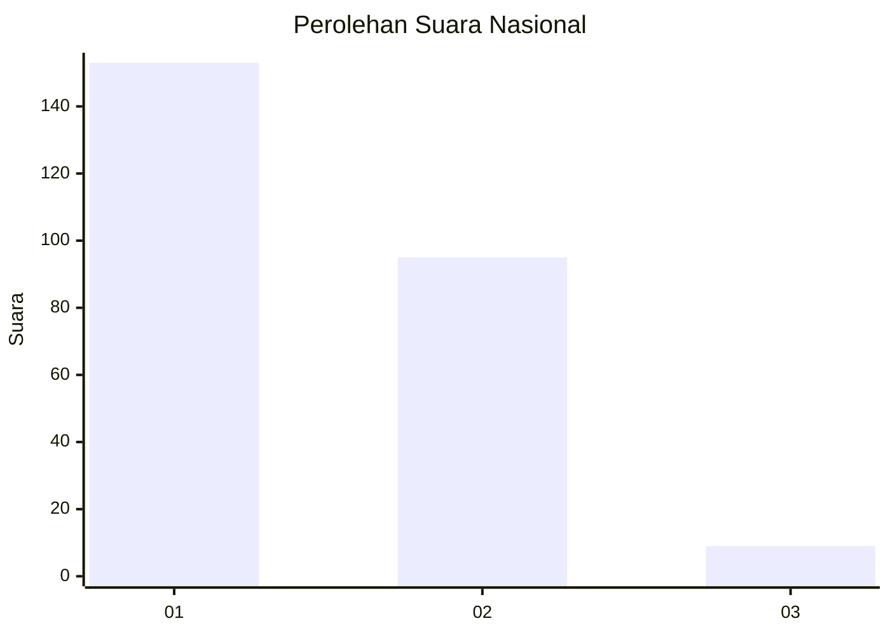
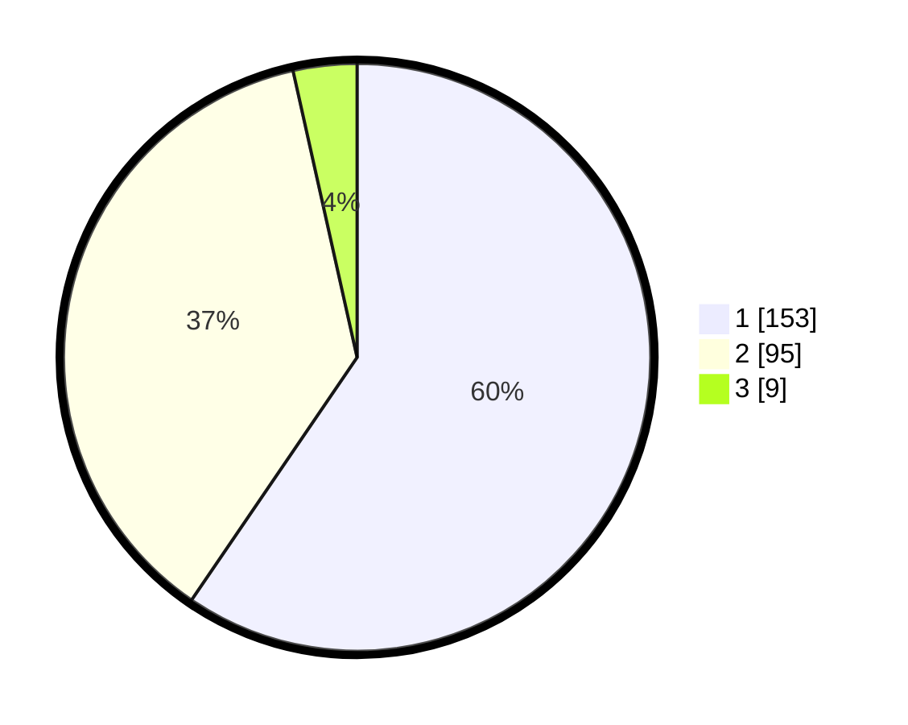

# Hasil

## Grafik

## Tabel

| No. | Nama Paslon    | Suara | Suara (raw) | Persentase |
|:--- |:-------------- | -----:| -----------:| ----------:|
| 1   | ANIES MUHAIMIN | 153   | [153][p-1]  | 59,53      |
| 2   | PRABOWO GIBRAN | 95    | [95][p-2]   | 36,96      |
| 3   | GANJAR MAHFUD  | 9     | [9][p-3]    | 3,50       |

[p-1]: https://github.com/gigit-pemilu/pemilu-2024/blob/main/pilpres/hitung-suara/sub/11-aceh/sub/04-aceh-tengah/sub/03-bebesen/sub/2010-blang-kolak-ii/sub/005-tps/sub/paslon-1.txt
[p-2]: https://github.com/gigit-pemilu/pemilu-2024/blob/main/pilpres/hitung-suara/sub/11-aceh/sub/04-aceh-tengah/sub/03-bebesen/sub/2010-blang-kolak-ii/sub/005-tps/sub/paslon-2.txt
[p-3]: https://github.com/gigit-pemilu/pemilu-2024/blob/main/pilpres/hitung-suara/sub/11-aceh/sub/04-aceh-tengah/sub/03-bebesen/sub/2010-blang-kolak-ii/sub/005-tps/sub/paslon-3.txt

## Foto C Plano

https://sirekap-obj-formc.kpu.go.id/8a15/pemilu/ppwp/11/04/03/20/10/1104032010005-20240216-001621--f32fda5d-83e0-4028-8050-3b9dfc90f3fa.jpg

https://sirekap-obj-formc.kpu.go.id/8a15/pemilu/ppwp/11/04/03/20/10/1104032010005-20240216-001624--4ff7babb-ccac-4a48-b422-774ccb361e5b.jpg

https://sirekap-obj-formc.kpu.go.id/8a15/pemilu/ppwp/11/04/03/20/10/1104032010005-20240216-001622--d0a51a1b-743c-4582-8e37-68e664d2a200.jpg

## Metadata

| Key        | Value               |
| ---------- | ------------------- |
| Time Stamp | 2024-02-16 02:30:27 |

## DATA PEMILIH TETAP

Jumlah pemilih dalam DPT: **300**.
 * L: **146**.
 * P: **154**.

## DATA PENGGUNA HAK PILIH

Jumlah pengguna hak pilih dalam DPT: **245**.
 * L: **131**.
 * P: **114**.

Jumlah pengguna hak pilih dalam DPTb: **8**.
 * L: **4**.
 * P: **4**.

Jumlah pengguna hak pilih dalam DPK: **4**.
 * L: **3**.
 * P: **1**.

Jumlah pengguna hak pilih: **257**.
 * L: **138**.
 * P: **119**.

## JUMLAH SUARA SAH DAN TIDAK SAH

JUMLAH SELURUH SUARA SAH: **257**.

JUMLAH SUARA TIDAK SAH: **0**.

JUMLAH SELURUH SUARA SAH DAN SUARA TIDAK SAH: **257**.

