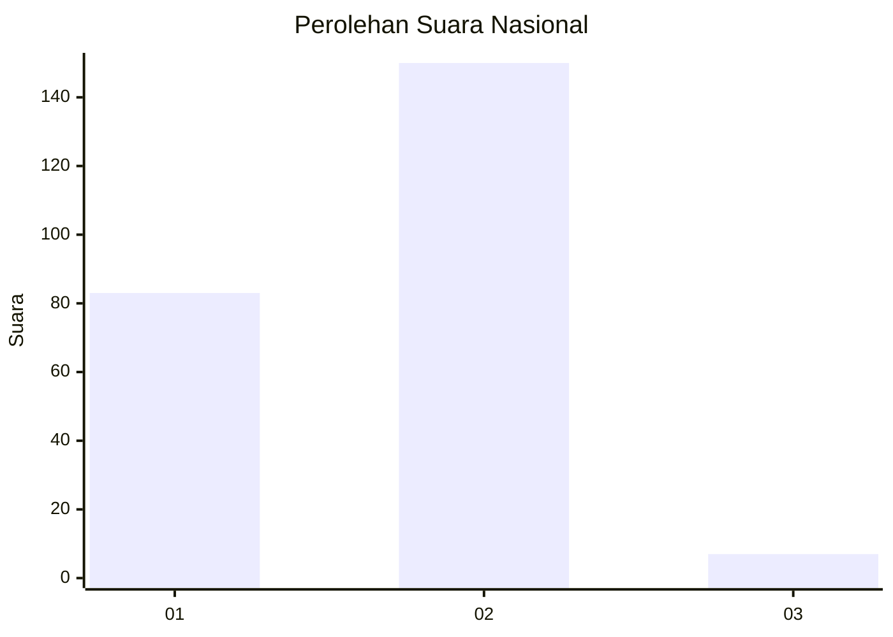
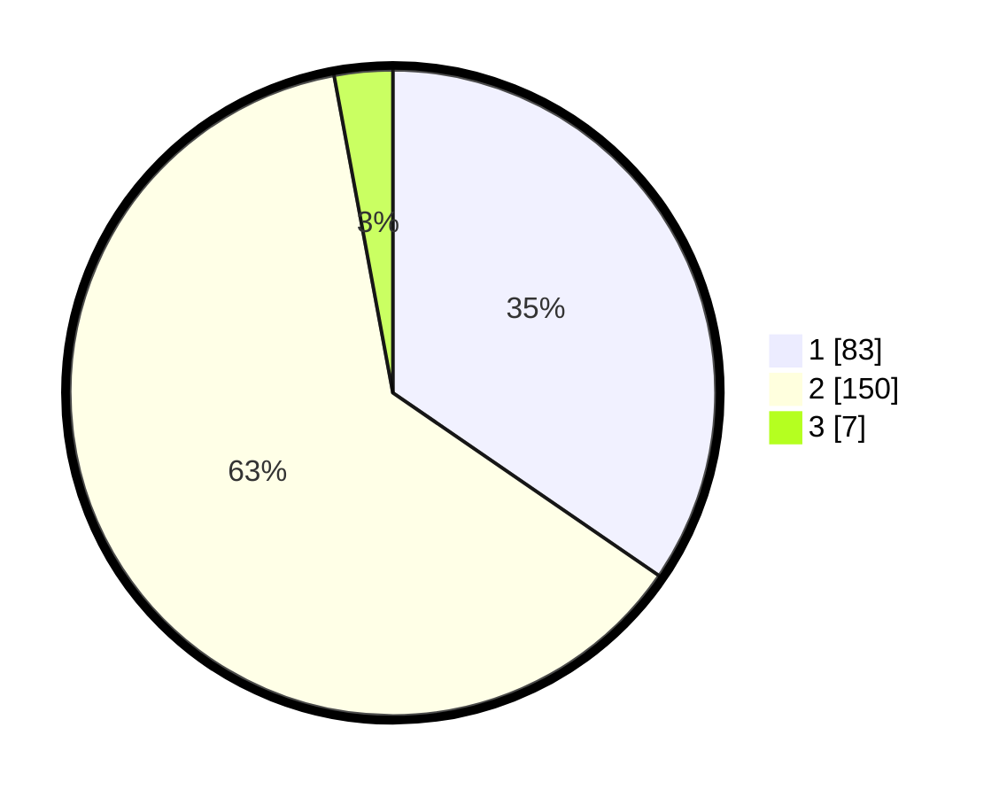

# Hasil

## Grafik

## Tabel

| No. | Nama Paslon    | Suara | Suara (raw) | Persentase |
|:--- |:-------------- | -----:| -----------:| ----------:|
| 1   | ANIES MUHAIMIN | 83    | [83][p-1]   | 34,58      |
| 2   | PRABOWO GIBRAN | 150   | [150][p-2]  | 62,50      |
| 3   | GANJAR MAHFUD  | 7     | [7][p-3]    | 2,92       |

[p-1]: https://github.com/gigit-pemilu/pemilu-2024/blob/main/pilpres/hitung-suara/sub/11-aceh/sub/04-aceh-tengah/sub/03-bebesen/sub/2010-blang-kolak-ii/sub/006-tps/sub/paslon-1.txt
[p-2]: https://github.com/gigit-pemilu/pemilu-2024/blob/main/pilpres/hitung-suara/sub/11-aceh/sub/04-aceh-tengah/sub/03-bebesen/sub/2010-blang-kolak-ii/sub/006-tps/sub/paslon-2.txt
[p-3]: https://github.com/gigit-pemilu/pemilu-2024/blob/main/pilpres/hitung-suara/sub/11-aceh/sub/04-aceh-tengah/sub/03-bebesen/sub/2010-blang-kolak-ii/sub/006-tps/sub/paslon-3.txt

## Foto C Plano

https://sirekap-obj-formc.kpu.go.id/6a17/pemilu/ppwp/11/04/03/20/10/1104032010006-20240215-114317--2aca6b9a-a896-48aa-95a9-5c67422e8077.jpg

https://sirekap-obj-formc.kpu.go.id/6a17/pemilu/ppwp/11/04/03/20/10/1104032010006-20240215-114444--7302d218-0d9b-4f3f-8746-1af2594ee8fd.jpg

https://sirekap-obj-formc.kpu.go.id/6a17/pemilu/ppwp/11/04/03/20/10/1104032010006-20240216-160544--ce1d008e-235d-4e4f-8b2d-0d1db4b1c8f2.jpg

## Metadata

| Key        | Value               |
| ---------- | ------------------- |
| Time Stamp | 2024-02-16 16:25:10 |

## DATA PEMILIH TETAP

Jumlah pemilih dalam DPT: **275**.
 * L: **106**.
 * P: **169**.

## DATA PENGGUNA HAK PILIH

Jumlah pengguna hak pilih dalam DPT: **221**.
 * L: **86**.
 * P: **135**.

Jumlah pengguna hak pilih dalam DPTb: **18**.
 * L: **6**.
 * P: **12**.

Jumlah pengguna hak pilih dalam DPK: **5**.
 * L: **1**.
 * P: **4**.

Jumlah pengguna hak pilih: **244**.
 * L: **93**.
 * P: **151**.

## JUMLAH SUARA SAH DAN TIDAK SAH

JUMLAH SELURUH SUARA SAH: **240**.

JUMLAH SUARA TIDAK SAH: **4**.

JUMLAH SELURUH SUARA SAH DAN SUARA TIDAK SAH: **244**.

