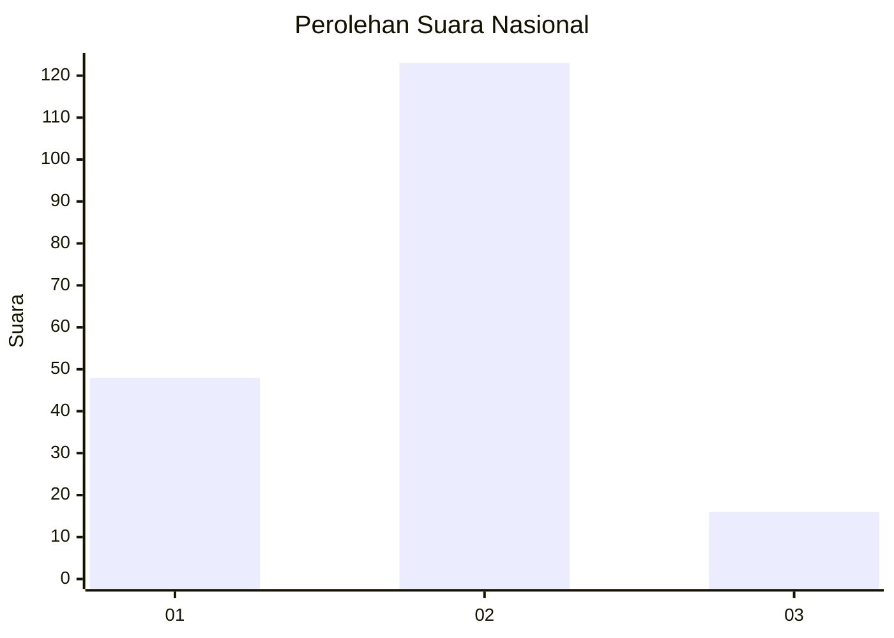
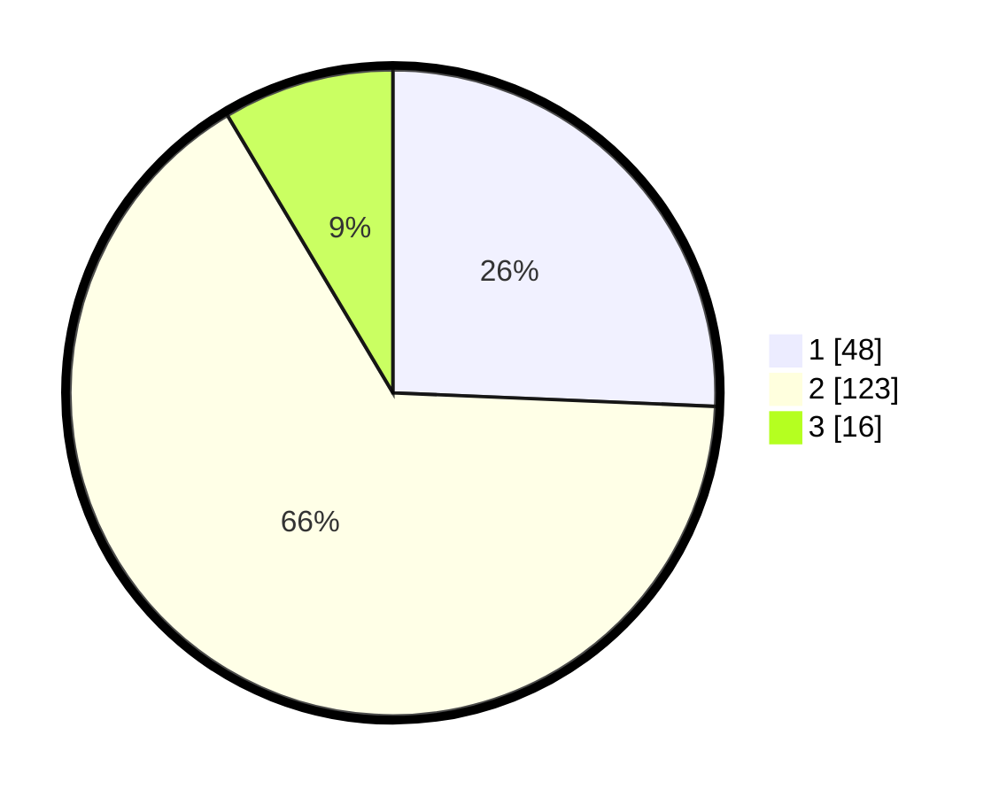

# Hasil

## Grafik

## Tabel

| No. | Nama Paslon    | Suara | Suara (raw) | Persentase |
|:--- |:-------------- | -----:| -----------:| ----------:|
| 1   | ANIES MUHAIMIN | 48    | [48][p-1]   | 25,67      |
| 2   | PRABOWO GIBRAN | 123   | [123][p-2]  | 65,78      |
| 3   | GANJAR MAHFUD  | 16    | [16][p-3]   | 8,56       |

[p-1]: https://github.com/gigit-pemilu/pemilu-2024/blob/main/pilpres/hitung-suara/sub/11-aceh/sub/04-aceh-tengah/sub/03-bebesen/sub/2010-blang-kolak-ii/sub/901-tps/sub/paslon-1.txt
[p-2]: https://github.com/gigit-pemilu/pemilu-2024/blob/main/pilpres/hitung-suara/sub/11-aceh/sub/04-aceh-tengah/sub/03-bebesen/sub/2010-blang-kolak-ii/sub/901-tps/sub/paslon-2.txt
[p-3]: https://github.com/gigit-pemilu/pemilu-2024/blob/main/pilpres/hitung-suara/sub/11-aceh/sub/04-aceh-tengah/sub/03-bebesen/sub/2010-blang-kolak-ii/sub/901-tps/sub/paslon-3.txt

## Foto C Plano

https://sirekap-obj-formc.kpu.go.id/5449/pemilu/ppwp/11/04/03/20/10/1104032010901-20240216-114507--529e5696-7194-4492-8d92-fffc2857ca78.jpg

https://sirekap-obj-formc.kpu.go.id/5449/pemilu/ppwp/11/04/03/20/10/1104032010901-20240216-114509--08f03aa6-dfed-4cae-acc7-f31eb34b2d85.jpg

https://sirekap-obj-formc.kpu.go.id/5449/pemilu/ppwp/11/04/03/20/10/1104032010901-20240216-114508--c1308daa-2161-4319-9c25-3489e3dbfaf7.jpg

## Metadata

| Key        | Value               |
| ---------- | ------------------- |
| Time Stamp | 2024-02-17 07:00:02 |

## DATA PEMILIH TETAP

Jumlah pemilih dalam DPT: **186**.
 * L: **184**.
 * P: **2**.

## DATA PENGGUNA HAK PILIH

Jumlah pengguna hak pilih dalam DPT: **120**.
 * L: **120**.
 * P: **0**.

Jumlah pengguna hak pilih dalam DPTb: **70**.
 * L: **67**.
 * P: **3**.

Jumlah pengguna hak pilih dalam DPK: **0**.
 * L: **0**.
 * P: **0**.

Jumlah pengguna hak pilih: **190**.
 * L: **187**.
 * P: **3**.

## JUMLAH SUARA SAH DAN TIDAK SAH

JUMLAH SELURUH SUARA SAH: **187**.

JUMLAH SUARA TIDAK SAH: **3**.

JUMLAH SELURUH SUARA SAH DAN SUARA TIDAK SAH: **190**.

