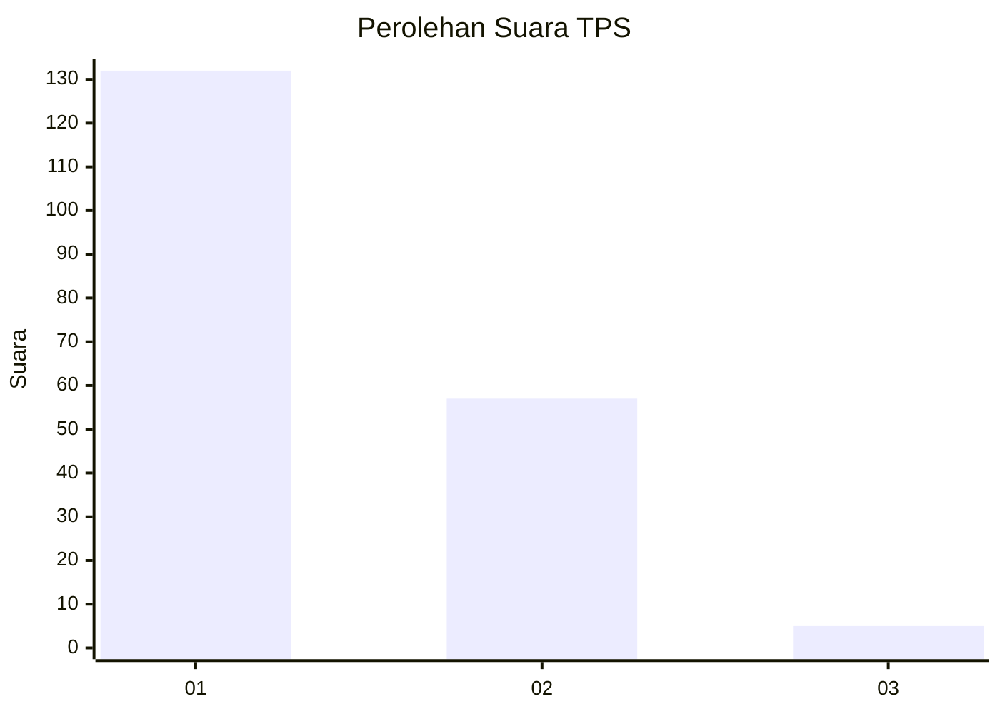
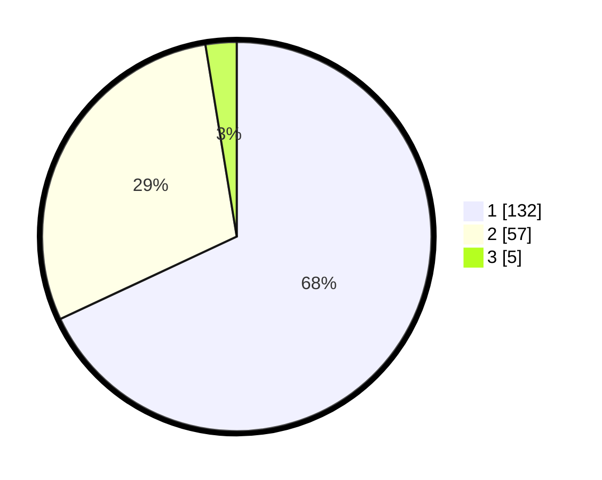

# Hasil

## Grafik

## Tabel

| No. | Nama Paslon    | Suara | Suara (raw) | Persentase |
|:--- |:-------------- | -----:| -----------:| ----------:|
| 1   | ANIES MUHAIMIN | 132   | [132][p-1]  | 68,04      |
| 2   | PRABOWO GIBRAN | 57    | [57][p-2]   | 29,38      |
| 3   | GANJAR MAHFUD  | 5     | [5][p-3]    | 2,58       |

[p-1]: https://github.com/gigit-pemilu/pemilu-2024-11-aceh/blob/main/pilpres/hitung-suara/sub/11-aceh/sub/04-aceh-tengah/sub/03-bebesen/sub/2014-keramat-mupakat/sub/006-tps/sub/paslon-1.txt
[p-2]: https://github.com/gigit-pemilu/pemilu-2024-11-aceh/blob/main/pilpres/hitung-suara/sub/11-aceh/sub/04-aceh-tengah/sub/03-bebesen/sub/2014-keramat-mupakat/sub/006-tps/sub/paslon-2.txt
[p-3]: https://github.com/gigit-pemilu/pemilu-2024-11-aceh/blob/main/pilpres/hitung-suara/sub/11-aceh/sub/04-aceh-tengah/sub/03-bebesen/sub/2014-keramat-mupakat/sub/006-tps/sub/paslon-3.txt

## Foto C Plano

https://sirekap-obj-formc.kpu.go.id/b406/pemilu/ppwp/11/04/03/20/14/1104032014006-20240216-132037--7b5c38e3-0c28-4113-8bc2-d0d03d318c68.jpg

https://sirekap-obj-formc.kpu.go.id/b406/pemilu/ppwp/11/04/03/20/14/1104032014006-20240216-132038--2db4d4d5-fb12-41b6-b3c4-97457e6a5e2e.jpg

https://sirekap-obj-formc.kpu.go.id/b406/pemilu/ppwp/11/04/03/20/14/1104032014006-20240216-132037--acda6f47-b807-41ba-8450-c802d5427749.jpg

## Metadata

| Key        | Value               |
| ---------- | ------------------- |
| Time Stamp | 2024-02-17 10:30:03 |

## DATA PEMILIH TETAP

Jumlah pemilih dalam DPT: **245**.
 * L: **119**.
 * P: **126**.

## DATA PENGGUNA HAK PILIH

Jumlah pengguna hak pilih dalam DPT: **176**.
 * L: **85**.
 * P: **91**.

Jumlah pengguna hak pilih dalam DPTb: **4**.
 * L: **2**.
 * P: **2**.

Jumlah pengguna hak pilih dalam DPK: **18**.
 * L: **15**.
 * P: **3**.

Jumlah pengguna hak pilih: **198**.
 * L: **102**.
 * P: **96**.

## JUMLAH SUARA SAH DAN TIDAK SAH

JUMLAH SELURUH SUARA SAH: **194**.

JUMLAH SUARA TIDAK SAH: **4**.

JUMLAH SELURUH SUARA SAH DAN SUARA TIDAK SAH: **198**.

