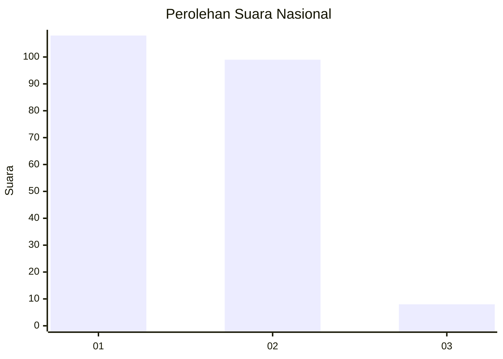
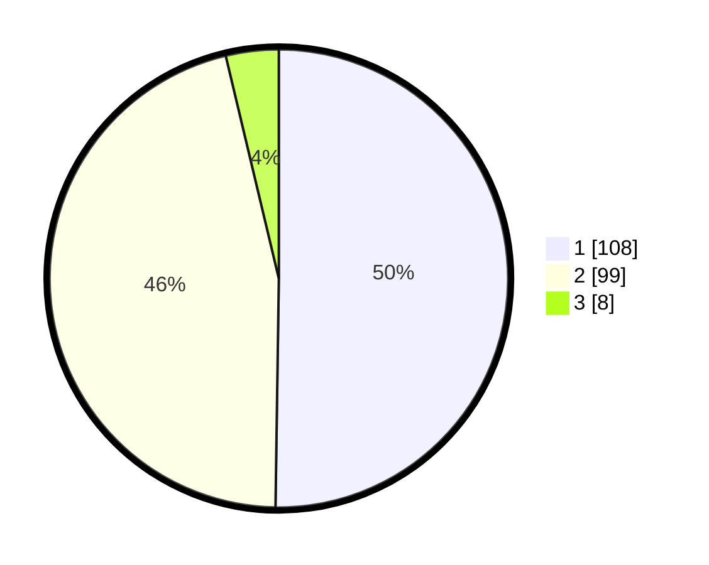

# Hasil

## Grafik

## Tabel

| No. | Nama Paslon    | Suara | Suara (raw) | Persentase |
|:--- |:-------------- | -----:| -----------:| ----------:|
| 1   | ANIES MUHAIMIN | 108   | [108][p-1]  | 50,23      |
| 2   | PRABOWO GIBRAN | 99    | [99][p-2]   | 46,05      |
| 3   | GANJAR MAHFUD  | 8     | [8][p-3]    | 3,72       |

[p-1]: https://github.com/gigit-pemilu/pemilu-2024/blob/main/pilpres/hitung-suara/sub/11-aceh/sub/04-aceh-tengah/sub/03-bebesen/sub/2023-nunang-antara/sub/001-tps/sub/paslon-1.txt
[p-2]: https://github.com/gigit-pemilu/pemilu-2024/blob/main/pilpres/hitung-suara/sub/11-aceh/sub/04-aceh-tengah/sub/03-bebesen/sub/2023-nunang-antara/sub/001-tps/sub/paslon-2.txt
[p-3]: https://github.com/gigit-pemilu/pemilu-2024/blob/main/pilpres/hitung-suara/sub/11-aceh/sub/04-aceh-tengah/sub/03-bebesen/sub/2023-nunang-antara/sub/001-tps/sub/paslon-3.txt

## Foto C Plano

https://sirekap-obj-formc.kpu.go.id/2bf2/pemilu/ppwp/11/04/03/20/23/1104032023001-20240216-093110--a2a11dd1-fbc7-4eed-8d59-33bac17d6417.jpg

https://sirekap-obj-formc.kpu.go.id/2bf2/pemilu/ppwp/11/04/03/20/23/1104032023001-20240216-093111--cbcaa3f2-1c31-47df-b41a-0240dc045d70.jpg

https://sirekap-obj-formc.kpu.go.id/2bf2/pemilu/ppwp/11/04/03/20/23/1104032023001-20240216-093111--81d057dc-de76-4898-a589-25d2213848ac.jpg

## Metadata

| Key        | Value               |
| ---------- | ------------------- |
| Time Stamp | 2024-02-17 11:00:02 |

## DATA PEMILIH TETAP

Jumlah pemilih dalam DPT: **205**.
 * L: **95**.
 * P: **110**.

## DATA PENGGUNA HAK PILIH

Jumlah pengguna hak pilih dalam DPT: **265**.
 * L: **123**.
 * P: **142**.

Jumlah pengguna hak pilih dalam DPTb: **3**.
 * L: **2**.
 * P: **1**.

Jumlah pengguna hak pilih dalam DPK: **9**.
 * L: **4**.
 * P: **5**.

Jumlah pengguna hak pilih: **277**.
 * L: **129**.
 * P: **148**.

## JUMLAH SUARA SAH DAN TIDAK SAH

JUMLAH SELURUH SUARA SAH: **215**.

JUMLAH SUARA TIDAK SAH: **2**.

JUMLAH SELURUH SUARA SAH DAN SUARA TIDAK SAH: **217**.

