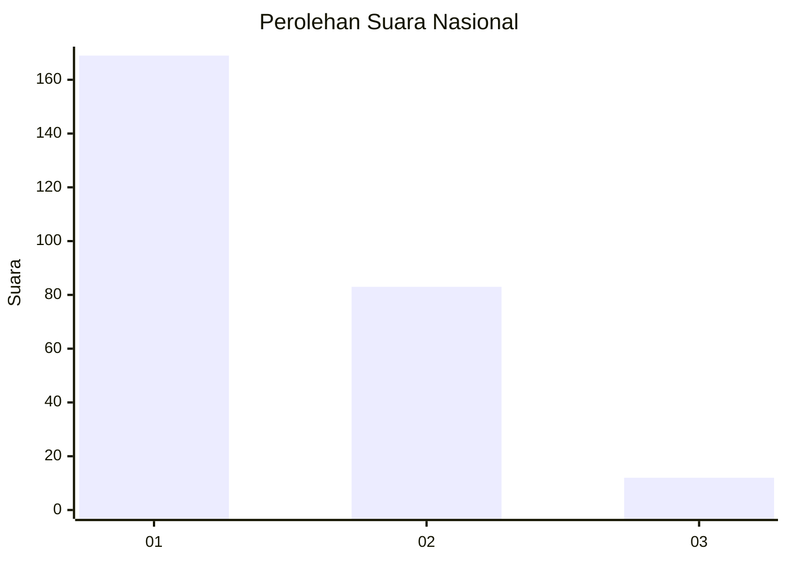
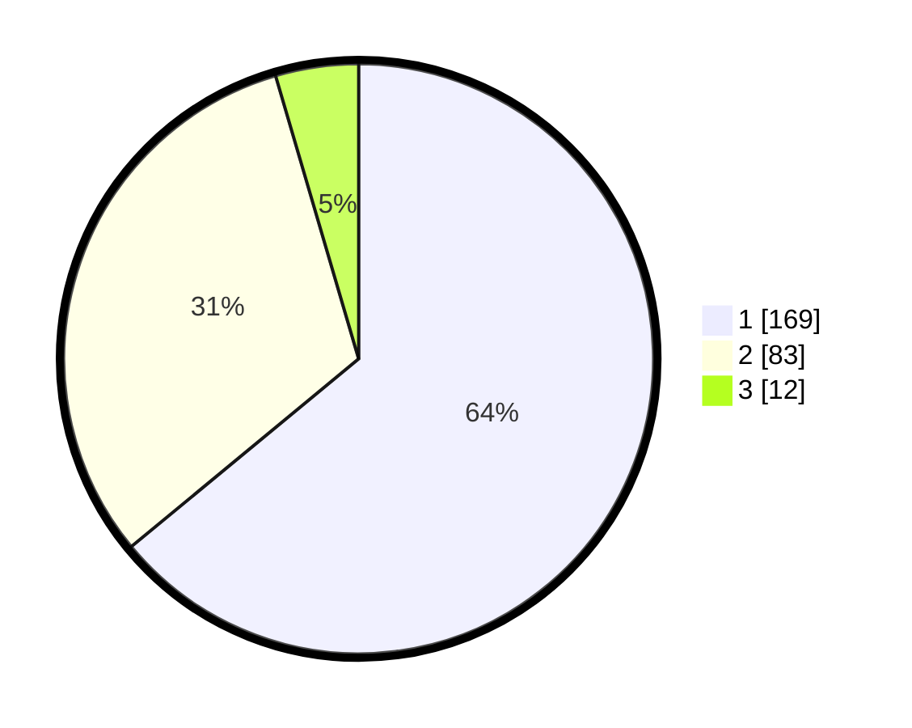

# Hasil

## Grafik

## Tabel

| No. | Nama Paslon    | Suara | Suara (raw) | Persentase |
|:--- |:-------------- | -----:| -----------:| ----------:|
| 1   | ANIES MUHAIMIN | 169   | [169][p-1]  | 64,02      |
| 2   | PRABOWO GIBRAN | 83    | [83][p-2]   | 31,44      |
| 3   | GANJAR MAHFUD  | 12    | [12][p-3]   | 4,55       |

[p-1]: https://github.com/gigit-pemilu/pemilu-2024/blob/main/pilpres/hitung-suara/sub/11-aceh/sub/04-aceh-tengah/sub/03-bebesen/sub/2024-pendere-saril/sub/001-tps/sub/paslon-1.txt
[p-2]: https://github.com/gigit-pemilu/pemilu-2024/blob/main/pilpres/hitung-suara/sub/11-aceh/sub/04-aceh-tengah/sub/03-bebesen/sub/2024-pendere-saril/sub/001-tps/sub/paslon-2.txt
[p-3]: https://github.com/gigit-pemilu/pemilu-2024/blob/main/pilpres/hitung-suara/sub/11-aceh/sub/04-aceh-tengah/sub/03-bebesen/sub/2024-pendere-saril/sub/001-tps/sub/paslon-3.txt

## Foto C Plano

https://sirekap-obj-formc.kpu.go.id/8587/pemilu/ppwp/11/04/03/20/24/1104032024001-20240215-021936--7e515e13-2161-4eb4-b321-c6adae2b9ca5.jpg

https://sirekap-obj-formc.kpu.go.id/8587/pemilu/ppwp/11/04/03/20/24/1104032024001-20240215-021958--61008772-acea-494a-9a8a-c0221543daf7.jpg

https://sirekap-obj-formc.kpu.go.id/8587/pemilu/ppwp/11/04/03/20/24/1104032024001-20240215-021947--8dfd6edc-63ec-4f51-9fb3-92b335350215.jpg

## Metadata

| Key        | Value               |
| ---------- | ------------------- |
| Time Stamp | 2024-02-15 07:00:44 |

## DATA PEMILIH TETAP

Jumlah pemilih dalam DPT: **270**.
 * L: **127**.
 * P: **143**.

## DATA PENGGUNA HAK PILIH

Jumlah pengguna hak pilih dalam DPT: **267**.
 * L: **124**.
 * P: **143**.

Jumlah pengguna hak pilih dalam DPTb: **1**.
 * L: **0**.
 * P: **1**.

Jumlah pengguna hak pilih dalam DPK: **33**.
 * L: **13**.
 * P: **20**.

Jumlah pengguna hak pilih: **301**.
 * L: **137**.
 * P: **164**.

## JUMLAH SUARA SAH DAN TIDAK SAH

JUMLAH SELURUH SUARA SAH: **264**.

JUMLAH SUARA TIDAK SAH: **3**.

JUMLAH SELURUH SUARA SAH DAN SUARA TIDAK SAH: **267**.

