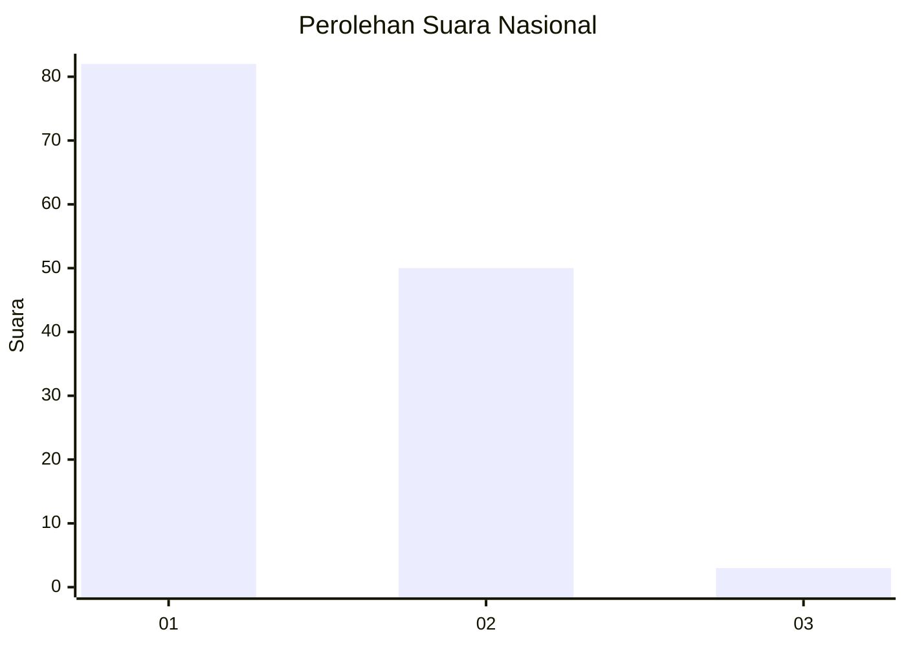
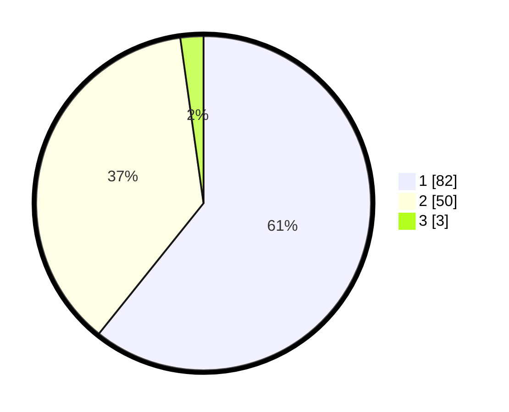

# Hasil

## Grafik

## Tabel

| No. | Nama Paslon    | Suara | Suara (raw) | Persentase |
|:--- |:-------------- | -----:| -----------:| ----------:|
| 1   | ANIES MUHAIMIN | 82    | [82][p-1]   | 60,74      |
| 2   | PRABOWO GIBRAN | 50    | [50][p-2]   | 37,04      |
| 3   | GANJAR MAHFUD  | 3     | [3][p-3]    | 2,22       |

[p-1]: https://github.com/gigit-pemilu/pemilu-2024/blob/main/pilpres/hitung-suara/sub/11-aceh/sub/04-aceh-tengah/sub/03-bebesen/sub/2027-colo-blang-gele/sub/001-tps/sub/paslon-1.txt
[p-2]: https://github.com/gigit-pemilu/pemilu-2024/blob/main/pilpres/hitung-suara/sub/11-aceh/sub/04-aceh-tengah/sub/03-bebesen/sub/2027-colo-blang-gele/sub/001-tps/sub/paslon-2.txt
[p-3]: https://github.com/gigit-pemilu/pemilu-2024/blob/main/pilpres/hitung-suara/sub/11-aceh/sub/04-aceh-tengah/sub/03-bebesen/sub/2027-colo-blang-gele/sub/001-tps/sub/paslon-3.txt

## Foto C Plano

https://sirekap-obj-formc.kpu.go.id/8454/pemilu/ppwp/11/04/03/20/27/1104032027001-20240216-152410--be08322f-b360-41d1-814a-5b51107861b2.jpg

https://sirekap-obj-formc.kpu.go.id/8454/pemilu/ppwp/11/04/03/20/27/1104032027001-20240216-152411--ac64d55c-f657-43a0-8d1d-b6ef193fa232.jpg

https://sirekap-obj-formc.kpu.go.id/8454/pemilu/ppwp/11/04/03/20/27/1104032027001-20240216-152410--a521c8e7-2aa6-49d5-a0d1-c0688ffe7d8d.jpg

## Metadata

| Key        | Value               |
| ---------- | ------------------- |
| Time Stamp | 2024-02-17 11:00:02 |

## DATA PEMILIH TETAP

Jumlah pemilih dalam DPT: **146**.
 * L: **74**.
 * P: **72**.

## DATA PENGGUNA HAK PILIH

Jumlah pengguna hak pilih dalam DPT: **136**.
 * L: **69**.
 * P: **67**.

Jumlah pengguna hak pilih dalam DPTb: **1**.
 * L: **1**.
 * P: **0**.

Jumlah pengguna hak pilih dalam DPK: **0**.
 * L: **0**.
 * P: **0**.

Jumlah pengguna hak pilih: **137**.
 * L: **70**.
 * P: **67**.

## JUMLAH SUARA SAH DAN TIDAK SAH

JUMLAH SELURUH SUARA SAH: **135**.

JUMLAH SUARA TIDAK SAH: **2**.

JUMLAH SELURUH SUARA SAH DAN SUARA TIDAK SAH: **137**.

