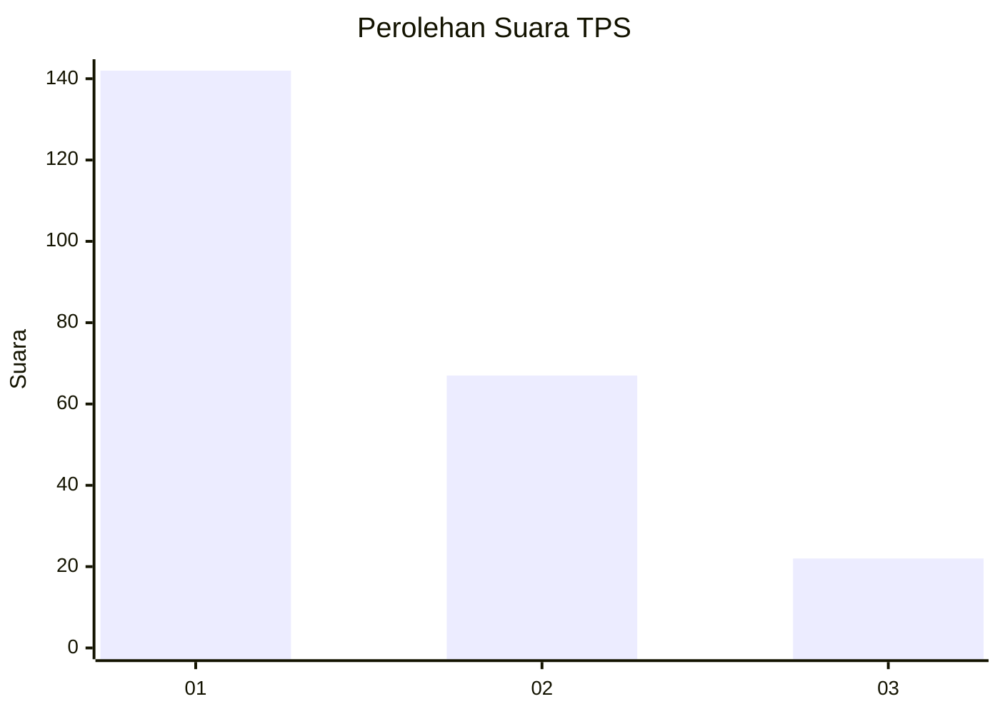
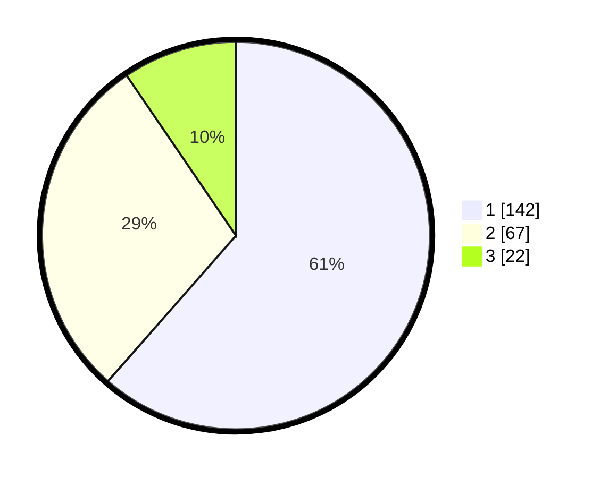

# Hasil

## Grafik

## Tabel

| No. | Nama Paslon    | Suara | Suara (raw) | Persentase |
|:--- |:-------------- | -----:| -----------:| ----------:|
| 1   | ANIES MUHAIMIN | 142   | [142][p-1]  | 61,47      |
| 2   | PRABOWO GIBRAN | 67    | [67][p-2]   | 29,00      |
| 3   | GANJAR MAHFUD  | 22    | [22][p-3]   | 9,52       |

[p-1]: https://github.com/gigit-pemilu/pemilu-2024-11-aceh/blob/main/pilpres/hitung-suara/sub/11-aceh/sub/04-aceh-tengah/sub/07-pegasing/sub/2001-arul-badak/sub/001-tps/sub/paslon-1.txt
[p-2]: https://github.com/gigit-pemilu/pemilu-2024-11-aceh/blob/main/pilpres/hitung-suara/sub/11-aceh/sub/04-aceh-tengah/sub/07-pegasing/sub/2001-arul-badak/sub/001-tps/sub/paslon-2.txt
[p-3]: https://github.com/gigit-pemilu/pemilu-2024-11-aceh/blob/main/pilpres/hitung-suara/sub/11-aceh/sub/04-aceh-tengah/sub/07-pegasing/sub/2001-arul-badak/sub/001-tps/sub/paslon-3.txt

## Foto C Plano

https://sirekap-obj-formc.kpu.go.id/812f/pemilu/ppwp/11/04/07/20/01/1104072001001-20240214-204405--ad7a6c3d-57e4-4fdc-b95f-3f06eb7fdcd4.jpg

https://sirekap-obj-formc.kpu.go.id/812f/pemilu/ppwp/11/04/07/20/01/1104072001001-20240214-204430--c73fcbf0-2dbe-4818-8359-d2d5ad2e76b7.jpg

https://sirekap-obj-formc.kpu.go.id/812f/pemilu/ppwp/11/04/07/20/01/1104072001001-20240214-204458--213586a2-9022-4fc9-a5a9-69e69456920c.jpg

## Metadata

| Key        | Value               |
| ---------- | ------------------- |
| Time Stamp | 2024-02-16 04:00:27 |

## DATA PEMILIH TETAP

Jumlah pemilih dalam DPT: **267**.
 * L: **144**.
 * P: **123**.

## DATA PENGGUNA HAK PILIH

Jumlah pengguna hak pilih dalam DPT: **233**.
 * L: **124**.
 * P: **109**.

Jumlah pengguna hak pilih dalam DPTb: **1**.
 * L: **0**.
 * P: **1**.

Jumlah pengguna hak pilih dalam DPK: **1**.
 * L: **0**.
 * P: **1**.

Jumlah pengguna hak pilih: **235**.
 * L: **124**.
 * P: **111**.

## JUMLAH SUARA SAH DAN TIDAK SAH

JUMLAH SELURUH SUARA SAH: **231**.

JUMLAH SUARA TIDAK SAH: **4**.

JUMLAH SELURUH SUARA SAH DAN SUARA TIDAK SAH: **235**.

