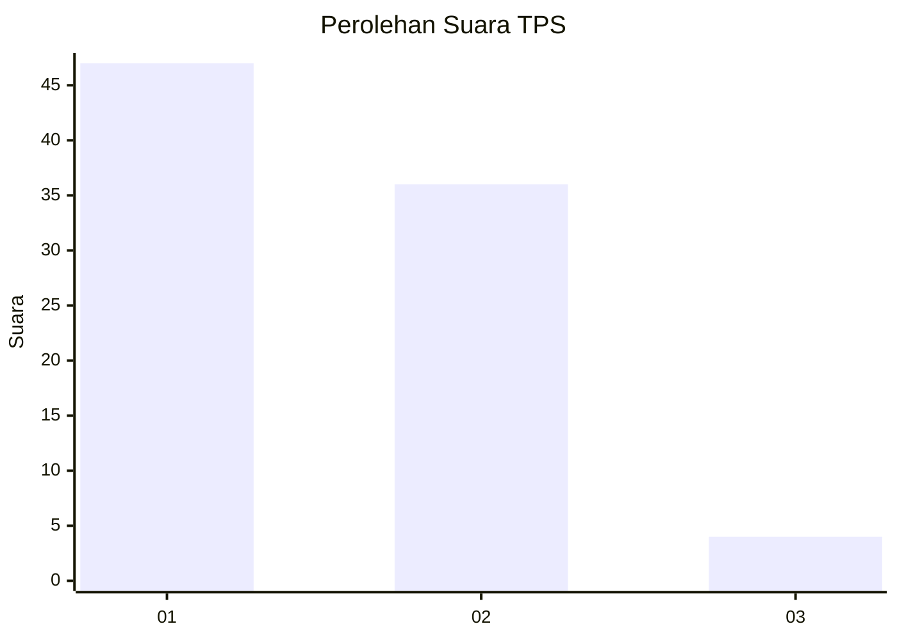
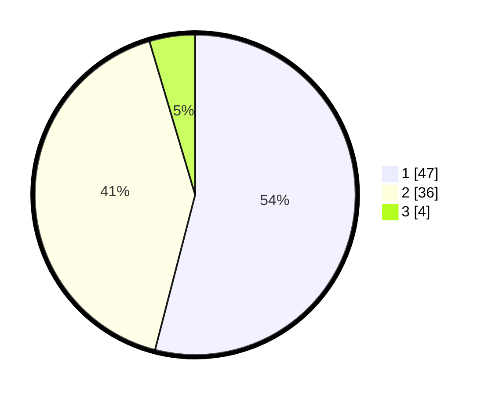

# Hasil

## Grafik

## Tabel

| No. | Nama Paslon    | Suara | Suara (raw) | Persentase |
|:--- |:-------------- | -----:| -----------:| ----------:|
| 1   | ANIES MUHAIMIN | 47    | [47][p-1]   | 54,02      |
| 2   | PRABOWO GIBRAN | 36    | [36][p-2]   | 41,38      |
| 3   | GANJAR MAHFUD  | 4     | [4][p-3]    | 4,60       |

[p-1]: https://github.com/gigit-pemilu/pemilu-2024-11-aceh/blob/main/pilpres/hitung-suara/sub/11-aceh/sub/04-aceh-tengah/sub/07-pegasing/sub/2001-arul-badak/sub/002-tps/sub/paslon-1.txt
[p-2]: https://github.com/gigit-pemilu/pemilu-2024-11-aceh/blob/main/pilpres/hitung-suara/sub/11-aceh/sub/04-aceh-tengah/sub/07-pegasing/sub/2001-arul-badak/sub/002-tps/sub/paslon-2.txt
[p-3]: https://github.com/gigit-pemilu/pemilu-2024-11-aceh/blob/main/pilpres/hitung-suara/sub/11-aceh/sub/04-aceh-tengah/sub/07-pegasing/sub/2001-arul-badak/sub/002-tps/sub/paslon-3.txt

## Foto C Plano

https://sirekap-obj-formc.kpu.go.id/6ffa/pemilu/ppwp/11/04/07/20/01/1104072001002-20240214-192001--030c1870-c5d4-4bb3-8061-b6e36a2c2fc2.jpg

https://sirekap-obj-formc.kpu.go.id/6ffa/pemilu/ppwp/11/04/07/20/01/1104072001002-20240214-192041--f6a8d586-8205-48da-ba8a-e710d5d58407.jpg

https://sirekap-obj-formc.kpu.go.id/6ffa/pemilu/ppwp/11/04/07/20/01/1104072001002-20240214-192107--214754d0-8ab5-47c1-8b8f-7d67bd5bb608.jpg

## Metadata

| Key        | Value               |
| ---------- | ------------------- |
| Time Stamp | 2024-02-17 18:00:00 |

## DATA PEMILIH TETAP

Jumlah pemilih dalam DPT: **113**.
 * L: **64**.
 * P: **49**.

## DATA PENGGUNA HAK PILIH

Jumlah pengguna hak pilih dalam DPT: **81**.
 * L: **45**.
 * P: **36**.

Jumlah pengguna hak pilih dalam DPTb: **2**.
 * L: **2**.
 * P: **0**.

Jumlah pengguna hak pilih dalam DPK: **4**.
 * L: **2**.
 * P: **2**.

Jumlah pengguna hak pilih: **87**.
 * L: **49**.
 * P: **38**.

## JUMLAH SUARA SAH DAN TIDAK SAH

JUMLAH SELURUH SUARA SAH: **87**.

JUMLAH SUARA TIDAK SAH: **0**.

JUMLAH SELURUH SUARA SAH DAN SUARA TIDAK SAH: **87**.

