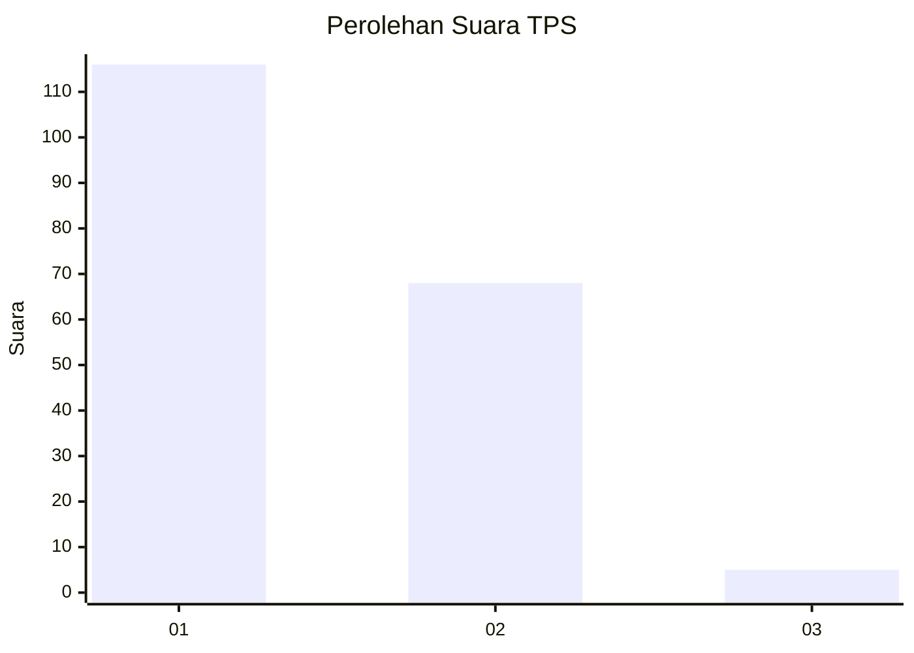
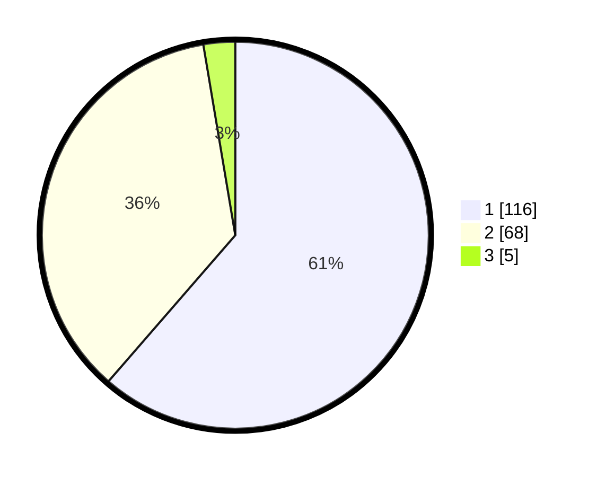

# Hasil

## Grafik

## Tabel

| No. | Nama Paslon    | Suara | Suara (raw) | Persentase |
|:--- |:-------------- | -----:| -----------:| ----------:|
| 1   | ANIES MUHAIMIN | 116   | [116][p-1]  | 61,38      |
| 2   | PRABOWO GIBRAN | 68    | [68][p-2]   | 35,98      |
| 3   | GANJAR MAHFUD  | 5     | [5][p-3]    | 2,65       |

[p-1]: https://github.com/gigit-pemilu/pemilu-2024-11-aceh/blob/main/pilpres/hitung-suara/sub/11-aceh/sub/04-aceh-tengah/sub/07-pegasing/sub/2001-arul-badak/sub/003-tps/sub/paslon-1.txt
[p-2]: https://github.com/gigit-pemilu/pemilu-2024-11-aceh/blob/main/pilpres/hitung-suara/sub/11-aceh/sub/04-aceh-tengah/sub/07-pegasing/sub/2001-arul-badak/sub/003-tps/sub/paslon-2.txt
[p-3]: https://github.com/gigit-pemilu/pemilu-2024-11-aceh/blob/main/pilpres/hitung-suara/sub/11-aceh/sub/04-aceh-tengah/sub/07-pegasing/sub/2001-arul-badak/sub/003-tps/sub/paslon-3.txt

## Foto C Plano

https://sirekap-obj-formc.kpu.go.id/f43a/pemilu/ppwp/11/04/07/20/01/1104072001003-20240215-031204--ce05d3c6-a23e-4ae3-8836-707339171c4c.jpg

https://sirekap-obj-formc.kpu.go.id/f43a/pemilu/ppwp/11/04/07/20/01/1104072001003-20240215-031308--137f3d4a-b014-4b8d-8c96-08733e81255b.jpg

https://sirekap-obj-formc.kpu.go.id/f43a/pemilu/ppwp/11/04/07/20/01/1104072001003-20240215-031322--93b2c1ea-0b90-4b25-a398-8cff643a5765.jpg

## Metadata

| Key        | Value               |
| ---------- | ------------------- |
| Time Stamp | 2024-02-16 04:00:27 |

## DATA PEMILIH TETAP

Jumlah pemilih dalam DPT: **197**.
 * L: **103**.
 * P: **94**.

## DATA PENGGUNA HAK PILIH

Jumlah pengguna hak pilih dalam DPT: **180**.
 * L: **92**.
 * P: **88**.

Jumlah pengguna hak pilih dalam DPTb: **4**.
 * L: **1**.
 * P: **3**.

Jumlah pengguna hak pilih dalam DPK: **6**.
 * L: **3**.
 * P: **3**.

Jumlah pengguna hak pilih: **190**.
 * L: **96**.
 * P: **94**.

## JUMLAH SUARA SAH DAN TIDAK SAH

JUMLAH SELURUH SUARA SAH: **189**.

JUMLAH SUARA TIDAK SAH: **1**.

JUMLAH SELURUH SUARA SAH DAN SUARA TIDAK SAH: **190**.

