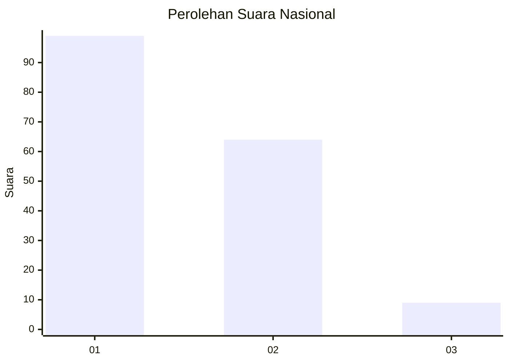
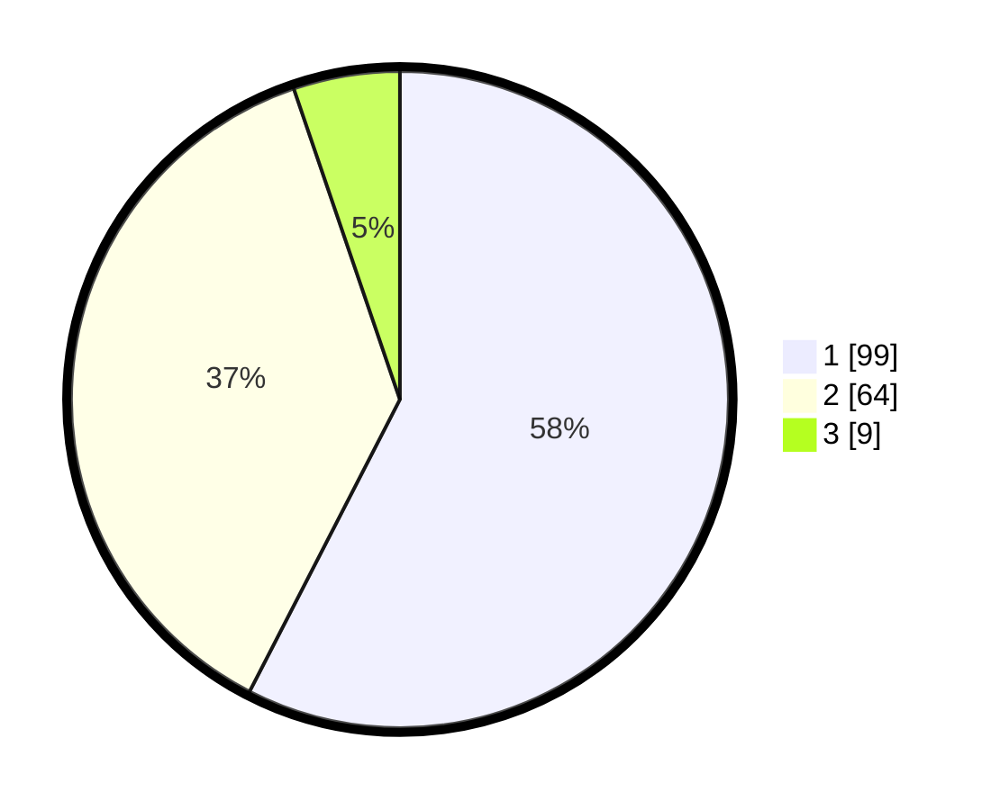

# Hasil

## Grafik

## Tabel

| No. | Nama Paslon    | Suara | Suara (raw) | Persentase |
|:--- |:-------------- | -----:| -----------:| ----------:|
| 1   | ANIES MUHAIMIN | 99    | [99][p-1]   | 57,56      |
| 2   | PRABOWO GIBRAN | 64    | [64][p-2]   | 37,21      |
| 3   | GANJAR MAHFUD  | 9     | [9][p-3]    | 5,23       |

[p-1]: https://github.com/gigit-pemilu/pemilu-2024/blob/main/pilpres/hitung-suara/sub/11-aceh/sub/04-aceh-tengah/sub/07-pegasing/sub/2004-berawang-baro/sub/002-tps/sub/paslon-1.txt
[p-2]: https://github.com/gigit-pemilu/pemilu-2024/blob/main/pilpres/hitung-suara/sub/11-aceh/sub/04-aceh-tengah/sub/07-pegasing/sub/2004-berawang-baro/sub/002-tps/sub/paslon-2.txt
[p-3]: https://github.com/gigit-pemilu/pemilu-2024/blob/main/pilpres/hitung-suara/sub/11-aceh/sub/04-aceh-tengah/sub/07-pegasing/sub/2004-berawang-baro/sub/002-tps/sub/paslon-3.txt

## Foto C Plano

https://sirekap-obj-formc.kpu.go.id/771c/pemilu/ppwp/11/04/07/20/04/1104072004002-20240218-150030--e5b49809-b61f-4930-ad9b-b0a251abb9b5.jpg

https://sirekap-obj-formc.kpu.go.id/771c/pemilu/ppwp/11/04/07/20/04/1104072004002-20240218-150031--c2a4dccf-dc1f-4443-90e1-edc4f86fe687.jpg

https://sirekap-obj-formc.kpu.go.id/771c/pemilu/ppwp/11/04/07/20/04/1104072004002-20240218-150030--75cf93c7-27f7-4317-bc70-2116a2d3aa45.jpg

## Metadata

| Key        | Value               |
| ---------- | ------------------- |
| Time Stamp | 2024-02-19 06:16:00 |

## DATA PEMILIH TETAP

Jumlah pemilih dalam DPT: **191**.
 * L: **92**.
 * P: **99**.

## DATA PENGGUNA HAK PILIH

Jumlah pengguna hak pilih dalam DPT: **169**.
 * L: **84**.
 * P: **85**.

Jumlah pengguna hak pilih dalam DPTb: **6**.
 * L: **4**.
 * P: **2**.

Jumlah pengguna hak pilih dalam DPK: **0**.
 * L: **0**.
 * P: **0**.

Jumlah pengguna hak pilih: **175**.
 * L: **88**.
 * P: **87**.

## JUMLAH SUARA SAH DAN TIDAK SAH

JUMLAH SELURUH SUARA SAH: **172**.

JUMLAH SUARA TIDAK SAH: **3**.

JUMLAH SELURUH SUARA SAH DAN SUARA TIDAK SAH: **175**.

