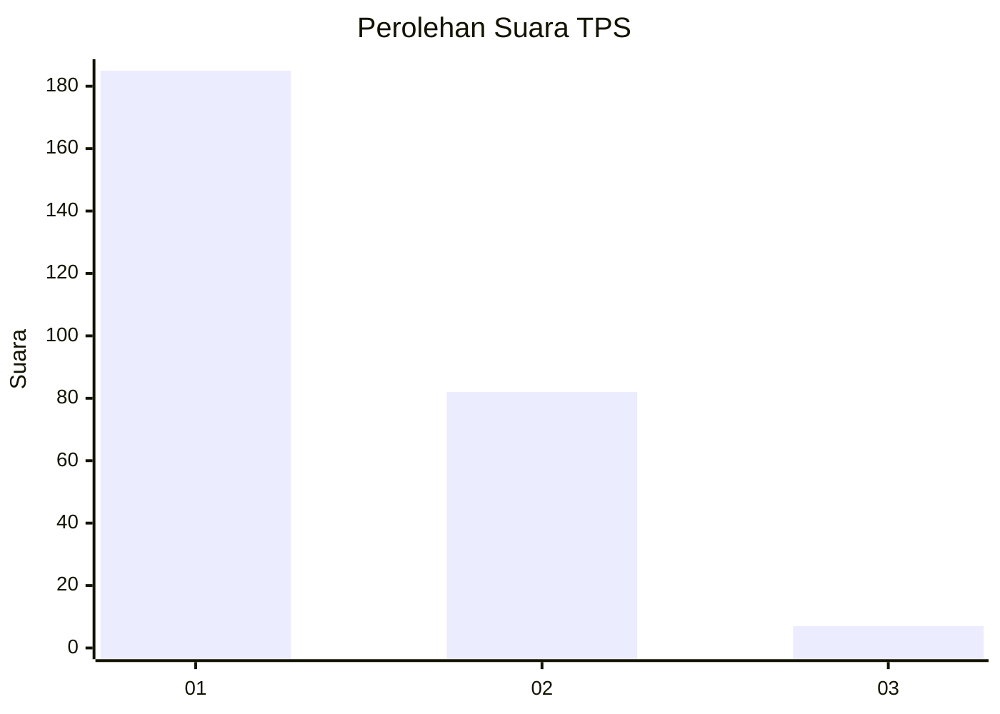
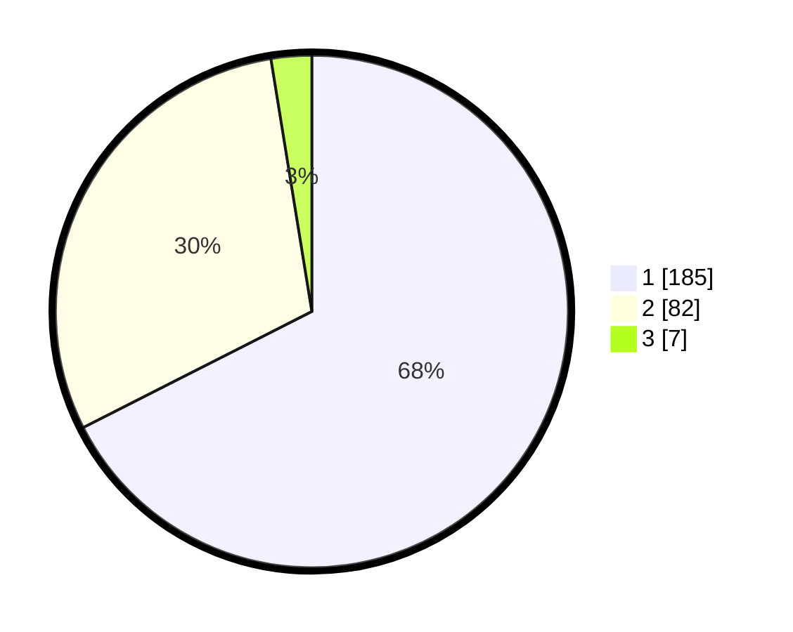

# Hasil

## Grafik

## Tabel

| No. | Nama Paslon    | Suara | Suara (raw) | Persentase |
|:--- |:-------------- | -----:| -----------:| ----------:|
| 1   | ANIES MUHAIMIN | 185   | [185][p-1]  | 67,52      |
| 2   | PRABOWO GIBRAN | 82    | [82][p-2]   | 29,93      |
| 3   | GANJAR MAHFUD  | 7     | [7][p-3]    | 2,55       |

[p-1]: https://github.com/gigit-pemilu/pemilu-2024-11-aceh/blob/main/pilpres/hitung-suara/sub/11-aceh/sub/04-aceh-tengah/sub/07-pegasing/sub/2008-gelelungi/sub/001-tps/sub/paslon-1.txt
[p-2]: https://github.com/gigit-pemilu/pemilu-2024-11-aceh/blob/main/pilpres/hitung-suara/sub/11-aceh/sub/04-aceh-tengah/sub/07-pegasing/sub/2008-gelelungi/sub/001-tps/sub/paslon-2.txt
[p-3]: https://github.com/gigit-pemilu/pemilu-2024-11-aceh/blob/main/pilpres/hitung-suara/sub/11-aceh/sub/04-aceh-tengah/sub/07-pegasing/sub/2008-gelelungi/sub/001-tps/sub/paslon-3.txt

## Foto C Plano

https://sirekap-obj-formc.kpu.go.id/a013/pemilu/ppwp/11/04/07/20/08/1104072008001-20240216-221306--1fbf22ea-064f-46cb-92be-6455a38e2eee.jpg

https://sirekap-obj-formc.kpu.go.id/a013/pemilu/ppwp/11/04/07/20/08/1104072008001-20240217-083845--1c954d6e-94ae-441b-ac08-2a189ad08279.jpg

https://sirekap-obj-formc.kpu.go.id/a013/pemilu/ppwp/11/04/07/20/08/1104072008001-20240217-084014--9ab5bfba-243d-4a49-b9c8-58a05ab04595.jpg

## Metadata

| Key        | Value               |
| ---------- | ------------------- |
| Time Stamp | 2024-02-17 11:00:02 |

## DATA PEMILIH TETAP

Jumlah pemilih dalam DPT: **276**.
 * L: **140**.
 * P: **136**.

## DATA PENGGUNA HAK PILIH

Jumlah pengguna hak pilih dalam DPT: **264**.
 * L: **135**.
 * P: **129**.

Jumlah pengguna hak pilih dalam DPTb: **4**.
 * L: **1**.
 * P: **3**.

Jumlah pengguna hak pilih dalam DPK: **3**.
 * L: **1**.
 * P: **2**.

Jumlah pengguna hak pilih: **271**.
 * L: **137**.
 * P: **134**.

## JUMLAH SUARA SAH DAN TIDAK SAH

JUMLAH SELURUH SUARA SAH: **274**.

JUMLAH SUARA TIDAK SAH: **4**.

JUMLAH SELURUH SUARA SAH DAN SUARA TIDAK SAH: **278**.

