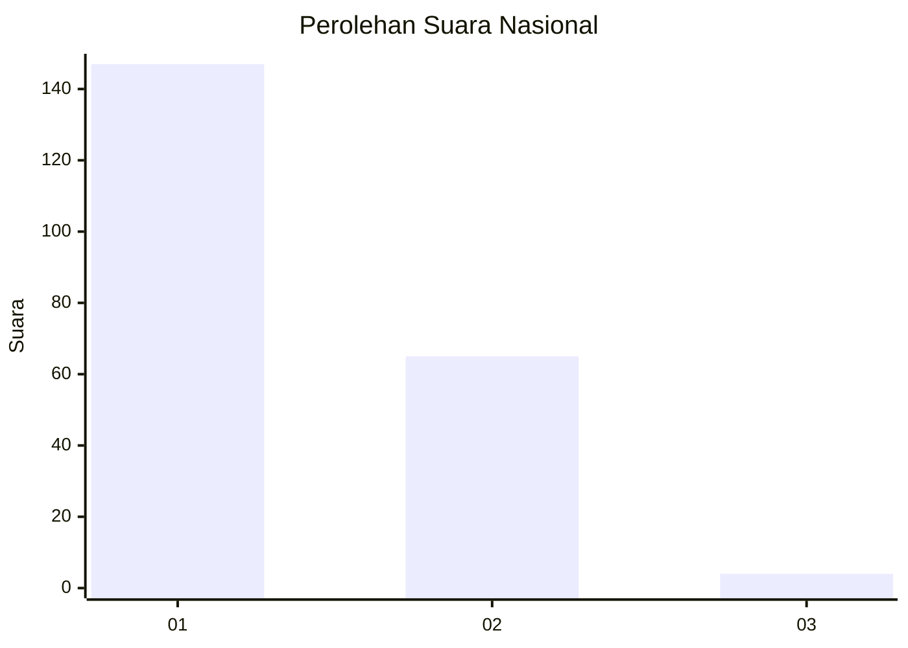
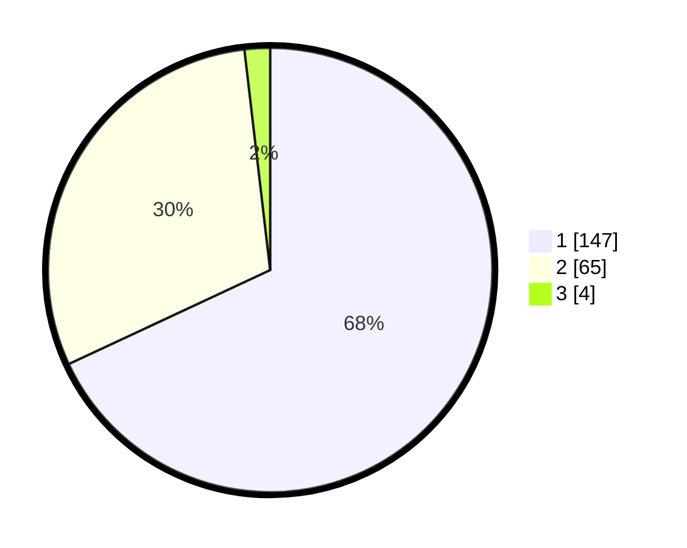

# Hasil

## Grafik

## Tabel

| No. | Nama Paslon    | Suara | Suara (raw) | Persentase |
|:--- |:-------------- | -----:| -----------:| ----------:|
| 1   | ANIES MUHAIMIN | 147   | [147][p-1]  | 68,06      |
| 2   | PRABOWO GIBRAN | 65    | [65][p-2]   | 30,09      |
| 3   | GANJAR MAHFUD  | 4     | [4][p-3]    | 1,85       |

[p-1]: https://github.com/gigit-pemilu/pemilu-2024/blob/main/pilpres/hitung-suara/sub/11-aceh/sub/04-aceh-tengah/sub/07-pegasing/sub/2010-kayu-kul/sub/003-tps/sub/paslon-1.txt
[p-2]: https://github.com/gigit-pemilu/pemilu-2024/blob/main/pilpres/hitung-suara/sub/11-aceh/sub/04-aceh-tengah/sub/07-pegasing/sub/2010-kayu-kul/sub/003-tps/sub/paslon-2.txt
[p-3]: https://github.com/gigit-pemilu/pemilu-2024/blob/main/pilpres/hitung-suara/sub/11-aceh/sub/04-aceh-tengah/sub/07-pegasing/sub/2010-kayu-kul/sub/003-tps/sub/paslon-3.txt

## Foto C Plano

https://sirekap-obj-formc.kpu.go.id/30f6/pemilu/ppwp/11/04/07/20/10/1104072010003-20240214-200837--5e3f279a-260a-4cad-9b2b-ba733cdc92ed.jpg

https://sirekap-obj-formc.kpu.go.id/30f6/pemilu/ppwp/11/04/07/20/10/1104072010003-20240214-195847--04fd9aa1-a0bb-451e-b62e-57daad8c36d3.jpg

https://sirekap-obj-formc.kpu.go.id/30f6/pemilu/ppwp/11/04/07/20/10/1104072010003-20240214-195926--ab5194f6-388e-4174-863f-68f395b516a8.jpg

## Metadata

| Key        | Value               |
| ---------- | ------------------- |
| Time Stamp | 2024-02-17 18:00:00 |

