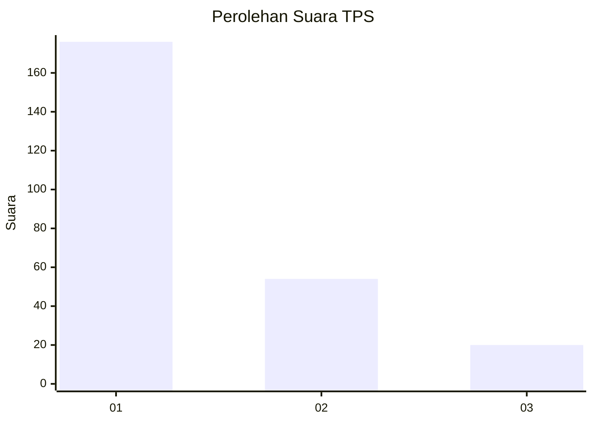
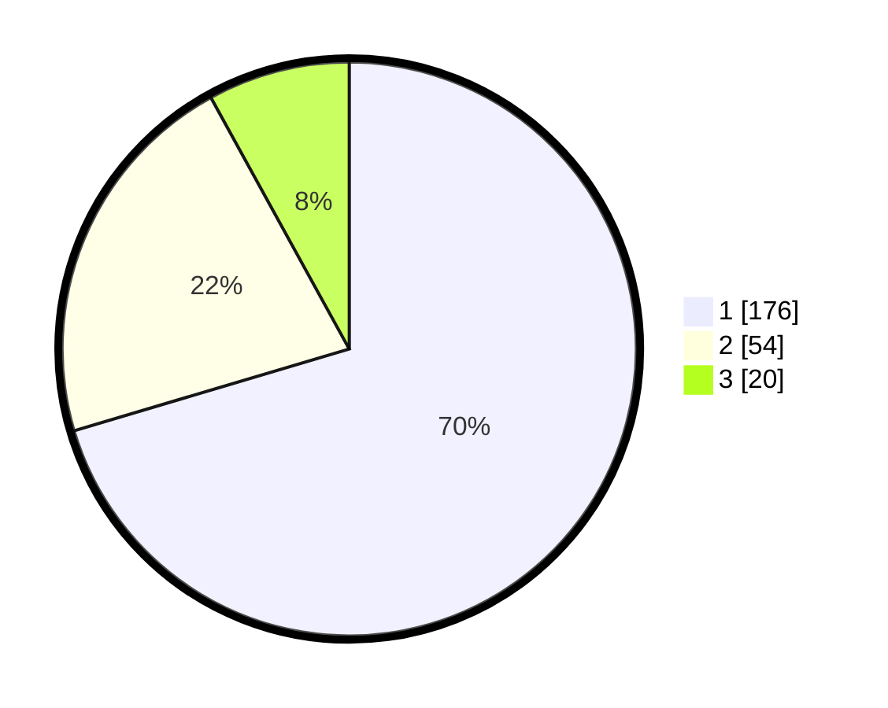

# Hasil

## Grafik

## Tabel

| No. | Nama Paslon    | Suara | Suara (raw) | Persentase |
|:--- |:-------------- | -----:| -----------:| ----------:|
| 1   | ANIES MUHAIMIN | 176   | [176][p-1]  | 70,40      |
| 2   | PRABOWO GIBRAN | 54    | [54][p-2]   | 21,60      |
| 3   | GANJAR MAHFUD  | 20    | [20][p-3]   | 8,00       |

[p-1]: https://github.com/gigit-pemilu/pemilu-2024-11-aceh/blob/main/pilpres/hitung-suara/sub/11-aceh/sub/04-aceh-tengah/sub/07-pegasing/sub/2021-simpang-kelaping/sub/006-tps/sub/paslon-1.txt
[p-2]: https://github.com/gigit-pemilu/pemilu-2024-11-aceh/blob/main/pilpres/hitung-suara/sub/11-aceh/sub/04-aceh-tengah/sub/07-pegasing/sub/2021-simpang-kelaping/sub/006-tps/sub/paslon-2.txt
[p-3]: https://github.com/gigit-pemilu/pemilu-2024-11-aceh/blob/main/pilpres/hitung-suara/sub/11-aceh/sub/04-aceh-tengah/sub/07-pegasing/sub/2021-simpang-kelaping/sub/006-tps/sub/paslon-3.txt

## Foto C Plano

https://sirekap-obj-formc.kpu.go.id/b44d/pemilu/ppwp/11/04/07/20/21/1104072021006-20240215-190741--dc160189-84bd-481f-9541-1a98e630e238.jpg

https://sirekap-obj-formc.kpu.go.id/b44d/pemilu/ppwp/11/04/07/20/21/1104072021006-20240215-190831--05ada7fa-4cc7-4153-8a91-87773bea8b51.jpg

## Metadata

| Key        | Value               |
| ---------- | ------------------- |
| Time Stamp | 2024-02-20 20:00:00 |

