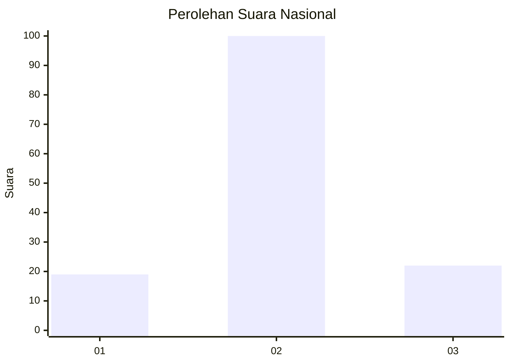

# Hasil

## Grafik

## Tabel

| No. | Nama Paslon    | Suara | Suara (raw) | Persentase |
|:--- |:-------------- | -----:| -----------:| ----------:|
| 1   | ANIES MUHAIMIN | 19    | [19][p-1]   | 13,48      |
| 2   | PRABOWO GIBRAN | 100   | [100][p-2]  | 70,92      |
| 3   | GANJAR MAHFUD  | 22    | [22][p-3]   | 15,60      |

[p-1]: https://github.com/gigit-pemilu/pemilu-2024/blob/main/pilpres/hitung-suara/sub/11-aceh/sub/04-aceh-tengah/sub/07-pegasing/sub/2029-wih-ilang/sub/003-tps/sub/paslon-1.txt
[p-2]: https://github.com/gigit-pemilu/pemilu-2024/blob/main/pilpres/hitung-suara/sub/11-aceh/sub/04-aceh-tengah/sub/07-pegasing/sub/2029-wih-ilang/sub/003-tps/sub/paslon-2.txt
[p-3]: https://github.com/gigit-pemilu/pemilu-2024/blob/main/pilpres/hitung-suara/sub/11-aceh/sub/04-aceh-tengah/sub/07-pegasing/sub/2029-wih-ilang/sub/003-tps/sub/paslon-3.txt

## Foto C Plano

https://sirekap-obj-formc.kpu.go.id/32ea/pemilu/ppwp/11/04/07/20/29/1104072029003-20240219-120328--1347a156-f3f2-4998-ab87-b1d236b0f2fa.jpg

https://sirekap-obj-formc.kpu.go.id/32ea/pemilu/ppwp/11/04/07/20/29/1104072029003-20240219-120329--e2fa307a-15a1-443a-8aaa-75a06880d710.jpg

https://sirekap-obj-formc.kpu.go.id/32ea/pemilu/ppwp/11/04/07/20/29/1104072029003-20240219-120328--7efe9c75-8679-42a7-9f97-807e64e4bf83.jpg

## Metadata

| Key        | Value               |
| ---------- | ------------------- |
| Time Stamp | 2024-02-20 12:00:00 |

## DATA PEMILIH TETAP

Jumlah pemilih dalam DPT: **170**.
 * L: **95**.
 * P: **75**.

## DATA PENGGUNA HAK PILIH

Jumlah pengguna hak pilih dalam DPT: **130**.
 * L: **71**.
 * P: **59**.

Jumlah pengguna hak pilih dalam DPTb: **9**.
 * L: **4**.
 * P: **5**.

Jumlah pengguna hak pilih dalam DPK: **0**.
 * L: **0**.
 * P: **2**.

Jumlah pengguna hak pilih: **141**.
 * L: **75**.
 * P: **66**.

## JUMLAH SUARA SAH DAN TIDAK SAH

JUMLAH SELURUH SUARA SAH: **141**.

JUMLAH SUARA TIDAK SAH: **0**.

JUMLAH SELURUH SUARA SAH DAN SUARA TIDAK SAH: **141**.

