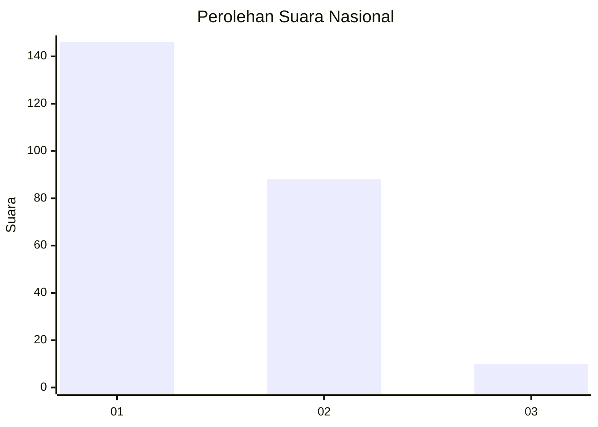
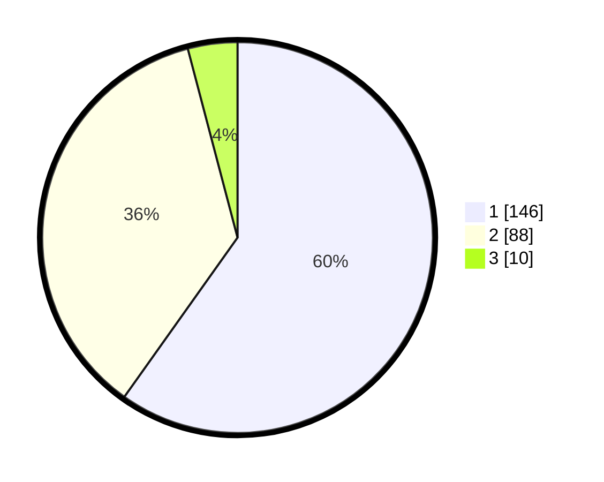

# Hasil

## Grafik

## Tabel

| No. | Nama Paslon    | Suara | Suara (raw) | Persentase |
|:--- |:-------------- | -----:| -----------:| ----------:|
| 1   | ANIES MUHAIMIN | 146   | [146][p-1]  | 59,84      |
| 2   | PRABOWO GIBRAN | 88    | [88][p-2]   | 36,07      |
| 3   | GANJAR MAHFUD  | 10    | [10][p-3]   | 4,10       |

[p-1]: https://github.com/gigit-pemilu/pemilu-2024/blob/main/pilpres/hitung-suara/sub/11-aceh/sub/04-aceh-tengah/sub/07-pegasing/sub/2031-wih-lah/sub/001-tps/sub/paslon-1.txt
[p-2]: https://github.com/gigit-pemilu/pemilu-2024/blob/main/pilpres/hitung-suara/sub/11-aceh/sub/04-aceh-tengah/sub/07-pegasing/sub/2031-wih-lah/sub/001-tps/sub/paslon-2.txt
[p-3]: https://github.com/gigit-pemilu/pemilu-2024/blob/main/pilpres/hitung-suara/sub/11-aceh/sub/04-aceh-tengah/sub/07-pegasing/sub/2031-wih-lah/sub/001-tps/sub/paslon-3.txt

## Foto C Plano

https://sirekap-obj-formc.kpu.go.id/cfbe/pemilu/ppwp/11/04/07/20/31/1104072031001-20240215-030016--f8b55f6f-1a46-47db-a3b4-47a5bc2631fc.jpg

https://sirekap-obj-formc.kpu.go.id/cfbe/pemilu/ppwp/11/04/07/20/31/1104072031001-20240216-130615--7b87f6f2-f520-45c2-a2bf-a8d9ca3b5c3b.jpg

https://sirekap-obj-formc.kpu.go.id/cfbe/pemilu/ppwp/11/04/07/20/31/1104072031001-20240215-030025--03645ad5-8fce-4054-a051-797b343064cc.jpg

## Metadata

| Key        | Value               |
| ---------- | ------------------- |
| Time Stamp | 2024-02-17 11:00:02 |

## DATA PEMILIH TETAP

Jumlah pemilih dalam DPT: **253**.
 * L: **116**.
 * P: **137**.

## DATA PENGGUNA HAK PILIH

Jumlah pengguna hak pilih dalam DPT: **245**.
 * L: **103**.
 * P: **142**.

Jumlah pengguna hak pilih dalam DPTb: **10**.
 * L: **4**.
 * P: **6**.

Jumlah pengguna hak pilih dalam DPK: **3**.
 * L: **0**.
 * P: **3**.

Jumlah pengguna hak pilih: **258**.
 * L: **107**.
 * P: **151**.

## JUMLAH SUARA SAH DAN TIDAK SAH

JUMLAH SELURUH SUARA SAH: **244**.

JUMLAH SUARA TIDAK SAH: **1**.

JUMLAH SELURUH SUARA SAH DAN SUARA TIDAK SAH: **245**.

