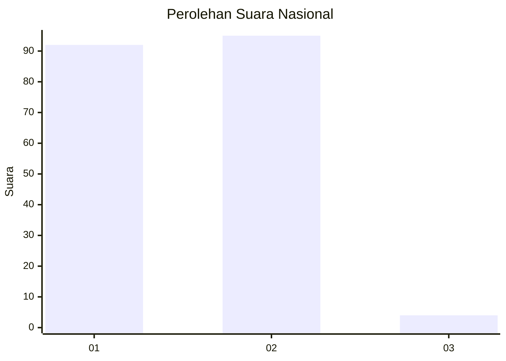
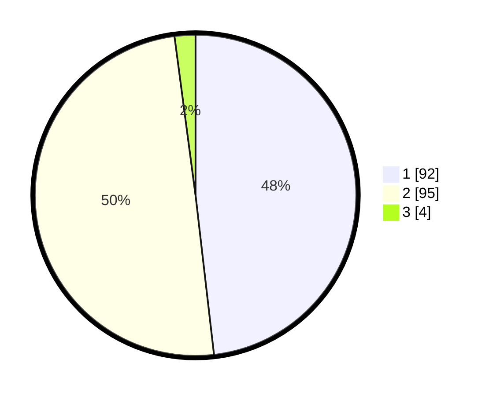

# Hasil

## Grafik

## Tabel

| No. | Nama Paslon    | Suara | Suara (raw) | Persentase |
|:--- |:-------------- | -----:| -----------:| ----------:|
| 1   | ANIES MUHAIMIN | 92    | [92][p-1]   | 48,17      |
| 2   | PRABOWO GIBRAN | 95    | [95][p-2]   | 49,74      |
| 3   | GANJAR MAHFUD  | 4     | [4][p-3]    | 2,09       |

[p-1]: https://github.com/gigit-pemilu/pemilu-2024/blob/main/pilpres/hitung-suara/sub/11-aceh/sub/04-aceh-tengah/sub/07-pegasing/sub/2034-kala-pegasing/sub/001-tps/sub/paslon-1.txt
[p-2]: https://github.com/gigit-pemilu/pemilu-2024/blob/main/pilpres/hitung-suara/sub/11-aceh/sub/04-aceh-tengah/sub/07-pegasing/sub/2034-kala-pegasing/sub/001-tps/sub/paslon-2.txt
[p-3]: https://github.com/gigit-pemilu/pemilu-2024/blob/main/pilpres/hitung-suara/sub/11-aceh/sub/04-aceh-tengah/sub/07-pegasing/sub/2034-kala-pegasing/sub/001-tps/sub/paslon-3.txt

## Foto C Plano

https://sirekap-obj-formc.kpu.go.id/7330/pemilu/ppwp/11/04/07/20/34/1104072034001-20240219-205328--7fec88f9-a1ea-4b56-9092-f69573da029a.jpg

https://sirekap-obj-formc.kpu.go.id/7330/pemilu/ppwp/11/04/07/20/34/1104072034001-20240218-091805--a61c01ae-19aa-4a93-959f-4a095ff8b1e7.jpg

## Metadata

| Key        | Value               |
| ---------- | ------------------- |
| Time Stamp | 2024-02-20 20:00:00 |

