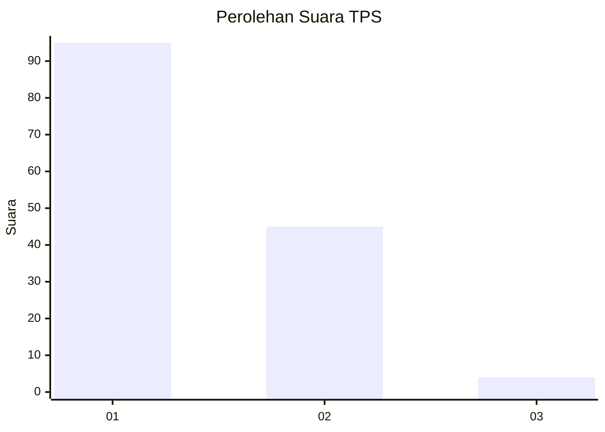
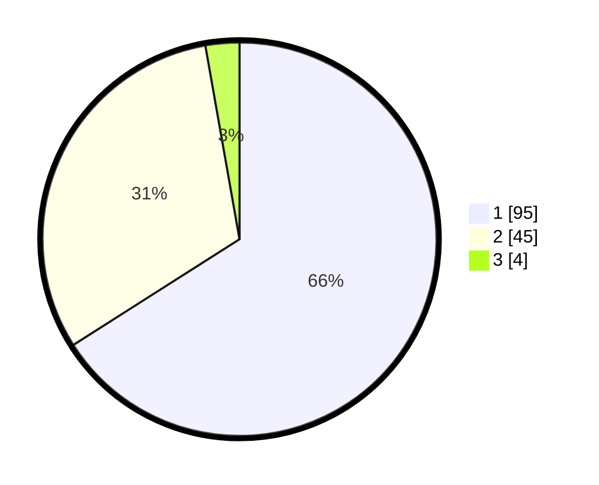

# Hasil

## Grafik

## Tabel

| No. | Nama Paslon    | Suara | Suara (raw) | Persentase |
|:--- |:-------------- | -----:| -----------:| ----------:|
| 1   | ANIES MUHAIMIN | 95    | [95][p-1]   | 65,97      |
| 2   | PRABOWO GIBRAN | 45    | [45][p-2]   | 31,25      |
| 3   | GANJAR MAHFUD  | 4     | [4][p-3]    | 2,78       |

[p-1]: https://github.com/gigit-pemilu/pemilu-2024-11-aceh/blob/main/pilpres/hitung-suara/sub/11-aceh/sub/04-aceh-tengah/sub/07-pegasing/sub/2036-panangan-mata/sub/001-tps/sub/paslon-1.txt
[p-2]: https://github.com/gigit-pemilu/pemilu-2024-11-aceh/blob/main/pilpres/hitung-suara/sub/11-aceh/sub/04-aceh-tengah/sub/07-pegasing/sub/2036-panangan-mata/sub/001-tps/sub/paslon-2.txt
[p-3]: https://github.com/gigit-pemilu/pemilu-2024-11-aceh/blob/main/pilpres/hitung-suara/sub/11-aceh/sub/04-aceh-tengah/sub/07-pegasing/sub/2036-panangan-mata/sub/001-tps/sub/paslon-3.txt

## Foto C Plano

https://sirekap-obj-formc.kpu.go.id/b3e1/pemilu/ppwp/11/04/07/20/36/1104072036001-20240216-145756--84dffebd-76bf-4dc4-9611-4752ae79684f.jpg

https://sirekap-obj-formc.kpu.go.id/b3e1/pemilu/ppwp/11/04/07/20/36/1104072036001-20240216-145758--780b1582-0c70-4f07-89f7-0d6c4aab20ca.jpg

https://sirekap-obj-formc.kpu.go.id/b3e1/pemilu/ppwp/11/04/07/20/36/1104072036001-20240216-145757--3e796bac-f8e5-4e4b-850d-8059c13f6b08.jpg

## Metadata

| Key        | Value               |
| ---------- | ------------------- |
| Time Stamp | 2024-02-17 11:00:02 |

## DATA PEMILIH TETAP

Jumlah pemilih dalam DPT: **163**.
 * L: **91**.
 * P: **72**.

## DATA PENGGUNA HAK PILIH

Jumlah pengguna hak pilih dalam DPT: **142**.
 * L: **81**.
 * P: **61**.

Jumlah pengguna hak pilih dalam DPTb: **2**.
 * L: **0**.
 * P: **2**.

Jumlah pengguna hak pilih dalam DPK: **1**.
 * L: **1**.
 * P: **0**.

Jumlah pengguna hak pilih: **145**.
 * L: **82**.
 * P: **63**.

## JUMLAH SUARA SAH DAN TIDAK SAH

JUMLAH SELURUH SUARA SAH: **144**.

JUMLAH SUARA TIDAK SAH: **1**.

JUMLAH SELURUH SUARA SAH DAN SUARA TIDAK SAH: **145**.

