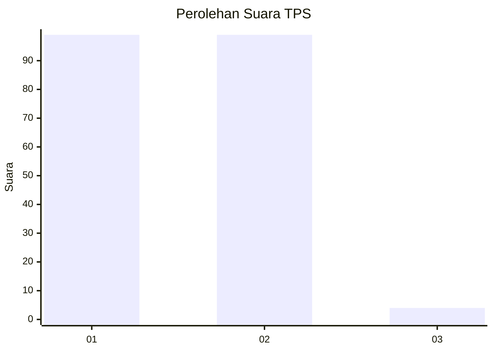
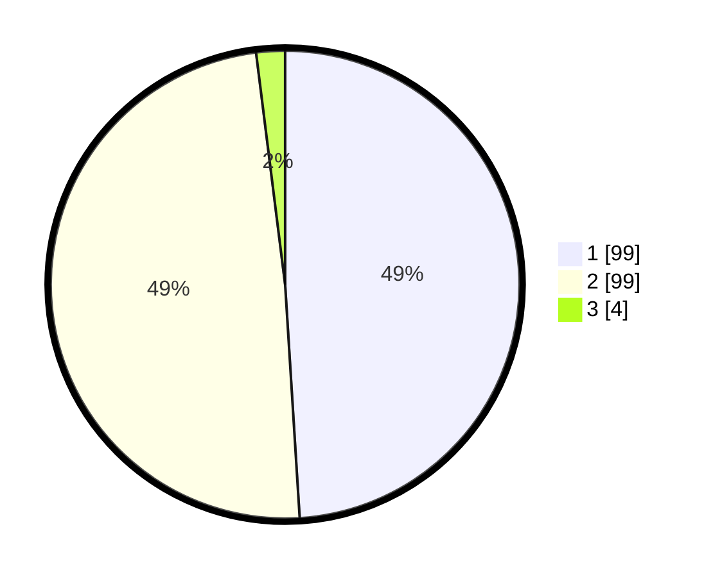

# Hasil

## Grafik

## Tabel

| No. | Nama Paslon    | Suara | Suara (raw) | Persentase |
|:--- |:-------------- | -----:| -----------:| ----------:|
| 1   | ANIES MUHAIMIN | 99    | [99][p-1]   | 49,01      |
| 2   | PRABOWO GIBRAN | 99    | [99][p-2]   | 49,01      |
| 3   | GANJAR MAHFUD  | 4     | [4][p-3]    | 1,98       |

[p-1]: https://github.com/gigit-pemilu/pemilu-2024-11-aceh/blob/main/pilpres/hitung-suara/sub/11-aceh/sub/04-aceh-tengah/sub/08-bintang/sub/2002-bale-nosar/sub/001-tps/sub/paslon-1.txt
[p-2]: https://github.com/gigit-pemilu/pemilu-2024-11-aceh/blob/main/pilpres/hitung-suara/sub/11-aceh/sub/04-aceh-tengah/sub/08-bintang/sub/2002-bale-nosar/sub/001-tps/sub/paslon-2.txt
[p-3]: https://github.com/gigit-pemilu/pemilu-2024-11-aceh/blob/main/pilpres/hitung-suara/sub/11-aceh/sub/04-aceh-tengah/sub/08-bintang/sub/2002-bale-nosar/sub/001-tps/sub/paslon-3.txt

## Foto C Plano

https://sirekap-obj-formc.kpu.go.id/cf6b/pemilu/ppwp/11/04/08/20/02/1104082002001-20240216-143419--9a5c2c89-fd95-4dbc-bc21-0bb26eca549e.jpg

https://sirekap-obj-formc.kpu.go.id/cf6b/pemilu/ppwp/11/04/08/20/02/1104082002001-20240216-143421--e3afa485-9045-4030-854e-8491b693040c.jpg

https://sirekap-obj-formc.kpu.go.id/cf6b/pemilu/ppwp/11/04/08/20/02/1104082002001-20240216-143420--fd698263-d47b-46cc-84ea-f88d6ef10bcd.jpg

## Metadata

| Key        | Value               |
| ---------- | ------------------- |
| Time Stamp | 2024-02-16 23:45:47 |

## DATA PEMILIH TETAP

Jumlah pemilih dalam DPT: **234**.
 * L: **115**.
 * P: **119**.

## DATA PENGGUNA HAK PILIH

Jumlah pengguna hak pilih dalam DPT: **204**.
 * L: **105**.
 * P: **99**.

Jumlah pengguna hak pilih dalam DPTb: **5**.
 * L: **2**.
 * P: **3**.

Jumlah pengguna hak pilih dalam DPK: **0**.
 * L: **0**.
 * P: **0**.

Jumlah pengguna hak pilih: **209**.
 * L: **107**.
 * P: **102**.

## JUMLAH SUARA SAH DAN TIDAK SAH

JUMLAH SELURUH SUARA SAH: **202**.

JUMLAH SUARA TIDAK SAH: **7**.

JUMLAH SELURUH SUARA SAH DAN SUARA TIDAK SAH: **209**.

