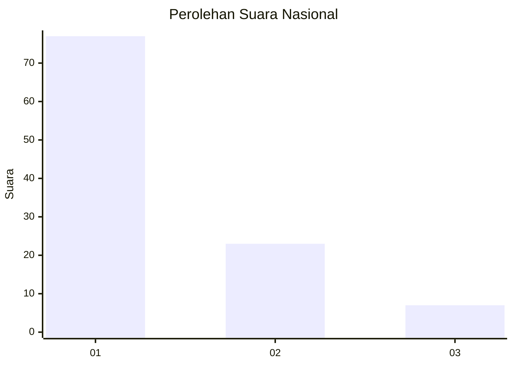
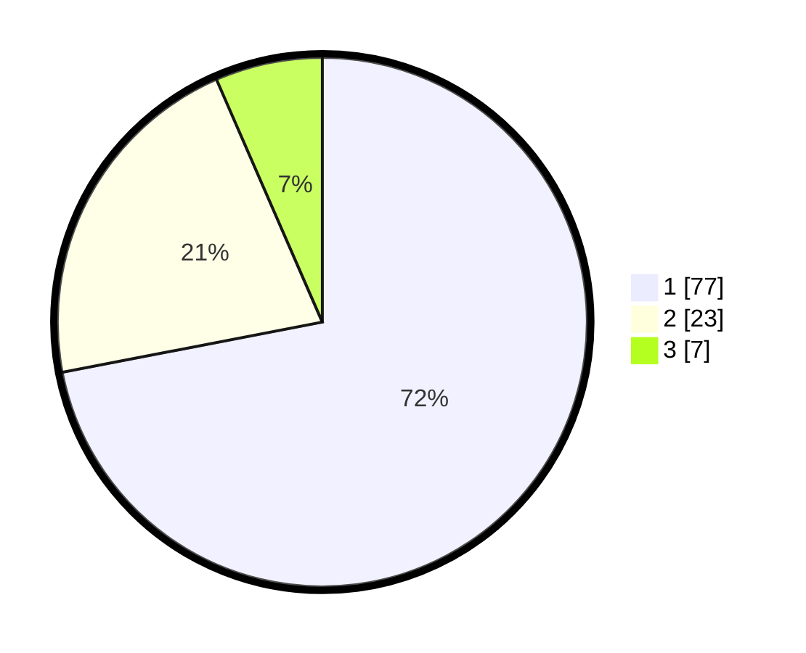

# Hasil

## Grafik

## Tabel

| No. | Nama Paslon    | Suara | Suara (raw) | Persentase |
|:--- |:-------------- | -----:| -----------:| ----------:|
| 1   | ANIES MUHAIMIN | 77    | [77][p-1]   | 71,96      |
| 2   | PRABOWO GIBRAN | 23    | [23][p-2]   | 21,50      |
| 3   | GANJAR MAHFUD  | 7     | [7][p-3]    | 6,54       |

[p-1]: https://github.com/gigit-pemilu/pemilu-2024/blob/main/pilpres/hitung-suara/sub/11-aceh/sub/04-aceh-tengah/sub/08-bintang/sub/2003-bamil-nosar/sub/001-tps/sub/paslon-1.txt
[p-2]: https://github.com/gigit-pemilu/pemilu-2024/blob/main/pilpres/hitung-suara/sub/11-aceh/sub/04-aceh-tengah/sub/08-bintang/sub/2003-bamil-nosar/sub/001-tps/sub/paslon-2.txt
[p-3]: https://github.com/gigit-pemilu/pemilu-2024/blob/main/pilpres/hitung-suara/sub/11-aceh/sub/04-aceh-tengah/sub/08-bintang/sub/2003-bamil-nosar/sub/001-tps/sub/paslon-3.txt

## Foto C Plano

https://sirekap-obj-formc.kpu.go.id/2514/pemilu/ppwp/11/04/08/20/03/1104082003001-20240221-172605--3c192896-0dcb-4f50-99dd-0cd5fab96267.jpg

https://sirekap-obj-formc.kpu.go.id/2514/pemilu/ppwp/11/04/08/20/03/1104082003001-20240221-172607--11bbb044-87c1-4216-aa16-efbe729c64fa.jpg

https://sirekap-obj-formc.kpu.go.id/2514/pemilu/ppwp/11/04/08/20/03/1104082003001-20240221-172606--c0f5af40-b158-4918-a42e-a7dafe7dcc8d.jpg

## Metadata

| Key        | Value               |
| ---------- | ------------------- |
| Time Stamp | 2024-02-24 22:31:28 |

## DATA PEMILIH TETAP

Jumlah pemilih dalam DPT: **116**.
 * L: **62**.
 * P: **54**.

## DATA PENGGUNA HAK PILIH

Jumlah pengguna hak pilih dalam DPT: **108**.
 * L: **59**.
 * P: **49**.

Jumlah pengguna hak pilih dalam DPTb: **3**.
 * L: **1**.
 * P: **2**.

Jumlah pengguna hak pilih dalam DPK: **0**.
 * L: **0**.
 * P: **0**.

Jumlah pengguna hak pilih: **111**.
 * L: **60**.
 * P: **51**.

## JUMLAH SUARA SAH DAN TIDAK SAH

JUMLAH SELURUH SUARA SAH: **107**.

JUMLAH SUARA TIDAK SAH: **4**.

JUMLAH SELURUH SUARA SAH DAN SUARA TIDAK SAH: **111**.

