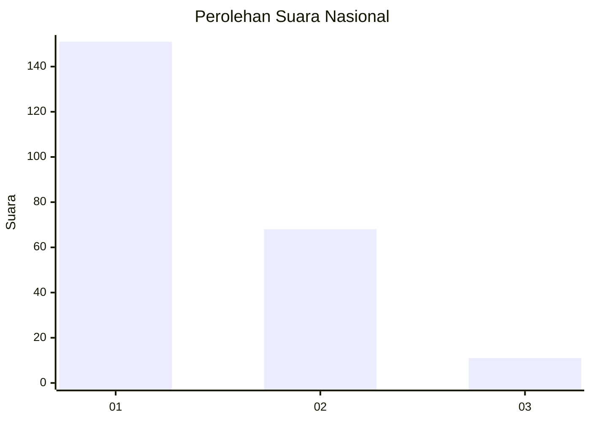
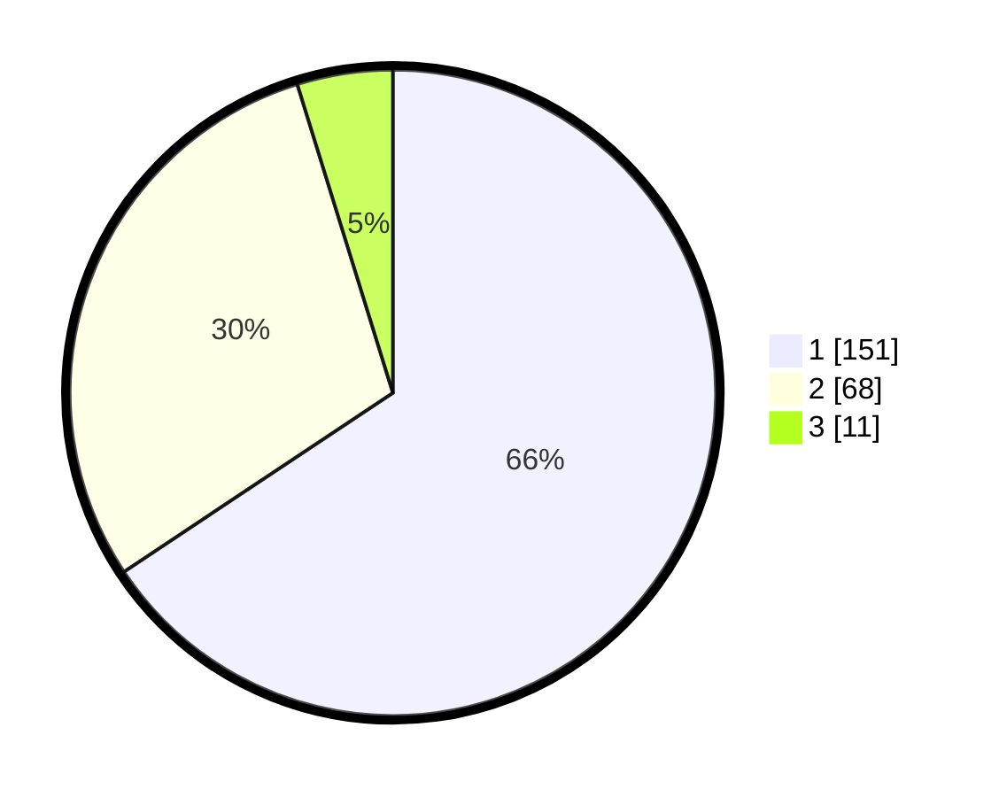

# Hasil

## Grafik

## Tabel

| No. | Nama Paslon    | Suara | Suara (raw) | Persentase |
|:--- |:-------------- | -----:| -----------:| ----------:|
| 1   | ANIES MUHAIMIN | 151   | [151][p-1]  | 65,65      |
| 2   | PRABOWO GIBRAN | 68    | [68][p-2]   | 29,57      |
| 3   | GANJAR MAHFUD  | 11    | [11][p-3]   | 4,78       |

[p-1]: https://github.com/gigit-pemilu/pemilu-2024/blob/main/pilpres/hitung-suara/sub/11-aceh/sub/04-aceh-tengah/sub/08-bintang/sub/2004-bewang/sub/001-tps/sub/paslon-1.txt
[p-2]: https://github.com/gigit-pemilu/pemilu-2024/blob/main/pilpres/hitung-suara/sub/11-aceh/sub/04-aceh-tengah/sub/08-bintang/sub/2004-bewang/sub/001-tps/sub/paslon-2.txt
[p-3]: https://github.com/gigit-pemilu/pemilu-2024/blob/main/pilpres/hitung-suara/sub/11-aceh/sub/04-aceh-tengah/sub/08-bintang/sub/2004-bewang/sub/001-tps/sub/paslon-3.txt

## Foto C Plano

https://sirekap-obj-formc.kpu.go.id/7d77/pemilu/ppwp/11/04/08/20/04/1104082004001-20240216-135028--e85d488f-e0d7-486c-82cf-8a09a2809df5.jpg

https://sirekap-obj-formc.kpu.go.id/7d77/pemilu/ppwp/11/04/08/20/04/1104082004001-20240216-135030--33757232-3a21-4662-b70b-47f4e85fc120.jpg

https://sirekap-obj-formc.kpu.go.id/7d77/pemilu/ppwp/11/04/08/20/04/1104082004001-20240216-135029--bd54bd2c-45e9-48e8-8a24-a1800b41f3df.jpg

## Metadata

| Key        | Value               |
| ---------- | ------------------- |
| Time Stamp | 2024-02-16 23:45:47 |

## DATA PEMILIH TETAP

Jumlah pemilih dalam DPT: **247**.
 * L: **130**.
 * P: **117**.

## DATA PENGGUNA HAK PILIH

Jumlah pengguna hak pilih dalam DPT: **227**.
 * L: **118**.
 * P: **109**.

Jumlah pengguna hak pilih dalam DPTb: **5**.
 * L: **1**.
 * P: **4**.

Jumlah pengguna hak pilih dalam DPK: **0**.
 * L: **0**.
 * P: **0**.

Jumlah pengguna hak pilih: **232**.
 * L: **119**.
 * P: **113**.

## JUMLAH SUARA SAH DAN TIDAK SAH

JUMLAH SELURUH SUARA SAH: **230**.

JUMLAH SUARA TIDAK SAH: **2**.

JUMLAH SELURUH SUARA SAH DAN SUARA TIDAK SAH: **232**.

