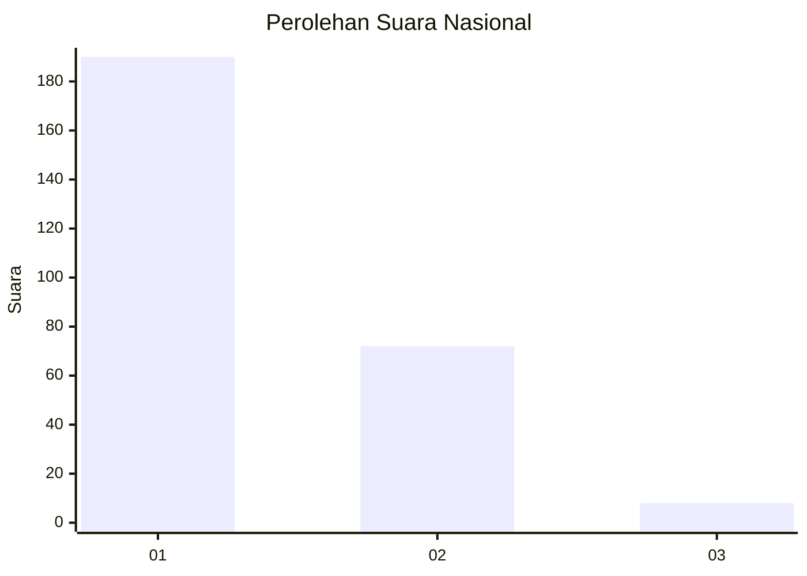
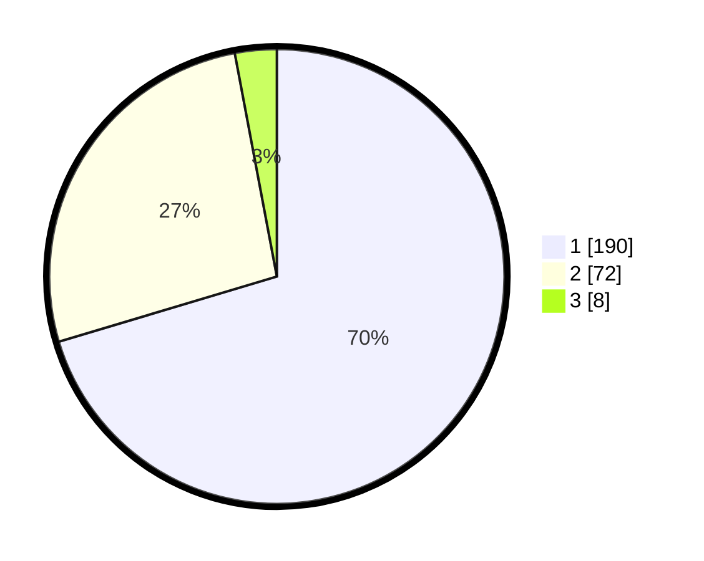

# Hasil

## Grafik

## Tabel

| No. | Nama Paslon    | Suara | Suara (raw) | Persentase |
|:--- |:-------------- | -----:| -----------:| ----------:|
| 1   | ANIES MUHAIMIN | 190   | [190][p-1]  | 70,37      |
| 2   | PRABOWO GIBRAN | 72    | [72][p-2]   | 26,67      |
| 3   | GANJAR MAHFUD  | 8     | [8][p-3]    | 2,96       |

[p-1]: https://github.com/gigit-pemilu/pemilu-2024/blob/main/pilpres/hitung-suara/sub/11-aceh/sub/04-aceh-tengah/sub/08-bintang/sub/2005-dedamar/sub/002-tps/sub/paslon-1.txt
[p-2]: https://github.com/gigit-pemilu/pemilu-2024/blob/main/pilpres/hitung-suara/sub/11-aceh/sub/04-aceh-tengah/sub/08-bintang/sub/2005-dedamar/sub/002-tps/sub/paslon-2.txt
[p-3]: https://github.com/gigit-pemilu/pemilu-2024/blob/main/pilpres/hitung-suara/sub/11-aceh/sub/04-aceh-tengah/sub/08-bintang/sub/2005-dedamar/sub/002-tps/sub/paslon-3.txt

## Foto C Plano

https://sirekap-obj-formc.kpu.go.id/2169/pemilu/ppwp/11/04/08/20/05/1104082005002-20240216-143430--6ea3fd5e-7dbf-4164-bd22-c2fc6be59396.jpg

https://sirekap-obj-formc.kpu.go.id/2169/pemilu/ppwp/11/04/08/20/05/1104082005002-20240216-143431--28007774-8e8b-4fe0-8023-b0ce70363f8c.jpg

https://sirekap-obj-formc.kpu.go.id/2169/pemilu/ppwp/11/04/08/20/05/1104082005002-20240216-143431--e422db0e-62e2-4416-9259-cdf731733d99.jpg

## Metadata

| Key        | Value               |
| ---------- | ------------------- |
| Time Stamp | 2024-02-16 23:45:47 |

## DATA PEMILIH TETAP

Jumlah pemilih dalam DPT: **298**.
 * L: **148**.
 * P: **150**.

## DATA PENGGUNA HAK PILIH

Jumlah pengguna hak pilih dalam DPT: **272**.
 * L: **136**.
 * P: **136**.

Jumlah pengguna hak pilih dalam DPTb: **1**.
 * L: **0**.
 * P: **1**.

Jumlah pengguna hak pilih dalam DPK: **4**.
 * L: **0**.
 * P: **4**.

Jumlah pengguna hak pilih: **277**.
 * L: **136**.
 * P: **141**.

## JUMLAH SUARA SAH DAN TIDAK SAH

JUMLAH SELURUH SUARA SAH: **270**.

JUMLAH SUARA TIDAK SAH: **7**.

JUMLAH SELURUH SUARA SAH DAN SUARA TIDAK SAH: **277**.

