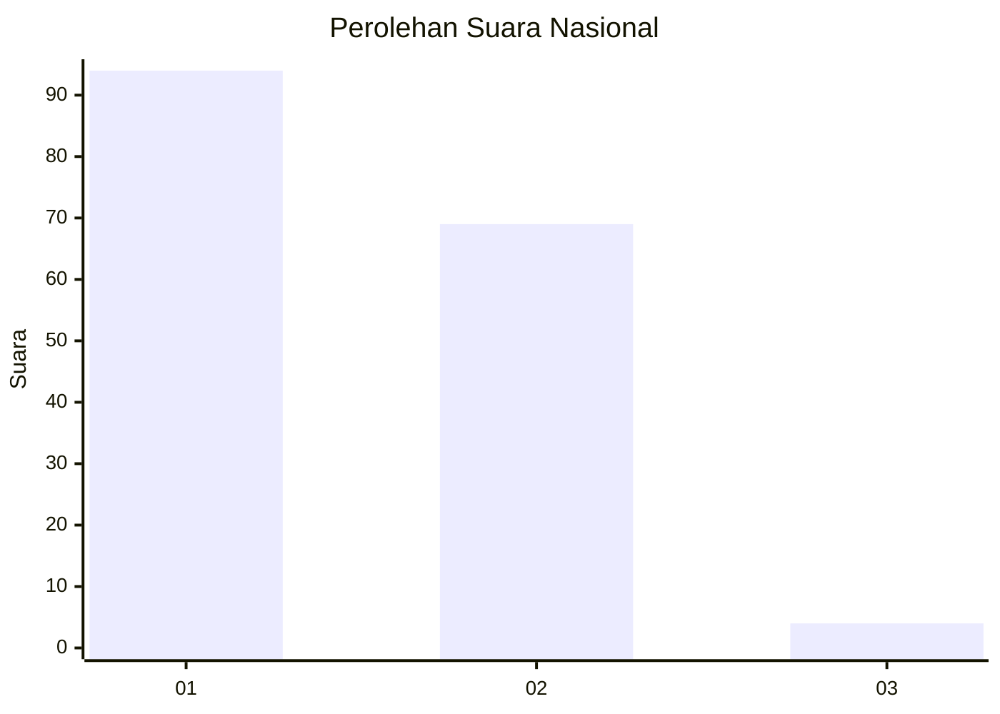
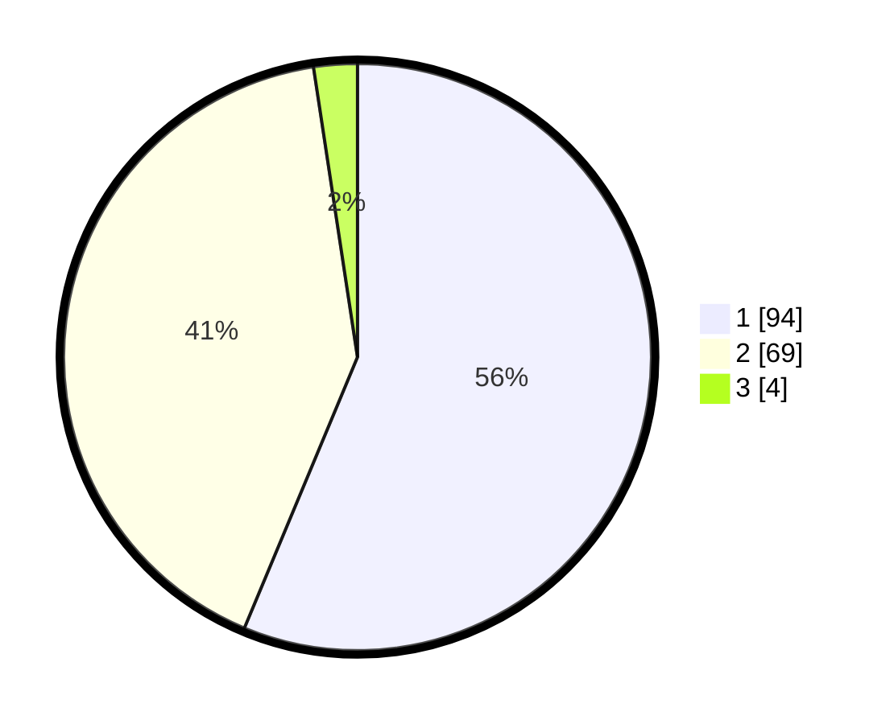

# Hasil

## Grafik

## Tabel

| No. | Nama Paslon    | Suara | Suara (raw) | Persentase |
|:--- |:-------------- | -----:| -----------:| ----------:|
| 1   | ANIES MUHAIMIN | 94    | [94][p-1]   | 56,29      |
| 2   | PRABOWO GIBRAN | 69    | [69][p-2]   | 41,32      |
| 3   | GANJAR MAHFUD  | 4     | [4][p-3]    | 2,40       |

[p-1]: https://github.com/gigit-pemilu/pemilu-2024/blob/main/pilpres/hitung-suara/sub/11-aceh/sub/04-aceh-tengah/sub/08-bintang/sub/2006-genuren/sub/001-tps/sub/paslon-1.txt
[p-2]: https://github.com/gigit-pemilu/pemilu-2024/blob/main/pilpres/hitung-suara/sub/11-aceh/sub/04-aceh-tengah/sub/08-bintang/sub/2006-genuren/sub/001-tps/sub/paslon-2.txt
[p-3]: https://github.com/gigit-pemilu/pemilu-2024/blob/main/pilpres/hitung-suara/sub/11-aceh/sub/04-aceh-tengah/sub/08-bintang/sub/2006-genuren/sub/001-tps/sub/paslon-3.txt

## Foto C Plano

https://sirekap-obj-formc.kpu.go.id/8455/pemilu/ppwp/11/04/08/20/06/1104082006001-20240216-131746--37babc8d-b8a5-415b-86f9-6518fca6ea12.jpg

https://sirekap-obj-formc.kpu.go.id/8455/pemilu/ppwp/11/04/08/20/06/1104082006001-20240216-131747--ac768fdf-e11c-4f5c-b8a9-8446730ecf35.jpg

https://sirekap-obj-formc.kpu.go.id/8455/pemilu/ppwp/11/04/08/20/06/1104082006001-20240216-131747--07049d50-6d70-4833-ac0f-dac4d7329fef.jpg

## Metadata

| Key        | Value               |
| ---------- | ------------------- |
| Time Stamp | 2024-02-17 11:00:02 |

## DATA PEMILIH TETAP

Jumlah pemilih dalam DPT: **176**.
 * L: **85**.
 * P: **91**.

## DATA PENGGUNA HAK PILIH

Jumlah pengguna hak pilih dalam DPT: **159**.
 * L: **76**.
 * P: **83**.

Jumlah pengguna hak pilih dalam DPTb: **2**.
 * L: **1**.
 * P: **1**.

Jumlah pengguna hak pilih dalam DPK: **6**.
 * L: **2**.
 * P: **4**.

Jumlah pengguna hak pilih: **167**.
 * L: **79**.
 * P: **88**.

## JUMLAH SUARA SAH DAN TIDAK SAH

JUMLAH SELURUH SUARA SAH: **167**.

JUMLAH SUARA TIDAK SAH: **0**.

JUMLAH SELURUH SUARA SAH DAN SUARA TIDAK SAH: **167**.

