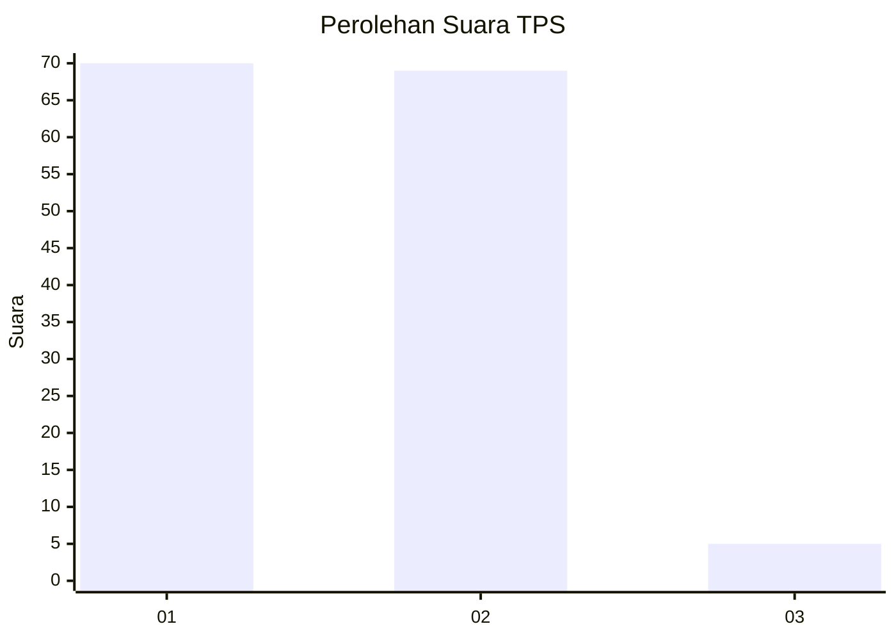
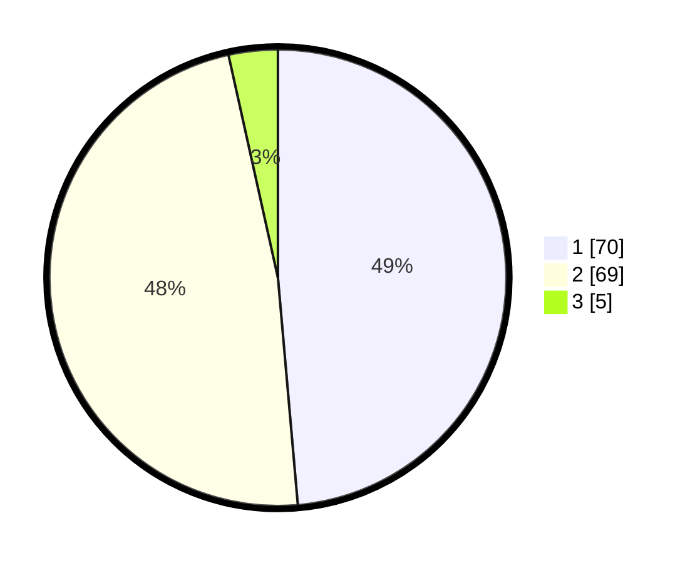

# Hasil

## Grafik

## Tabel

| No. | Nama Paslon    | Suara | Suara (raw) | Persentase |
|:--- |:-------------- | -----:| -----------:| ----------:|
| 1   | ANIES MUHAIMIN | 70    | [70][p-1]   | 48,61      |
| 2   | PRABOWO GIBRAN | 69    | [69][p-2]   | 47,92      |
| 3   | GANJAR MAHFUD  | 5     | [5][p-3]    | 3,47       |

[p-1]: https://github.com/gigit-pemilu/pemilu-2024-11-aceh/blob/main/pilpres/hitung-suara/sub/11-aceh/sub/04-aceh-tengah/sub/08-bintang/sub/2009-kejurun-syiah-utama/sub/001-tps/sub/paslon-1.txt
[p-2]: https://github.com/gigit-pemilu/pemilu-2024-11-aceh/blob/main/pilpres/hitung-suara/sub/11-aceh/sub/04-aceh-tengah/sub/08-bintang/sub/2009-kejurun-syiah-utama/sub/001-tps/sub/paslon-2.txt
[p-3]: https://github.com/gigit-pemilu/pemilu-2024-11-aceh/blob/main/pilpres/hitung-suara/sub/11-aceh/sub/04-aceh-tengah/sub/08-bintang/sub/2009-kejurun-syiah-utama/sub/001-tps/sub/paslon-3.txt

## Foto C Plano

https://sirekap-obj-formc.kpu.go.id/7b0c/pemilu/ppwp/11/04/08/20/09/1104082009001-20240216-062409--10815fe7-0cd1-412a-8079-3ecff433ad11.jpg

https://sirekap-obj-formc.kpu.go.id/7b0c/pemilu/ppwp/11/04/08/20/09/1104082009001-20240216-063531--ed26f8ef-04af-4d68-a4d5-b4ed0e55cca2.jpg

https://sirekap-obj-formc.kpu.go.id/7b0c/pemilu/ppwp/11/04/08/20/09/1104082009001-20240216-062414--a557b053-76be-4324-9a51-95c0eb5f34c1.jpg

## Metadata

| Key        | Value               |
| ---------- | ------------------- |
| Time Stamp | 2024-02-17 11:00:02 |

## DATA PEMILIH TETAP

Jumlah pemilih dalam DPT: **152**.
 * L: **79**.
 * P: **73**.

## DATA PENGGUNA HAK PILIH

Jumlah pengguna hak pilih dalam DPT: **143**.
 * L: **78**.
 * P: **65**.

Jumlah pengguna hak pilih dalam DPTb: **8**.
 * L: **4**.
 * P: **4**.

Jumlah pengguna hak pilih dalam DPK: **0**.
 * L: **0**.
 * P: **0**.

Jumlah pengguna hak pilih: **151**.
 * L: **82**.
 * P: **69**.

## JUMLAH SUARA SAH DAN TIDAK SAH

JUMLAH SELURUH SUARA SAH: **144**.

JUMLAH SUARA TIDAK SAH: **7**.

JUMLAH SELURUH SUARA SAH DAN SUARA TIDAK SAH: **151**.

