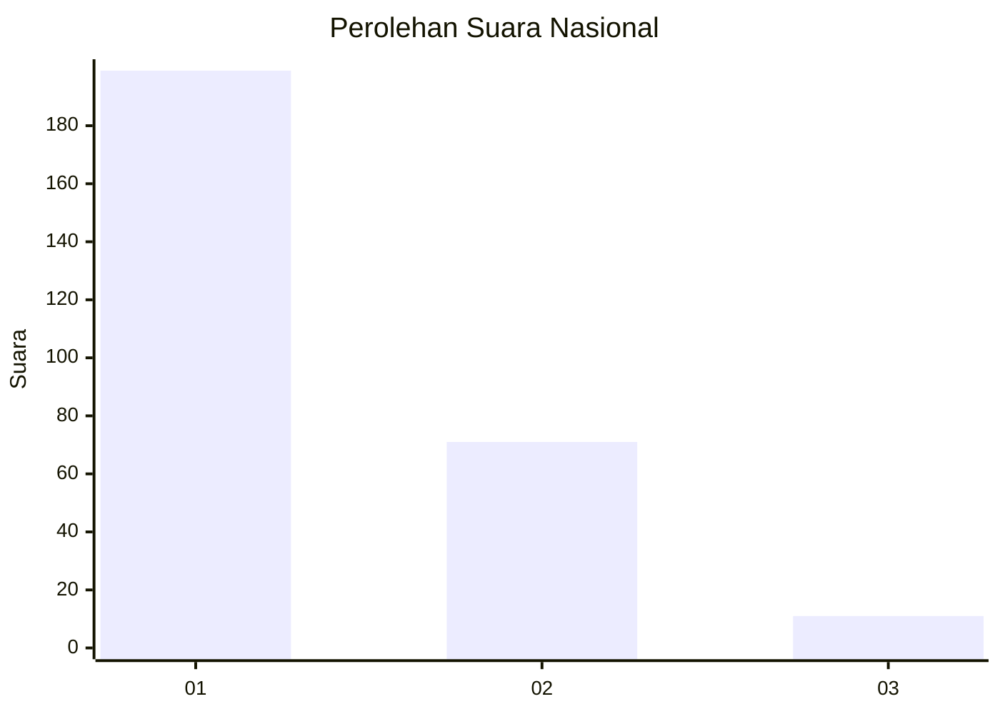
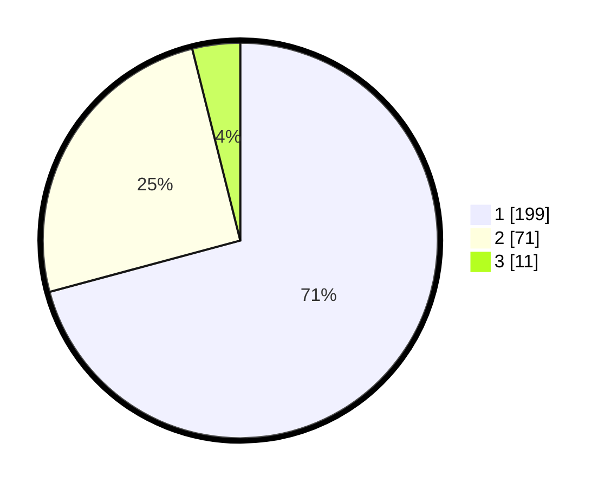

# Hasil

## Grafik

## Tabel

| No. | Nama Paslon    | Suara | Suara (raw) | Persentase |
|:--- |:-------------- | -----:| -----------:| ----------:|
| 1   | ANIES MUHAIMIN | 199   | [199][p-1]  | 70,82      |
| 2   | PRABOWO GIBRAN | 71    | [71][p-2]   | 25,27      |
| 3   | GANJAR MAHFUD  | 11    | [11][p-3]   | 3,91       |

[p-1]: https://github.com/gigit-pemilu/pemilu-2024/blob/main/pilpres/hitung-suara/sub/11-aceh/sub/04-aceh-tengah/sub/08-bintang/sub/2014-linung-bulen-ii/sub/002-tps/sub/paslon-1.txt
[p-2]: https://github.com/gigit-pemilu/pemilu-2024/blob/main/pilpres/hitung-suara/sub/11-aceh/sub/04-aceh-tengah/sub/08-bintang/sub/2014-linung-bulen-ii/sub/002-tps/sub/paslon-2.txt
[p-3]: https://github.com/gigit-pemilu/pemilu-2024/blob/main/pilpres/hitung-suara/sub/11-aceh/sub/04-aceh-tengah/sub/08-bintang/sub/2014-linung-bulen-ii/sub/002-tps/sub/paslon-3.txt

## Foto C Plano

https://sirekap-obj-formc.kpu.go.id/4a4d/pemilu/ppwp/11/04/08/20/14/1104082014002-20240221-170727--5c31c200-c9ad-420e-85cd-4bf0d48315b3.jpg

https://sirekap-obj-formc.kpu.go.id/4a4d/pemilu/ppwp/11/04/08/20/14/1104082014002-20240221-170729--fcd5560c-a954-453f-9687-ab9192fa010d.jpg

https://sirekap-obj-formc.kpu.go.id/4a4d/pemilu/ppwp/11/04/08/20/14/1104082014002-20240221-170728--879fccd7-06f7-4cca-b2e1-80ca5dd89c1c.jpg

## Metadata

| Key        | Value               |
| ---------- | ------------------- |
| Time Stamp | 2024-02-24 22:31:28 |

## DATA PEMILIH TETAP

Jumlah pemilih dalam DPT: **280**.
 * L: **143**.
 * P: **137**.

## DATA PENGGUNA HAK PILIH

Jumlah pengguna hak pilih dalam DPT: **277**.
 * L: **141**.
 * P: **136**.

Jumlah pengguna hak pilih dalam DPTb: **4**.
 * L: **2**.
 * P: **2**.

Jumlah pengguna hak pilih dalam DPK: **2**.
 * L: **1**.
 * P: **1**.

Jumlah pengguna hak pilih: **283**.
 * L: **144**.
 * P: **139**.

## JUMLAH SUARA SAH DAN TIDAK SAH

JUMLAH SELURUH SUARA SAH: **281**.

JUMLAH SUARA TIDAK SAH: **2**.

JUMLAH SELURUH SUARA SAH DAN SUARA TIDAK SAH: **283**.

