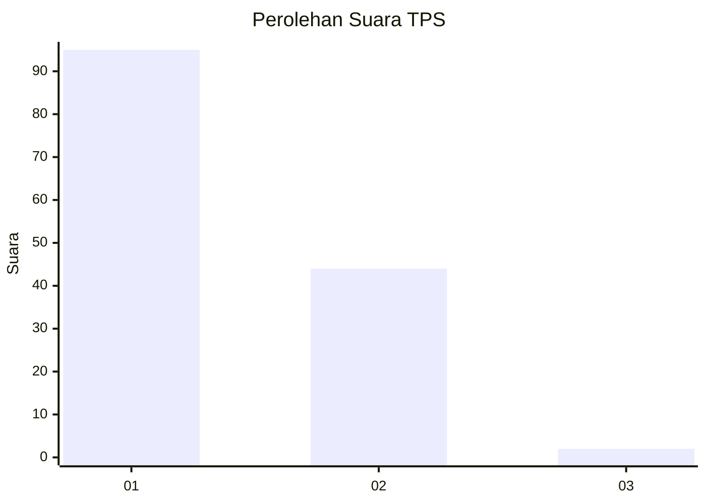
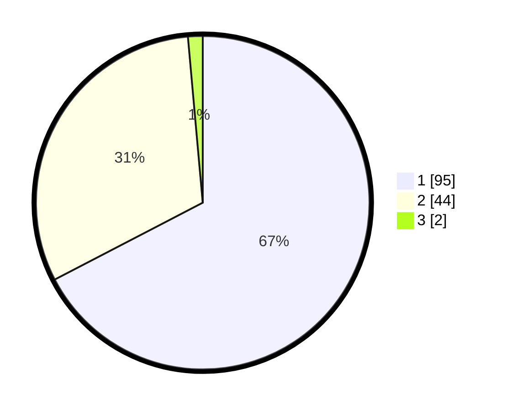

# Hasil

## Grafik

## Tabel

| No. | Nama Paslon    | Suara | Suara (raw) | Persentase |
|:--- |:-------------- | -----:| -----------:| ----------:|
| 1   | ANIES MUHAIMIN | 95    | [95][p-1]   | 67,38      |
| 2   | PRABOWO GIBRAN | 44    | [44][p-2]   | 31,21      |
| 3   | GANJAR MAHFUD  | 2     | [2][p-3]    | 1,42       |

[p-1]: https://github.com/gigit-pemilu/pemilu-2024-11-aceh/blob/main/pilpres/hitung-suara/sub/11-aceh/sub/04-aceh-tengah/sub/08-bintang/sub/2024-gele-pulo/sub/001-tps/sub/paslon-1.txt
[p-2]: https://github.com/gigit-pemilu/pemilu-2024-11-aceh/blob/main/pilpres/hitung-suara/sub/11-aceh/sub/04-aceh-tengah/sub/08-bintang/sub/2024-gele-pulo/sub/001-tps/sub/paslon-2.txt
[p-3]: https://github.com/gigit-pemilu/pemilu-2024-11-aceh/blob/main/pilpres/hitung-suara/sub/11-aceh/sub/04-aceh-tengah/sub/08-bintang/sub/2024-gele-pulo/sub/001-tps/sub/paslon-3.txt

## Foto C Plano

https://sirekap-obj-formc.kpu.go.id/fc59/pemilu/ppwp/11/04/08/20/24/1104082024001-20240217-181254--52e9c7d2-e65a-4b36-9849-baa690740917.jpg

https://sirekap-obj-formc.kpu.go.id/fc59/pemilu/ppwp/11/04/08/20/24/1104082024001-20240217-181255--bf88de7a-ec4b-417f-a64c-24f676667638.jpg

https://sirekap-obj-formc.kpu.go.id/fc59/pemilu/ppwp/11/04/08/20/24/1104082024001-20240217-181254--e9af17f6-7929-47dc-a101-4d216ee5b7a5.jpg

## Metadata

| Key        | Value               |
| ---------- | ------------------- |
| Time Stamp | 2024-02-22 13:00:00 |

