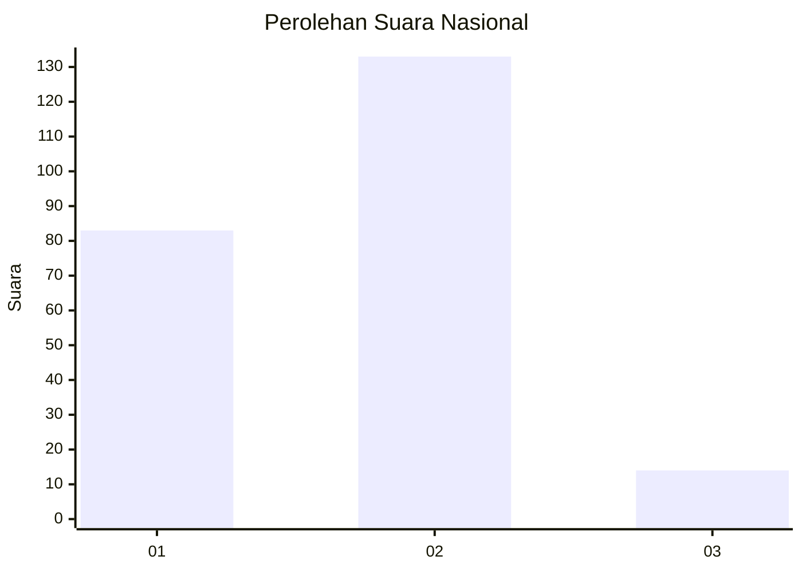
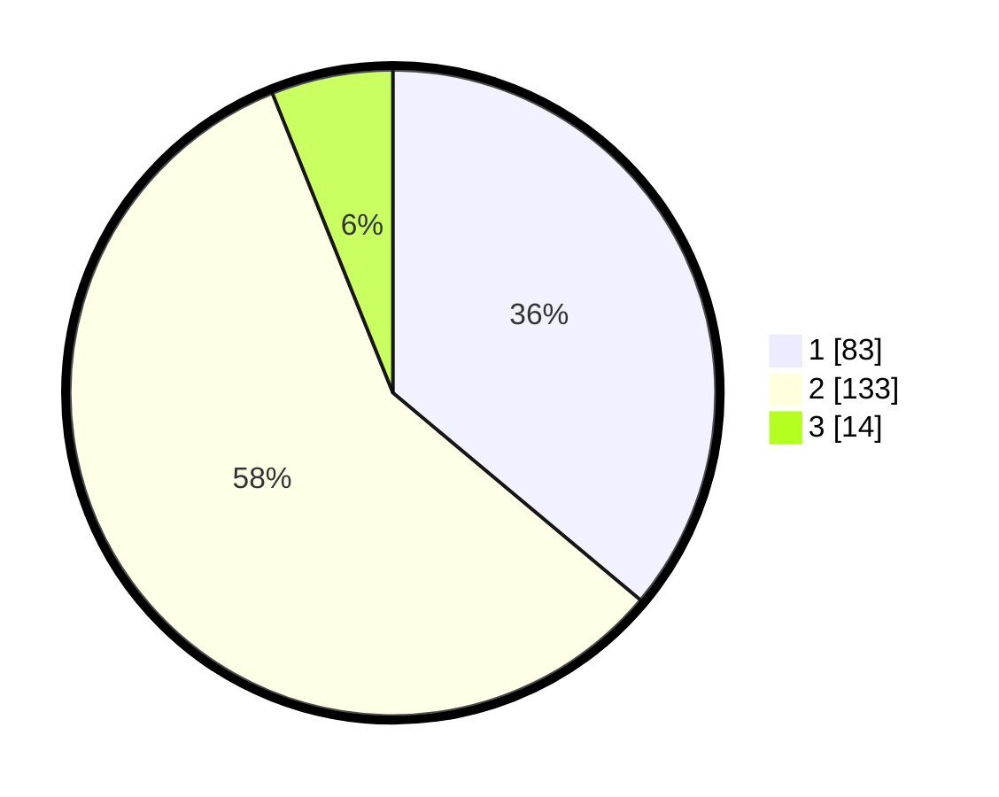

# Hasil

## Grafik

## Tabel

| No. | Nama Paslon    | Suara | Suara (raw) | Persentase |
|:--- |:-------------- | -----:| -----------:| ----------:|
| 1   | ANIES MUHAIMIN | 83    | [83][p-1]   | 36,09      |
| 2   | PRABOWO GIBRAN | 133   | [133][p-2]  | 57,83      |
| 3   | GANJAR MAHFUD  | 14    | [14][p-3]   | 6,09       |

[p-1]: https://github.com/gigit-pemilu/pemilu-2024/blob/main/pilpres/hitung-suara/sub/11-aceh/sub/04-aceh-tengah/sub/10-ketol/sub/2002-blang-mancung/sub/001-tps/sub/paslon-1.txt
[p-2]: https://github.com/gigit-pemilu/pemilu-2024/blob/main/pilpres/hitung-suara/sub/11-aceh/sub/04-aceh-tengah/sub/10-ketol/sub/2002-blang-mancung/sub/001-tps/sub/paslon-2.txt
[p-3]: https://github.com/gigit-pemilu/pemilu-2024/blob/main/pilpres/hitung-suara/sub/11-aceh/sub/04-aceh-tengah/sub/10-ketol/sub/2002-blang-mancung/sub/001-tps/sub/paslon-3.txt

## Foto C Plano

https://sirekap-obj-formc.kpu.go.id/1df2/pemilu/ppwp/11/04/10/20/02/1104102002001-20240214-194709--240a81f3-9214-4d0b-9fc7-5c7a7d6bb91f.jpg

https://sirekap-obj-formc.kpu.go.id/1df2/pemilu/ppwp/11/04/10/20/02/1104102002001-20240214-220222--844dc0d4-ea5d-4400-9677-0edb4885647e.jpg

## Metadata

| Key        | Value               |
| ---------- | ------------------- |
| Time Stamp | 2024-02-21 22:00:00 |

