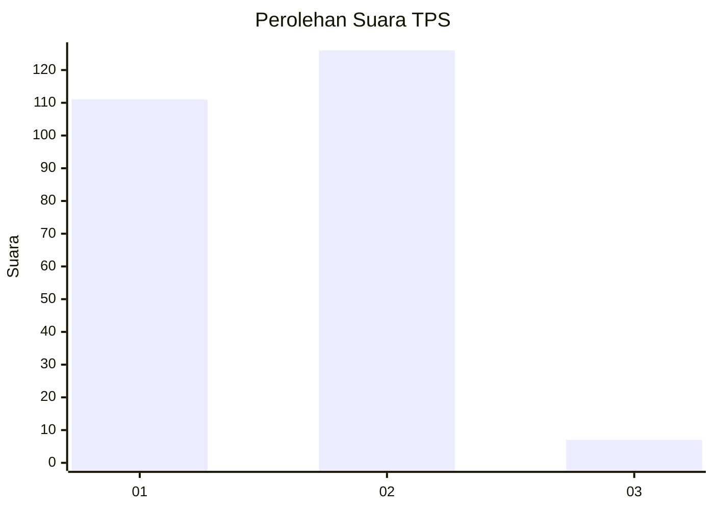
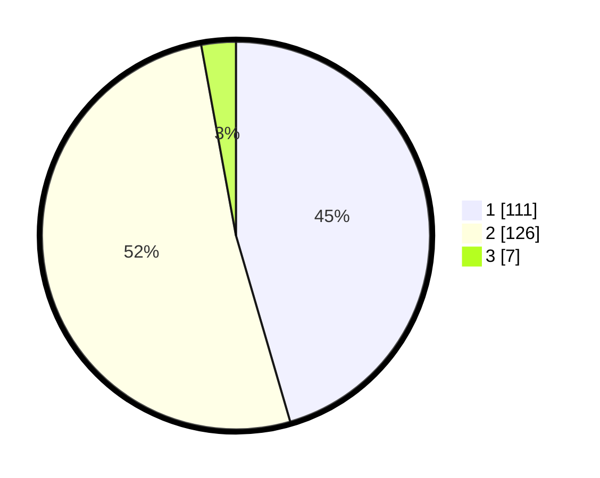

# Hasil

## Grafik

## Tabel

| No. | Nama Paslon    | Suara | Suara (raw) | Persentase |
|:--- |:-------------- | -----:| -----------:| ----------:|
| 1   | ANIES MUHAIMIN | 111   | [111][p-1]  | 45,49      |
| 2   | PRABOWO GIBRAN | 126   | [126][p-2]  | 51,64      |
| 3   | GANJAR MAHFUD  | 7     | [7][p-3]    | 2,87       |

[p-1]: https://github.com/gigit-pemilu/pemilu-2024-11-aceh/blob/main/pilpres/hitung-suara/sub/11-aceh/sub/04-aceh-tengah/sub/10-ketol/sub/2002-blang-mancung/sub/005-tps/sub/paslon-1.txt
[p-2]: https://github.com/gigit-pemilu/pemilu-2024-11-aceh/blob/main/pilpres/hitung-suara/sub/11-aceh/sub/04-aceh-tengah/sub/10-ketol/sub/2002-blang-mancung/sub/005-tps/sub/paslon-2.txt
[p-3]: https://github.com/gigit-pemilu/pemilu-2024-11-aceh/blob/main/pilpres/hitung-suara/sub/11-aceh/sub/04-aceh-tengah/sub/10-ketol/sub/2002-blang-mancung/sub/005-tps/sub/paslon-3.txt

## Foto C Plano

https://sirekap-obj-formc.kpu.go.id/debe/pemilu/ppwp/11/04/10/20/02/1104102002005-20240217-154322--d0859594-64d9-48fb-be29-12210bddfff3.jpg

https://sirekap-obj-formc.kpu.go.id/debe/pemilu/ppwp/11/04/10/20/02/1104102002005-20240214-234706--bbe11ac1-6fbb-4534-aa5b-a52d7c7b8d05.jpg

## Metadata

| Key        | Value               |
| ---------- | ------------------- |
| Time Stamp | 2024-02-17 18:00:00 |

