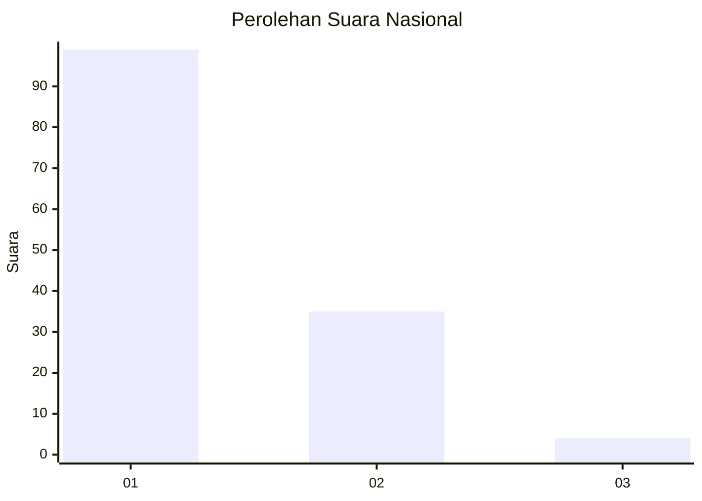
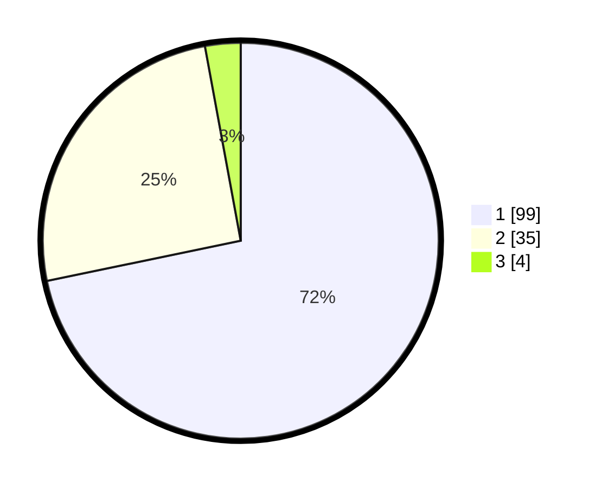

# Hasil

## Grafik

## Tabel

| No. | Nama Paslon    | Suara | Suara (raw) | Persentase |
|:--- |:-------------- | -----:| -----------:| ----------:|
| 1   | ANIES MUHAIMIN | 99    | [99][p-1]   | 71,74      |
| 2   | PRABOWO GIBRAN | 35    | [35][p-2]   | 25,36      |
| 3   | GANJAR MAHFUD  | 4     | [4][p-3]    | 2,90       |

[p-1]: https://github.com/gigit-pemilu/pemilu-2024/blob/main/pilpres/hitung-suara/sub/11-aceh/sub/04-aceh-tengah/sub/10-ketol/sub/2003-bintang-pepara/sub/001-tps/sub/paslon-1.txt
[p-2]: https://github.com/gigit-pemilu/pemilu-2024/blob/main/pilpres/hitung-suara/sub/11-aceh/sub/04-aceh-tengah/sub/10-ketol/sub/2003-bintang-pepara/sub/001-tps/sub/paslon-2.txt
[p-3]: https://github.com/gigit-pemilu/pemilu-2024/blob/main/pilpres/hitung-suara/sub/11-aceh/sub/04-aceh-tengah/sub/10-ketol/sub/2003-bintang-pepara/sub/001-tps/sub/paslon-3.txt

## Foto C Plano

https://sirekap-obj-formc.kpu.go.id/5724/pemilu/ppwp/11/04/10/20/03/1104102003001-20240214-222350--5e8067d4-5cd4-4f9a-b8e7-d256239e55ec.jpg

https://sirekap-obj-formc.kpu.go.id/5724/pemilu/ppwp/11/04/10/20/03/1104102003001-20240215-020945--68984918-aa38-4abd-a9ed-899c4090a5e8.jpg

https://sirekap-obj-formc.kpu.go.id/5724/pemilu/ppwp/11/04/10/20/03/1104102003001-20240215-021207--7869d74f-3ee7-429c-9df8-8d2e81bad2c3.jpg

## Metadata

| Key        | Value               |
| ---------- | ------------------- |
| Time Stamp | 2024-02-16 04:30:27 |

## DATA PEMILIH TETAP

Jumlah pemilih dalam DPT: **163**.
 * L: **83**.
 * P: **80**.

## DATA PENGGUNA HAK PILIH

Jumlah pengguna hak pilih dalam DPT: **140**.
 * L: **76**.
 * P: **64**.

Jumlah pengguna hak pilih dalam DPTb: **2**.
 * L: **1**.
 * P: **1**.

Jumlah pengguna hak pilih dalam DPK: **2**.
 * L: **1**.
 * P: **1**.

Jumlah pengguna hak pilih: **144**.
 * L: **78**.
 * P: **66**.

## JUMLAH SUARA SAH DAN TIDAK SAH

JUMLAH SELURUH SUARA SAH: **138**.

JUMLAH SUARA TIDAK SAH: **6**.

JUMLAH SELURUH SUARA SAH DAN SUARA TIDAK SAH: **144**.

