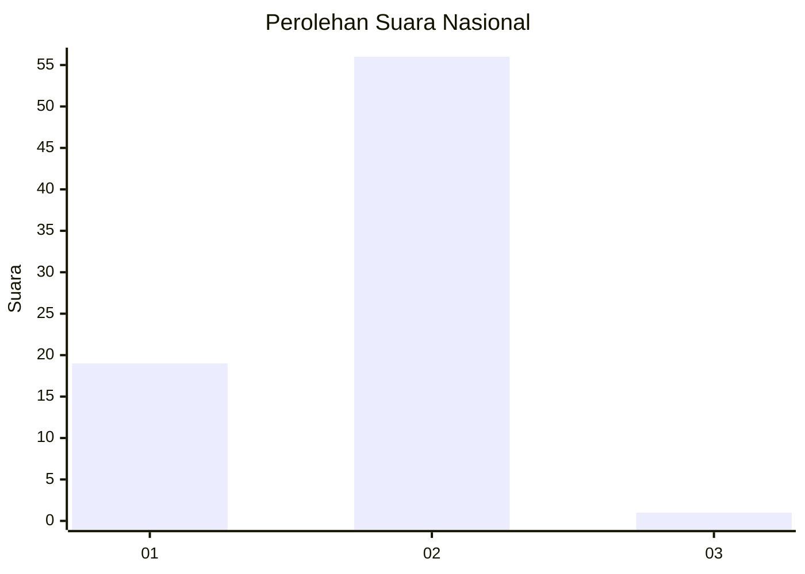
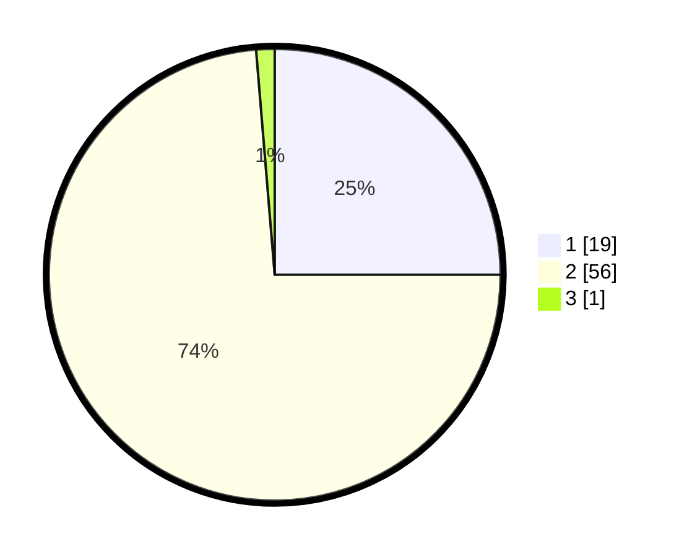

# Hasil

## Grafik

## Tabel

| No. | Nama Paslon    | Suara | Suara (raw) | Persentase |
|:--- |:-------------- | -----:| -----------:| ----------:|
| 1   | ANIES MUHAIMIN | 19    | [19][p-1]   | 25,00      |
| 2   | PRABOWO GIBRAN | 56    | [56][p-2]   | 73,68      |
| 3   | GANJAR MAHFUD  | 1     | [1][p-3]    | 1,32       |

[p-1]: https://github.com/gigit-pemilu/pemilu-2024/blob/main/pilpres/hitung-suara/sub/11-aceh/sub/04-aceh-tengah/sub/10-ketol/sub/2009-kala-ketol/sub/002-tps/sub/paslon-1.txt
[p-2]: https://github.com/gigit-pemilu/pemilu-2024/blob/main/pilpres/hitung-suara/sub/11-aceh/sub/04-aceh-tengah/sub/10-ketol/sub/2009-kala-ketol/sub/002-tps/sub/paslon-2.txt
[p-3]: https://github.com/gigit-pemilu/pemilu-2024/blob/main/pilpres/hitung-suara/sub/11-aceh/sub/04-aceh-tengah/sub/10-ketol/sub/2009-kala-ketol/sub/002-tps/sub/paslon-3.txt

## Foto C Plano

https://sirekap-obj-formc.kpu.go.id/8065/pemilu/ppwp/11/04/10/20/09/1104102009002-20240215-003049--a5a378e6-569c-46f9-8d2a-50f61574d2f3.jpg

https://sirekap-obj-formc.kpu.go.id/8065/pemilu/ppwp/11/04/10/20/09/1104102009002-20240215-003328--4b85957e-47f5-477b-92c1-73ca4b9046fe.jpg

https://sirekap-obj-formc.kpu.go.id/8065/pemilu/ppwp/11/04/10/20/09/1104102009002-20240215-010906--63058cbf-d963-47e1-9daa-2e3ca76435cd.jpg

## Metadata

| Key        | Value               |
| ---------- | ------------------- |
| Time Stamp | 2024-02-15 18:00:26 |

## DATA PEMILIH TETAP

Jumlah pemilih dalam DPT: **86**.
 * L: **46**.
 * P: **40**.

## DATA PENGGUNA HAK PILIH

Jumlah pengguna hak pilih dalam DPT: **76**.
 * L: **39**.
 * P: **37**.

Jumlah pengguna hak pilih dalam DPTb: **1**.
 * L: **1**.
 * P: **0**.

Jumlah pengguna hak pilih dalam DPK: **1**.
 * L: **0**.
 * P: **1**.

Jumlah pengguna hak pilih: **78**.
 * L: **40**.
 * P: **38**.

## JUMLAH SUARA SAH DAN TIDAK SAH

JUMLAH SELURUH SUARA SAH: **76**.

JUMLAH SUARA TIDAK SAH: **2**.

JUMLAH SELURUH SUARA SAH DAN SUARA TIDAK SAH: **78**.

