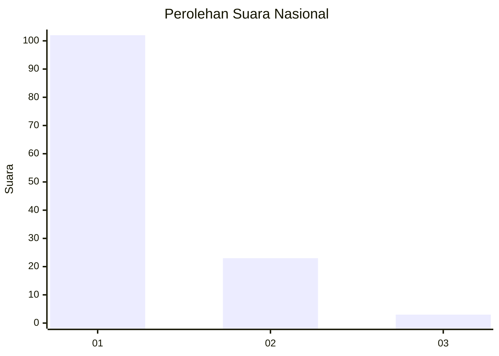
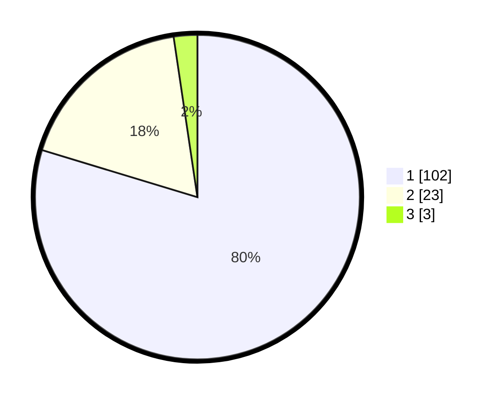

# Hasil

## Grafik

## Tabel

| No. | Nama Paslon    | Suara | Suara (raw) | Persentase |
|:--- |:-------------- | -----:| -----------:| ----------:|
| 1   | ANIES MUHAIMIN | 102   | [102][p-1]  | 79,69      |
| 2   | PRABOWO GIBRAN | 23    | [23][p-2]   | 17,97      |
| 3   | GANJAR MAHFUD  | 3     | [3][p-3]    | 2,34       |

[p-1]: https://github.com/gigit-pemilu/pemilu-2024/blob/main/pilpres/hitung-suara/sub/11-aceh/sub/04-aceh-tengah/sub/10-ketol/sub/2014-pantan-reduk/sub/001-tps/sub/paslon-1.txt
[p-2]: https://github.com/gigit-pemilu/pemilu-2024/blob/main/pilpres/hitung-suara/sub/11-aceh/sub/04-aceh-tengah/sub/10-ketol/sub/2014-pantan-reduk/sub/001-tps/sub/paslon-2.txt
[p-3]: https://github.com/gigit-pemilu/pemilu-2024/blob/main/pilpres/hitung-suara/sub/11-aceh/sub/04-aceh-tengah/sub/10-ketol/sub/2014-pantan-reduk/sub/001-tps/sub/paslon-3.txt

## Foto C Plano

https://sirekap-obj-formc.kpu.go.id/dfad/pemilu/ppwp/11/04/10/20/14/1104102014001-20240216-154607--6435ad80-de79-4771-8939-e52230d7385a.jpg

https://sirekap-obj-formc.kpu.go.id/dfad/pemilu/ppwp/11/04/10/20/14/1104102014001-20240216-154609--7675343c-73b3-4cc2-a324-824d87358864.jpg

https://sirekap-obj-formc.kpu.go.id/dfad/pemilu/ppwp/11/04/10/20/14/1104102014001-20240216-154608--405b87e9-1d2d-4155-8f2d-983ba665b229.jpg

## Metadata

| Key        | Value               |
| ---------- | ------------------- |
| Time Stamp | 2024-02-17 11:30:03 |

## DATA PEMILIH TETAP

Jumlah pemilih dalam DPT: **158**.
 * L: **93**.
 * P: **65**.

## DATA PENGGUNA HAK PILIH

Jumlah pengguna hak pilih dalam DPT: **129**.
 * L: **75**.
 * P: **54**.

Jumlah pengguna hak pilih dalam DPTb: **3**.
 * L: **1**.
 * P: **2**.

Jumlah pengguna hak pilih dalam DPK: **5**.
 * L: **3**.
 * P: **2**.

Jumlah pengguna hak pilih: **137**.
 * L: **79**.
 * P: **58**.

## JUMLAH SUARA SAH DAN TIDAK SAH

JUMLAH SELURUH SUARA SAH: **128**.

JUMLAH SUARA TIDAK SAH: **9**.

JUMLAH SELURUH SUARA SAH DAN SUARA TIDAK SAH: **137**.

