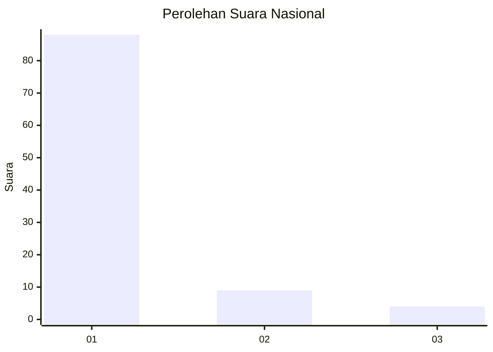
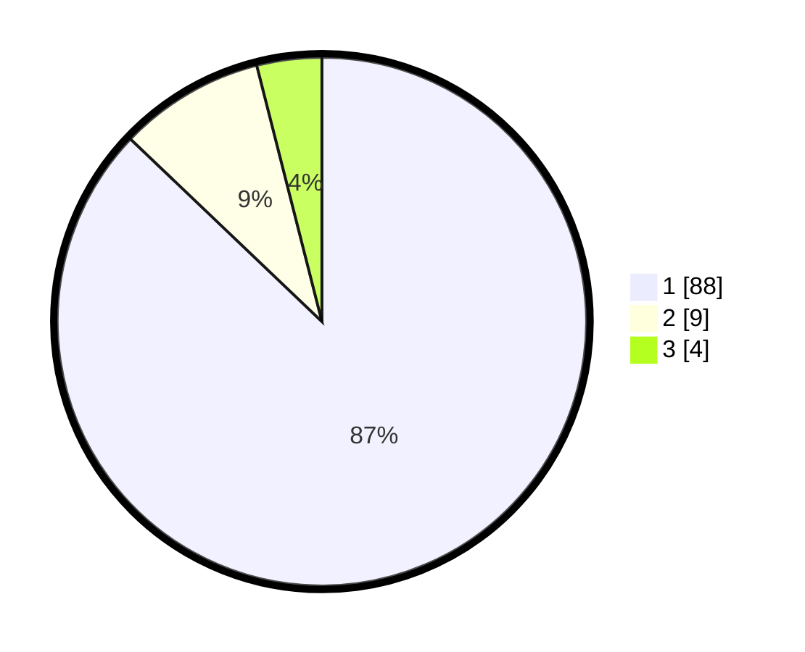

# Hasil

## Grafik

## Tabel

| No. | Nama Paslon    | Suara | Suara (raw) | Persentase |
|:--- |:-------------- | -----:| -----------:| ----------:|
| 1   | ANIES MUHAIMIN | 88    | [88][p-1]   | 87,13      |
| 2   | PRABOWO GIBRAN | 9     | [9][p-2]    | 8,91       |
| 3   | GANJAR MAHFUD  | 4     | [4][p-3]    | 3,96       |

[p-1]: https://github.com/gigit-pemilu/pemilu-2024/blob/main/pilpres/hitung-suara/sub/11-aceh/sub/04-aceh-tengah/sub/10-ketol/sub/2014-pantan-reduk/sub/002-tps/sub/paslon-1.txt
[p-2]: https://github.com/gigit-pemilu/pemilu-2024/blob/main/pilpres/hitung-suara/sub/11-aceh/sub/04-aceh-tengah/sub/10-ketol/sub/2014-pantan-reduk/sub/002-tps/sub/paslon-2.txt
[p-3]: https://github.com/gigit-pemilu/pemilu-2024/blob/main/pilpres/hitung-suara/sub/11-aceh/sub/04-aceh-tengah/sub/10-ketol/sub/2014-pantan-reduk/sub/002-tps/sub/paslon-3.txt

## Foto C Plano

https://sirekap-obj-formc.kpu.go.id/02b2/pemilu/ppwp/11/04/10/20/14/1104102014002-20240216-144546--54b64031-bb59-4837-aa52-15fd54101b63.jpg

https://sirekap-obj-formc.kpu.go.id/02b2/pemilu/ppwp/11/04/10/20/14/1104102014002-20240216-144547--4c6cd8af-e835-4fd6-abe8-01a036c1bc9a.jpg

https://sirekap-obj-formc.kpu.go.id/02b2/pemilu/ppwp/11/04/10/20/14/1104102014002-20240216-144546--a18570f1-5e48-45a0-874a-4f76fd58d718.jpg

## Metadata

| Key        | Value               |
| ---------- | ------------------- |
| Time Stamp | 2024-02-17 11:00:02 |

## DATA PEMILIH TETAP

Jumlah pemilih dalam DPT: **138**.
 * L: **81**.
 * P: **57**.

## DATA PENGGUNA HAK PILIH

Jumlah pengguna hak pilih dalam DPT: **105**.
 * L: **57**.
 * P: **48**.

Jumlah pengguna hak pilih dalam DPTb: **0**.
 * L: **0**.
 * P: **0**.

Jumlah pengguna hak pilih dalam DPK: **4**.
 * L: **3**.
 * P: **1**.

Jumlah pengguna hak pilih: **109**.
 * L: **60**.
 * P: **49**.

## JUMLAH SUARA SAH DAN TIDAK SAH

JUMLAH SELURUH SUARA SAH: **101**.

JUMLAH SUARA TIDAK SAH: **8**.

JUMLAH SELURUH SUARA SAH DAN SUARA TIDAK SAH: **109**.

