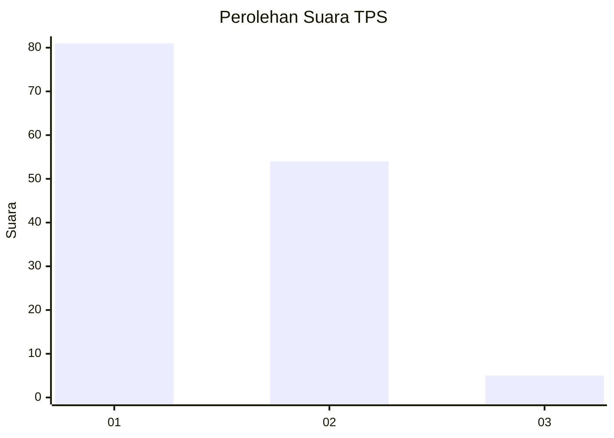
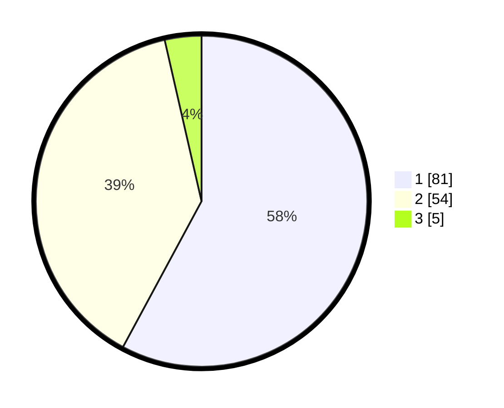

# Hasil

## Grafik

## Tabel

| No. | Nama Paslon    | Suara | Suara (raw) | Persentase |
|:--- |:-------------- | -----:| -----------:| ----------:|
| 1   | ANIES MUHAIMIN | 81    | [81][p-1]   | 57,86      |
| 2   | PRABOWO GIBRAN | 54    | [54][p-2]   | 38,57      |
| 3   | GANJAR MAHFUD  | 5     | [5][p-3]    | 3,57       |

[p-1]: https://github.com/gigit-pemilu/pemilu-2024-11-aceh/blob/main/pilpres/hitung-suara/sub/11-aceh/sub/04-aceh-tengah/sub/11-kebayakan/sub/2001-bukit-sama/sub/001-tps/sub/paslon-1.txt
[p-2]: https://github.com/gigit-pemilu/pemilu-2024-11-aceh/blob/main/pilpres/hitung-suara/sub/11-aceh/sub/04-aceh-tengah/sub/11-kebayakan/sub/2001-bukit-sama/sub/001-tps/sub/paslon-2.txt
[p-3]: https://github.com/gigit-pemilu/pemilu-2024-11-aceh/blob/main/pilpres/hitung-suara/sub/11-aceh/sub/04-aceh-tengah/sub/11-kebayakan/sub/2001-bukit-sama/sub/001-tps/sub/paslon-3.txt

## Foto C Plano

https://sirekap-obj-formc.kpu.go.id/7210/pemilu/ppwp/11/04/11/20/01/1104112001001-20240216-145923--97b3f870-dc8b-4e64-9876-9cfb7479eef0.jpg

https://sirekap-obj-formc.kpu.go.id/7210/pemilu/ppwp/11/04/11/20/01/1104112001001-20240216-145924--3e385fd8-06b0-4d4b-bda8-e10370541eed.jpg

https://sirekap-obj-formc.kpu.go.id/7210/pemilu/ppwp/11/04/11/20/01/1104112001001-20240216-145923--4e2218f4-5404-4e20-b5ed-beb0dff22c96.jpg

## Metadata

| Key        | Value               |
| ---------- | ------------------- |
| Time Stamp | 2024-02-16 17:30:00 |

## DATA PEMILIH TETAP

Jumlah pemilih dalam DPT: **154**.
 * L: **78**.
 * P: **76**.

## DATA PENGGUNA HAK PILIH

Jumlah pengguna hak pilih dalam DPT: **137**.
 * L: **68**.
 * P: **69**.

Jumlah pengguna hak pilih dalam DPTb: **4**.
 * L: **1**.
 * P: **3**.

Jumlah pengguna hak pilih dalam DPK: **0**.
 * L: **0**.
 * P: **0**.

Jumlah pengguna hak pilih: **141**.
 * L: **69**.
 * P: **72**.

## JUMLAH SUARA SAH DAN TIDAK SAH

JUMLAH SELURUH SUARA SAH: **140**.

JUMLAH SUARA TIDAK SAH: **1**.

JUMLAH SELURUH SUARA SAH DAN SUARA TIDAK SAH: **141**.

