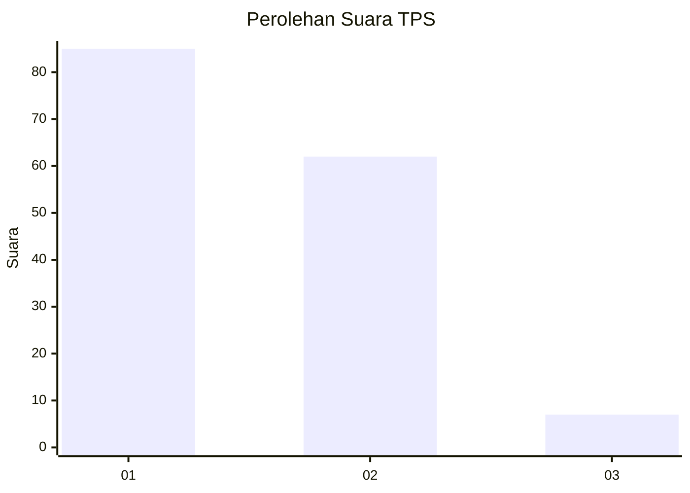
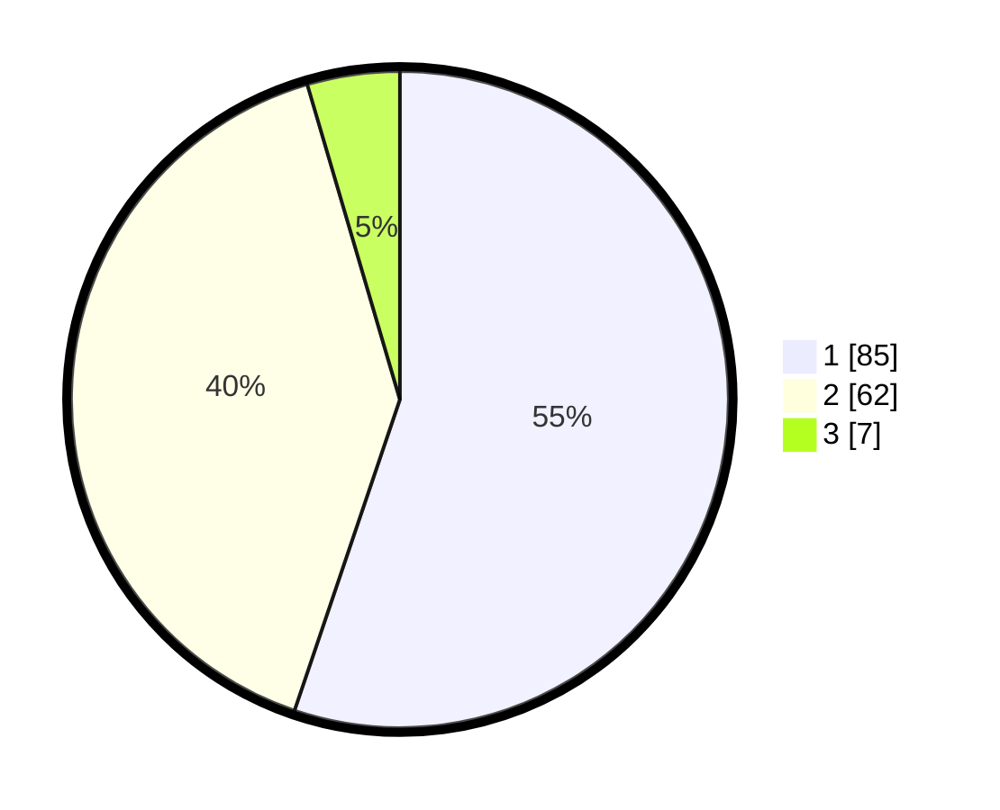

# Hasil

## Grafik

## Tabel

| No. | Nama Paslon    | Suara | Suara (raw) | Persentase |
|:--- |:-------------- | -----:| -----------:| ----------:|
| 1   | ANIES MUHAIMIN | 85    | [85][p-1]   | 55,19      |
| 2   | PRABOWO GIBRAN | 62    | [62][p-2]   | 40,26      |
| 3   | GANJAR MAHFUD  | 7     | [7][p-3]    | 4,55       |

[p-1]: https://github.com/gigit-pemilu/pemilu-2024-11-aceh/blob/main/pilpres/hitung-suara/sub/11-aceh/sub/04-aceh-tengah/sub/11-kebayakan/sub/2001-bukit-sama/sub/002-tps/sub/paslon-1.txt
[p-2]: https://github.com/gigit-pemilu/pemilu-2024-11-aceh/blob/main/pilpres/hitung-suara/sub/11-aceh/sub/04-aceh-tengah/sub/11-kebayakan/sub/2001-bukit-sama/sub/002-tps/sub/paslon-2.txt
[p-3]: https://github.com/gigit-pemilu/pemilu-2024-11-aceh/blob/main/pilpres/hitung-suara/sub/11-aceh/sub/04-aceh-tengah/sub/11-kebayakan/sub/2001-bukit-sama/sub/002-tps/sub/paslon-3.txt

## Foto C Plano

https://sirekap-obj-formc.kpu.go.id/e680/pemilu/ppwp/11/04/11/20/01/1104112001002-20240216-174719--82f32203-3f93-420c-a135-f1ee551963b4.jpg

https://sirekap-obj-formc.kpu.go.id/e680/pemilu/ppwp/11/04/11/20/01/1104112001002-20240216-174720--48d76b92-11d9-4a18-8cdb-a6e5ee58d82e.jpg

https://sirekap-obj-formc.kpu.go.id/e680/pemilu/ppwp/11/04/11/20/01/1104112001002-20240216-174720--72b62934-abc9-4b63-8399-1da527b11b26.jpg

## Metadata

| Key        | Value               |
| ---------- | ------------------- |
| Time Stamp | 2024-02-17 06:00:03 |

## DATA PEMILIH TETAP

Jumlah pemilih dalam DPT: **169**.
 * L: **91**.
 * P: **78**.

## DATA PENGGUNA HAK PILIH

Jumlah pengguna hak pilih dalam DPT: **155**.
 * L: **85**.
 * P: **70**.

Jumlah pengguna hak pilih dalam DPTb: **0**.
 * L: **0**.
 * P: **0**.

Jumlah pengguna hak pilih dalam DPK: **0**.
 * L: **0**.
 * P: **0**.

Jumlah pengguna hak pilih: **155**.
 * L: **85**.
 * P: **70**.

## JUMLAH SUARA SAH DAN TIDAK SAH

JUMLAH SELURUH SUARA SAH: **154**.

JUMLAH SUARA TIDAK SAH: **1**.

JUMLAH SELURUH SUARA SAH DAN SUARA TIDAK SAH: **155**.

