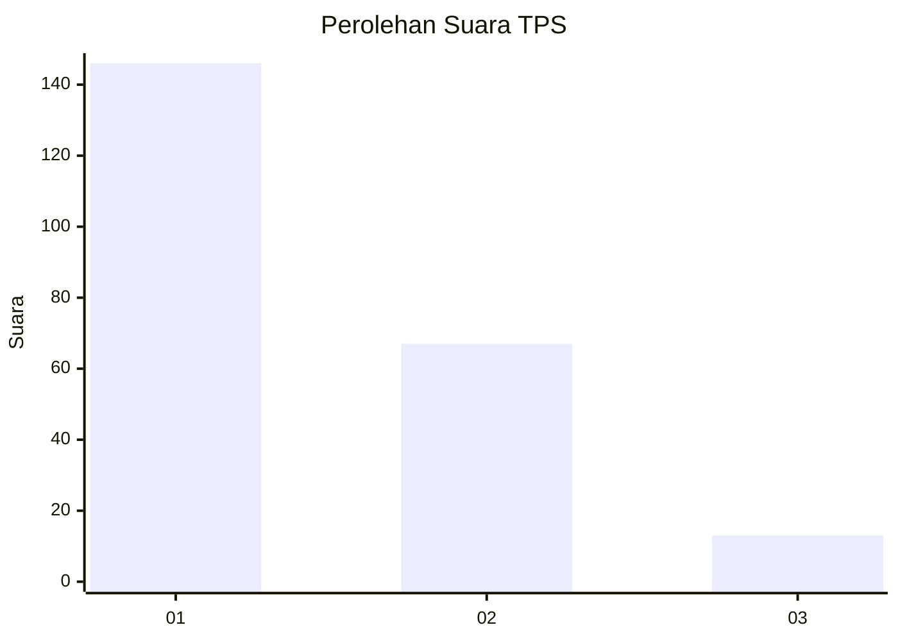
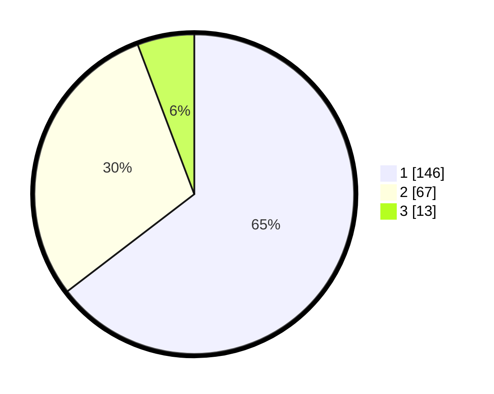

# Hasil

## Grafik

## Tabel

| No. | Nama Paslon    | Suara | Suara (raw) | Persentase |
|:--- |:-------------- | -----:| -----------:| ----------:|
| 1   | ANIES MUHAIMIN | 146   | [146][p-1]  | 64,60      |
| 2   | PRABOWO GIBRAN | 67    | [67][p-2]   | 29,65      |
| 3   | GANJAR MAHFUD  | 13    | [13][p-3]   | 5,75       |

[p-1]: https://github.com/gigit-pemilu/pemilu-2024-11-aceh/blob/main/pilpres/hitung-suara/sub/11-aceh/sub/04-aceh-tengah/sub/11-kebayakan/sub/2002-gunung-bukit/sub/001-tps/sub/paslon-1.txt
[p-2]: https://github.com/gigit-pemilu/pemilu-2024-11-aceh/blob/main/pilpres/hitung-suara/sub/11-aceh/sub/04-aceh-tengah/sub/11-kebayakan/sub/2002-gunung-bukit/sub/001-tps/sub/paslon-2.txt
[p-3]: https://github.com/gigit-pemilu/pemilu-2024-11-aceh/blob/main/pilpres/hitung-suara/sub/11-aceh/sub/04-aceh-tengah/sub/11-kebayakan/sub/2002-gunung-bukit/sub/001-tps/sub/paslon-3.txt

## Foto C Plano

https://sirekap-obj-formc.kpu.go.id/1b71/pemilu/ppwp/11/04/11/20/02/1104112002001-20240216-101909--42bb55af-6a77-4deb-92e2-62beb34660cf.jpg

https://sirekap-obj-formc.kpu.go.id/1b71/pemilu/ppwp/11/04/11/20/02/1104112002001-20240216-101917--5dab7082-b2a6-47e4-bfe3-3df85c4f51c9.jpg

https://sirekap-obj-formc.kpu.go.id/1b71/pemilu/ppwp/11/04/11/20/02/1104112002001-20240216-101915--1d698e83-6ca9-4ab2-a6c4-1e072cd58ccf.jpg

## Metadata

| Key        | Value               |
| ---------- | ------------------- |
| Time Stamp | 2024-02-21 18:00:00 |

## DATA PEMILIH TETAP

Jumlah pemilih dalam DPT: **270**.
 * L: **128**.
 * P: **142**.

## DATA PENGGUNA HAK PILIH

Jumlah pengguna hak pilih dalam DPT: **220**.
 * L: **105**.
 * P: **115**.

Jumlah pengguna hak pilih dalam DPTb: **5**.
 * L: **2**.
 * P: **3**.

Jumlah pengguna hak pilih dalam DPK: **4**.
 * L: **2**.
 * P: **2**.

Jumlah pengguna hak pilih: **229**.
 * L: **109**.
 * P: **120**.

## JUMLAH SUARA SAH DAN TIDAK SAH

JUMLAH SELURUH SUARA SAH: **226**.

JUMLAH SUARA TIDAK SAH: **3**.

JUMLAH SELURUH SUARA SAH DAN SUARA TIDAK SAH: **229**.

