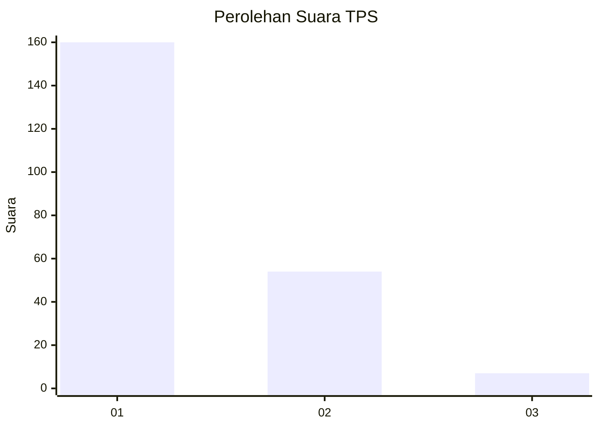
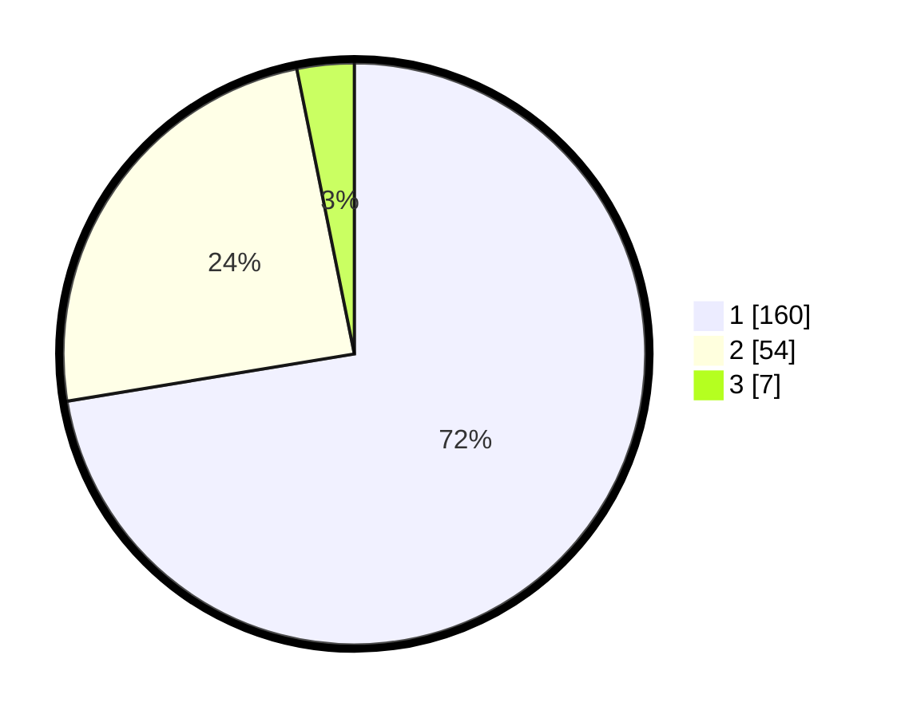

# Hasil

## Grafik

## Tabel

| No. | Nama Paslon    | Suara | Suara (raw) | Persentase |
|:--- |:-------------- | -----:| -----------:| ----------:|
| 1   | ANIES MUHAIMIN | 160   | [160][p-1]  | 72,40      |
| 2   | PRABOWO GIBRAN | 54    | [54][p-2]   | 24,43      |
| 3   | GANJAR MAHFUD  | 7     | [7][p-3]    | 3,17       |

[p-1]: https://github.com/gigit-pemilu/pemilu-2024-11-aceh/blob/main/pilpres/hitung-suara/sub/11-aceh/sub/04-aceh-tengah/sub/11-kebayakan/sub/2002-gunung-bukit/sub/002-tps/sub/paslon-1.txt
[p-2]: https://github.com/gigit-pemilu/pemilu-2024-11-aceh/blob/main/pilpres/hitung-suara/sub/11-aceh/sub/04-aceh-tengah/sub/11-kebayakan/sub/2002-gunung-bukit/sub/002-tps/sub/paslon-2.txt
[p-3]: https://github.com/gigit-pemilu/pemilu-2024-11-aceh/blob/main/pilpres/hitung-suara/sub/11-aceh/sub/04-aceh-tengah/sub/11-kebayakan/sub/2002-gunung-bukit/sub/002-tps/sub/paslon-3.txt

## Foto C Plano

https://sirekap-obj-formc.kpu.go.id/a56d/pemilu/ppwp/11/04/11/20/02/1104112002002-20240216-153321--9056342a-8064-43f9-96b4-c23af4ae2f85.jpg

https://sirekap-obj-formc.kpu.go.id/a56d/pemilu/ppwp/11/04/11/20/02/1104112002002-20240216-153322--8ab1903d-8568-4681-abdc-fae2ecc37355.jpg

https://sirekap-obj-formc.kpu.go.id/a56d/pemilu/ppwp/11/04/11/20/02/1104112002002-20240216-153322--f6c000cc-3e90-4eec-8d80-d57acdc7128e.jpg

## Metadata

| Key        | Value               |
| ---------- | ------------------- |
| Time Stamp | 2024-02-17 06:30:03 |

## DATA PEMILIH TETAP

Jumlah pemilih dalam DPT: **252**.
 * L: **116**.
 * P: **136**.

## DATA PENGGUNA HAK PILIH

Jumlah pengguna hak pilih dalam DPT: **207**.
 * L: **95**.
 * P: **112**.

Jumlah pengguna hak pilih dalam DPTb: **14**.
 * L: **5**.
 * P: **9**.

Jumlah pengguna hak pilih dalam DPK: **1**.
 * L: **0**.
 * P: **1**.

Jumlah pengguna hak pilih: **222**.
 * L: **100**.
 * P: **122**.

## JUMLAH SUARA SAH DAN TIDAK SAH

JUMLAH SELURUH SUARA SAH: **221**.

JUMLAH SUARA TIDAK SAH: **1**.

JUMLAH SELURUH SUARA SAH DAN SUARA TIDAK SAH: **222**.

