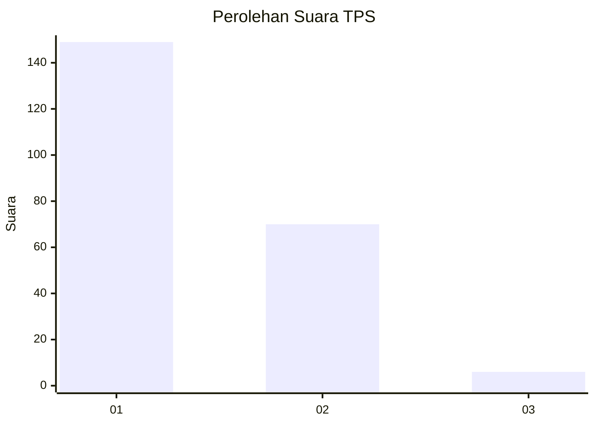
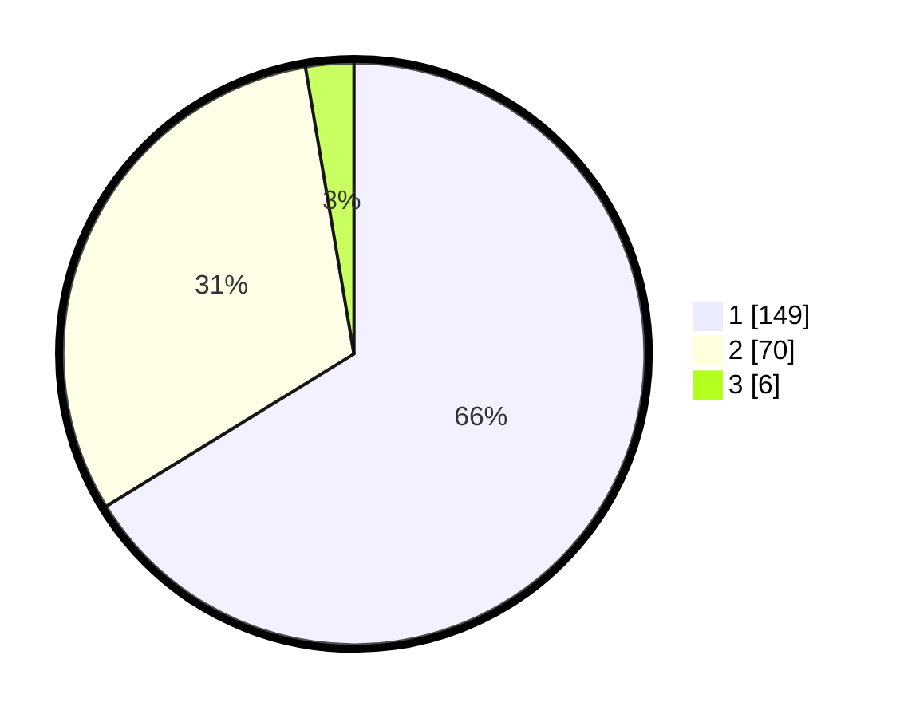

# Hasil

## Grafik

## Tabel

| No. | Nama Paslon    | Suara | Suara (raw) | Persentase |
|:--- |:-------------- | -----:| -----------:| ----------:|
| 1   | ANIES MUHAIMIN | 149   | [149][p-1]  | 66,22      |
| 2   | PRABOWO GIBRAN | 70    | [70][p-2]   | 31,11      |
| 3   | GANJAR MAHFUD  | 6     | [6][p-3]    | 2,67       |

[p-1]: https://github.com/gigit-pemilu/pemilu-2024-11-aceh/blob/main/pilpres/hitung-suara/sub/11-aceh/sub/04-aceh-tengah/sub/11-kebayakan/sub/2002-gunung-bukit/sub/003-tps/sub/paslon-1.txt
[p-2]: https://github.com/gigit-pemilu/pemilu-2024-11-aceh/blob/main/pilpres/hitung-suara/sub/11-aceh/sub/04-aceh-tengah/sub/11-kebayakan/sub/2002-gunung-bukit/sub/003-tps/sub/paslon-2.txt
[p-3]: https://github.com/gigit-pemilu/pemilu-2024-11-aceh/blob/main/pilpres/hitung-suara/sub/11-aceh/sub/04-aceh-tengah/sub/11-kebayakan/sub/2002-gunung-bukit/sub/003-tps/sub/paslon-3.txt

## Foto C Plano

https://sirekap-obj-formc.kpu.go.id/dcdb/pemilu/ppwp/11/04/11/20/02/1104112002003-20240216-140330--4ef10ebc-2701-4486-a161-b6def24f29cc.jpg

https://sirekap-obj-formc.kpu.go.id/dcdb/pemilu/ppwp/11/04/11/20/02/1104112002003-20240214-211512--058dfdef-d114-41ca-ab8d-6ecd695d08a1.jpg

https://sirekap-obj-formc.kpu.go.id/dcdb/pemilu/ppwp/11/04/11/20/02/1104112002003-20240216-140330--cdfe7e79-aa4a-4bc6-a117-4f6237dd3b7b.jpg

## Metadata

| Key        | Value               |
| ---------- | ------------------- |
| Time Stamp | 2024-02-16 14:30:33 |

## DATA PEMILIH TETAP

Jumlah pemilih dalam DPT: **251**.
 * L: **120**.
 * P: **131**.

## DATA PENGGUNA HAK PILIH

Jumlah pengguna hak pilih dalam DPT: **207**.
 * L: **95**.
 * P: **112**.

Jumlah pengguna hak pilih dalam DPTb: **14**.
 * L: **4**.
 * P: **10**.

Jumlah pengguna hak pilih dalam DPK: **6**.
 * L: **3**.
 * P: **3**.

Jumlah pengguna hak pilih: **227**.
 * L: **102**.
 * P: **125**.

## JUMLAH SUARA SAH DAN TIDAK SAH

JUMLAH SELURUH SUARA SAH: **225**.

JUMLAH SUARA TIDAK SAH: **2**.

JUMLAH SELURUH SUARA SAH DAN SUARA TIDAK SAH: **227**.

