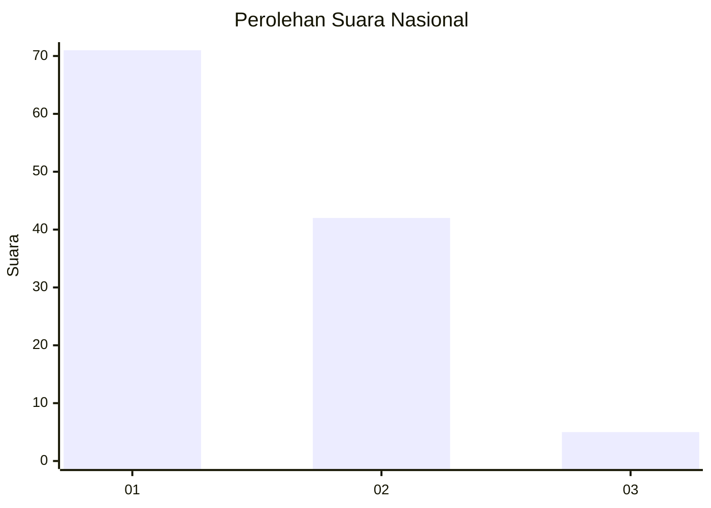
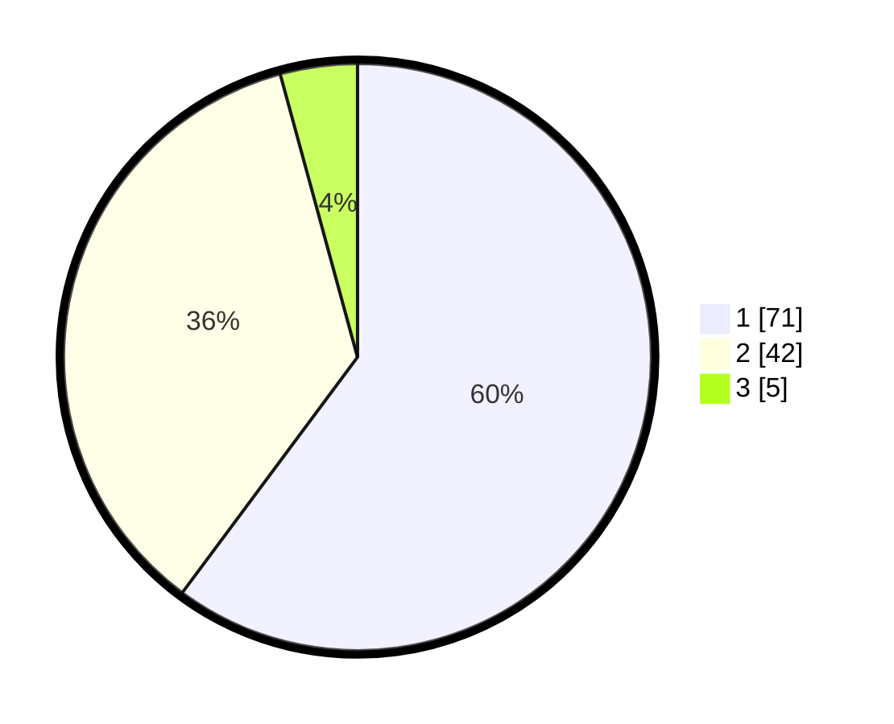

# Hasil

## Grafik

## Tabel

| No. | Nama Paslon    | Suara | Suara (raw) | Persentase |
|:--- |:-------------- | -----:| -----------:| ----------:|
| 1   | ANIES MUHAIMIN | 71    | [71][p-1]   | 60,17      |
| 2   | PRABOWO GIBRAN | 42    | [42][p-2]   | 35,59      |
| 3   | GANJAR MAHFUD  | 5     | [5][p-3]    | 4,24       |

[p-1]: https://github.com/gigit-pemilu/pemilu-2024/blob/main/pilpres/hitung-suara/sub/11-aceh/sub/04-aceh-tengah/sub/11-kebayakan/sub/2007-paya-reje-tami-delem/sub/002-tps/sub/paslon-1.txt
[p-2]: https://github.com/gigit-pemilu/pemilu-2024/blob/main/pilpres/hitung-suara/sub/11-aceh/sub/04-aceh-tengah/sub/11-kebayakan/sub/2007-paya-reje-tami-delem/sub/002-tps/sub/paslon-2.txt
[p-3]: https://github.com/gigit-pemilu/pemilu-2024/blob/main/pilpres/hitung-suara/sub/11-aceh/sub/04-aceh-tengah/sub/11-kebayakan/sub/2007-paya-reje-tami-delem/sub/002-tps/sub/paslon-3.txt

## Foto C Plano

https://sirekap-obj-formc.kpu.go.id/0b82/pemilu/ppwp/11/04/11/20/07/1104112007002-20240216-071020--fccdbf1e-72c5-40b6-a0bf-ad41a0bf6f58.jpg

https://sirekap-obj-formc.kpu.go.id/0b82/pemilu/ppwp/11/04/11/20/07/1104112007002-20240216-071022--3f0f5192-ec0d-44ae-bf94-0bd0f0e65267.jpg

https://sirekap-obj-formc.kpu.go.id/0b82/pemilu/ppwp/11/04/11/20/07/1104112007002-20240216-071021--8f486b1c-1d46-4a58-8de7-faa043412743.jpg

## Metadata

| Key        | Value               |
| ---------- | ------------------- |
| Time Stamp | 2024-02-21 18:00:00 |

## DATA PEMILIH TETAP

Jumlah pemilih dalam DPT: **138**.
 * L: **70**.
 * P: **68**.

## DATA PENGGUNA HAK PILIH

Jumlah pengguna hak pilih dalam DPT: **118**.
 * L: **63**.
 * P: **55**.

Jumlah pengguna hak pilih dalam DPTb: **0**.
 * L: **0**.
 * P: **0**.

Jumlah pengguna hak pilih dalam DPK: **0**.
 * L: **0**.
 * P: **0**.

Jumlah pengguna hak pilih: **118**.
 * L: **63**.
 * P: **55**.

## JUMLAH SUARA SAH DAN TIDAK SAH

JUMLAH SELURUH SUARA SAH: **118**.

JUMLAH SUARA TIDAK SAH: **0**.

JUMLAH SELURUH SUARA SAH DAN SUARA TIDAK SAH: **118**.

