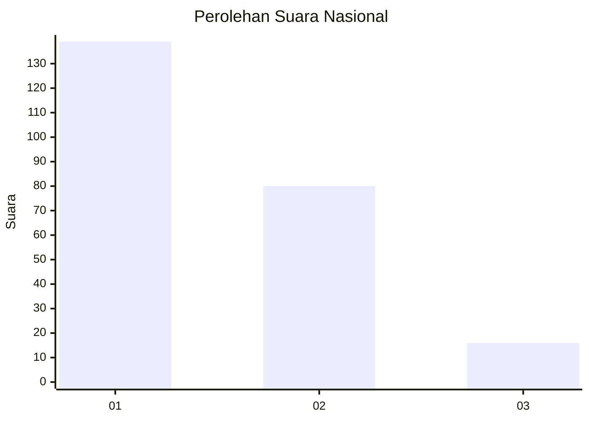
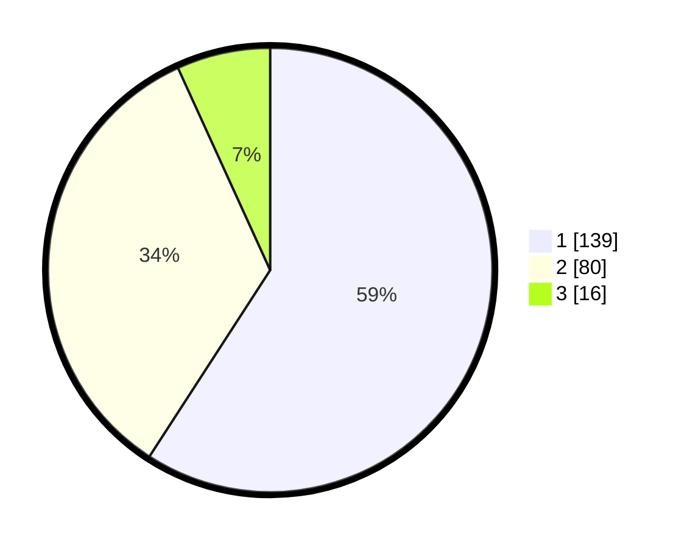

# Hasil

## Grafik

## Tabel

| No. | Nama Paslon    | Suara | Suara (raw) | Persentase |
|:--- |:-------------- | -----:| -----------:| ----------:|
| 1   | ANIES MUHAIMIN | 139   | [139][p-1]  | 59,15      |
| 2   | PRABOWO GIBRAN | 80    | [80][p-2]   | 34,04      |
| 3   | GANJAR MAHFUD  | 16    | [16][p-3]   | 6,81       |

[p-1]: https://github.com/gigit-pemilu/pemilu-2024/blob/main/pilpres/hitung-suara/sub/11-aceh/sub/04-aceh-tengah/sub/11-kebayakan/sub/2011-bukit-ewih-tami-delem/sub/002-tps/sub/paslon-1.txt
[p-2]: https://github.com/gigit-pemilu/pemilu-2024/blob/main/pilpres/hitung-suara/sub/11-aceh/sub/04-aceh-tengah/sub/11-kebayakan/sub/2011-bukit-ewih-tami-delem/sub/002-tps/sub/paslon-2.txt
[p-3]: https://github.com/gigit-pemilu/pemilu-2024/blob/main/pilpres/hitung-suara/sub/11-aceh/sub/04-aceh-tengah/sub/11-kebayakan/sub/2011-bukit-ewih-tami-delem/sub/002-tps/sub/paslon-3.txt

## Foto C Plano

https://sirekap-obj-formc.kpu.go.id/7f1d/pemilu/ppwp/11/04/11/20/11/1104112011002-20240216-084800--73d03dd9-18f9-4c27-b647-62d0ba84bb75.jpg

https://sirekap-obj-formc.kpu.go.id/7f1d/pemilu/ppwp/11/04/11/20/11/1104112011002-20240216-092248--d76e3572-f276-47df-b7ab-f0bab7a9bfaa.jpg

https://sirekap-obj-formc.kpu.go.id/7f1d/pemilu/ppwp/11/04/11/20/11/1104112011002-20240216-092247--0fe40826-00cd-4ddb-ba77-226a89739032.jpg

## Metadata

| Key        | Value               |
| ---------- | ------------------- |
| Time Stamp | 2024-02-17 06:30:03 |

## DATA PEMILIH TETAP

Jumlah pemilih dalam DPT: **257**.
 * L: **119**.
 * P: **138**.

## DATA PENGGUNA HAK PILIH

Jumlah pengguna hak pilih dalam DPT: **239**.
 * L: **109**.
 * P: **130**.

Jumlah pengguna hak pilih dalam DPTb: **2**.
 * L: **1**.
 * P: **1**.

Jumlah pengguna hak pilih dalam DPK: **0**.
 * L: **0**.
 * P: **0**.

Jumlah pengguna hak pilih: **241**.
 * L: **110**.
 * P: **131**.

## JUMLAH SUARA SAH DAN TIDAK SAH

JUMLAH SELURUH SUARA SAH: **235**.

JUMLAH SUARA TIDAK SAH: **6**.

JUMLAH SELURUH SUARA SAH DAN SUARA TIDAK SAH: **241**.

