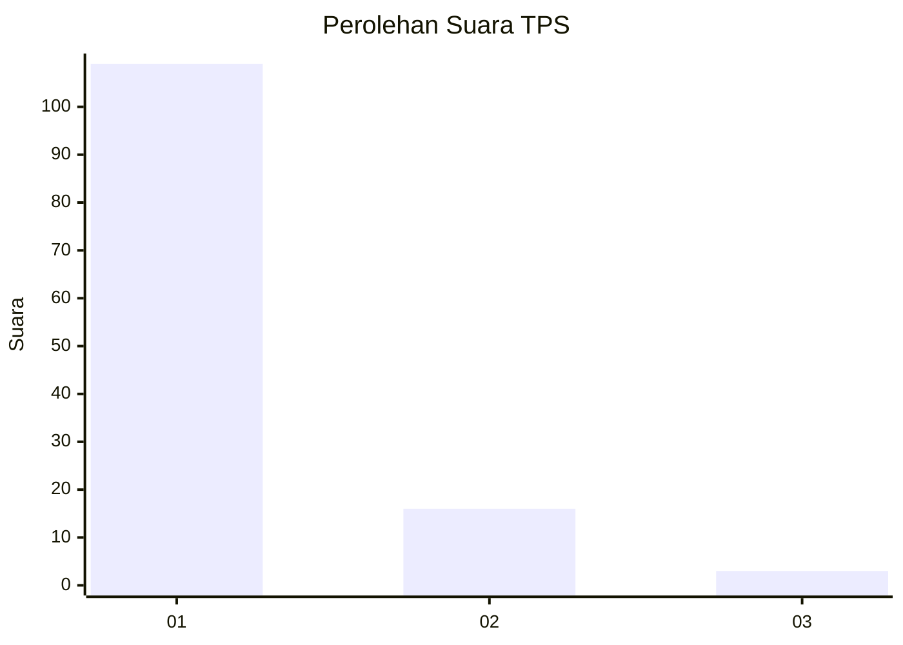
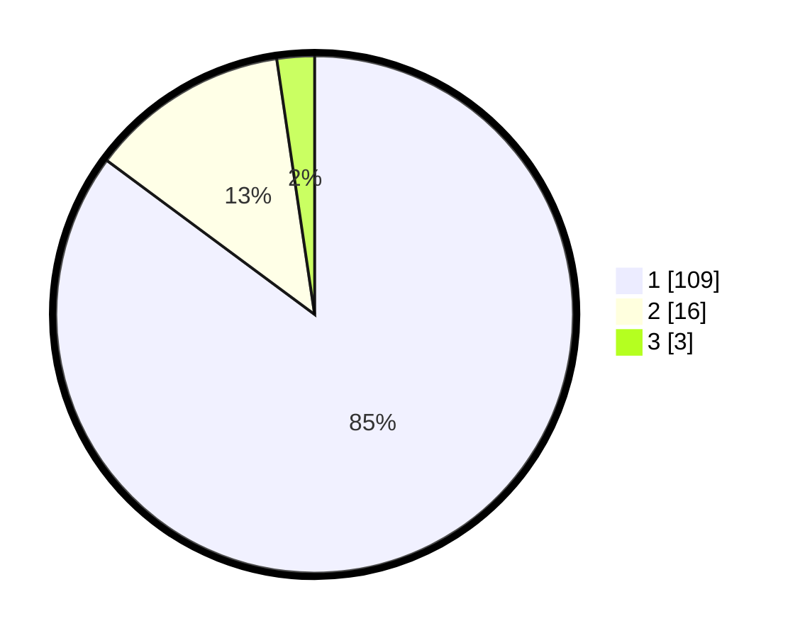

# Hasil

## Grafik

## Tabel

| No. | Nama Paslon    | Suara | Suara (raw) | Persentase |
|:--- |:-------------- | -----:| -----------:| ----------:|
| 1   | ANIES MUHAIMIN | 109   | [109][p-1]  | 85,16      |
| 2   | PRABOWO GIBRAN | 16    | [16][p-2]   | 12,50      |
| 3   | GANJAR MAHFUD  | 3     | [3][p-3]    | 2,34       |

[p-1]: https://github.com/gigit-pemilu/pemilu-2024-11-aceh/blob/main/pilpres/hitung-suara/sub/11-aceh/sub/04-aceh-tengah/sub/12-kute-panang/sub/2001-atu-gogop/sub/002-tps/sub/paslon-1.txt
[p-2]: https://github.com/gigit-pemilu/pemilu-2024-11-aceh/blob/main/pilpres/hitung-suara/sub/11-aceh/sub/04-aceh-tengah/sub/12-kute-panang/sub/2001-atu-gogop/sub/002-tps/sub/paslon-2.txt
[p-3]: https://github.com/gigit-pemilu/pemilu-2024-11-aceh/blob/main/pilpres/hitung-suara/sub/11-aceh/sub/04-aceh-tengah/sub/12-kute-panang/sub/2001-atu-gogop/sub/002-tps/sub/paslon-3.txt

## Foto C Plano

https://sirekap-obj-formc.kpu.go.id/4741/pemilu/ppwp/11/04/12/20/01/1104122001002-20240216-151109--b7e6649d-de1a-46a2-b3d5-62e5223cf8f1.jpg

https://sirekap-obj-formc.kpu.go.id/4741/pemilu/ppwp/11/04/12/20/01/1104122001002-20240216-151111--8678cc11-2cf1-49d2-8639-3a7002b314b2.jpg

https://sirekap-obj-formc.kpu.go.id/4741/pemilu/ppwp/11/04/12/20/01/1104122001002-20240216-151110--c35957a4-b5d0-4df3-a9cc-34fba7ed842d.jpg

## Metadata

| Key        | Value               |
| ---------- | ------------------- |
| Time Stamp | 2024-02-17 07:00:02 |

## DATA PEMILIH TETAP

Jumlah pemilih dalam DPT: **132**.
 * L: **72**.
 * P: **60**.

## DATA PENGGUNA HAK PILIH

Jumlah pengguna hak pilih dalam DPT: **125**.
 * L: **70**.
 * P: **55**.

Jumlah pengguna hak pilih dalam DPTb: **3**.
 * L: **0**.
 * P: **3**.

Jumlah pengguna hak pilih dalam DPK: **1**.
 * L: **1**.
 * P: **0**.

Jumlah pengguna hak pilih: **129**.
 * L: **71**.
 * P: **58**.

## JUMLAH SUARA SAH DAN TIDAK SAH

JUMLAH SELURUH SUARA SAH: **128**.

JUMLAH SUARA TIDAK SAH: **1**.

JUMLAH SELURUH SUARA SAH DAN SUARA TIDAK SAH: **129**.

