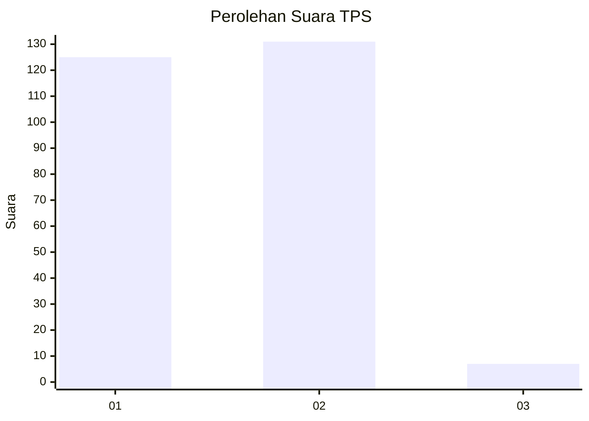
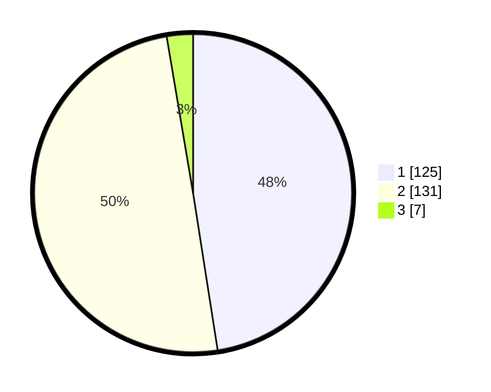

# Hasil

## Grafik

## Tabel

| No. | Nama Paslon    | Suara | Suara (raw) | Persentase |
|:--- |:-------------- | -----:| -----------:| ----------:|
| 1   | ANIES MUHAIMIN | 125   | [125][p-1]  | 47,53      |
| 2   | PRABOWO GIBRAN | 131   | [131][p-2]  | 49,81      |
| 3   | GANJAR MAHFUD  | 7     | [7][p-3]    | 2,66       |

[p-1]: https://github.com/gigit-pemilu/pemilu-2024-11-aceh/blob/main/pilpres/hitung-suara/sub/11-aceh/sub/04-aceh-tengah/sub/12-kute-panang/sub/2003-buter-balik/sub/001-tps/sub/paslon-1.txt
[p-2]: https://github.com/gigit-pemilu/pemilu-2024-11-aceh/blob/main/pilpres/hitung-suara/sub/11-aceh/sub/04-aceh-tengah/sub/12-kute-panang/sub/2003-buter-balik/sub/001-tps/sub/paslon-2.txt
[p-3]: https://github.com/gigit-pemilu/pemilu-2024-11-aceh/blob/main/pilpres/hitung-suara/sub/11-aceh/sub/04-aceh-tengah/sub/12-kute-panang/sub/2003-buter-balik/sub/001-tps/sub/paslon-3.txt

## Foto C Plano

https://sirekap-obj-formc.kpu.go.id/5a2d/pemilu/ppwp/11/04/12/20/03/1104122003001-20240214-184952--c47f52b0-3e47-46a3-bf3d-7c3dd3684fb9.jpg

https://sirekap-obj-formc.kpu.go.id/5a2d/pemilu/ppwp/11/04/12/20/03/1104122003001-20240214-185221--d4432a9d-24e9-49cf-a3b8-bca49aabbe45.jpg

https://sirekap-obj-formc.kpu.go.id/5a2d/pemilu/ppwp/11/04/12/20/03/1104122003001-20240214-185404--63f8054c-35da-45b1-bda4-7ae36ef661e3.jpg

## Metadata

| Key        | Value               |
| ---------- | ------------------- |
| Time Stamp | 2024-02-14 21:46:01 |

## DATA PEMILIH TETAP

Jumlah pemilih dalam DPT: **285**.
 * L: **142**.
 * P: **143**.

## DATA PENGGUNA HAK PILIH

Jumlah pengguna hak pilih dalam DPT: **270**.
 * L: **136**.
 * P: **134**.

Jumlah pengguna hak pilih dalam DPTb: **1**.
 * L: **0**.
 * P: **1**.

Jumlah pengguna hak pilih dalam DPK: **0**.
 * L: **0**.
 * P: **0**.

Jumlah pengguna hak pilih: **271**.
 * L: **136**.
 * P: **135**.

## JUMLAH SUARA SAH DAN TIDAK SAH

JUMLAH SELURUH SUARA SAH: **263**.

JUMLAH SUARA TIDAK SAH: **8**.

JUMLAH SELURUH SUARA SAH DAN SUARA TIDAK SAH: **271**.

