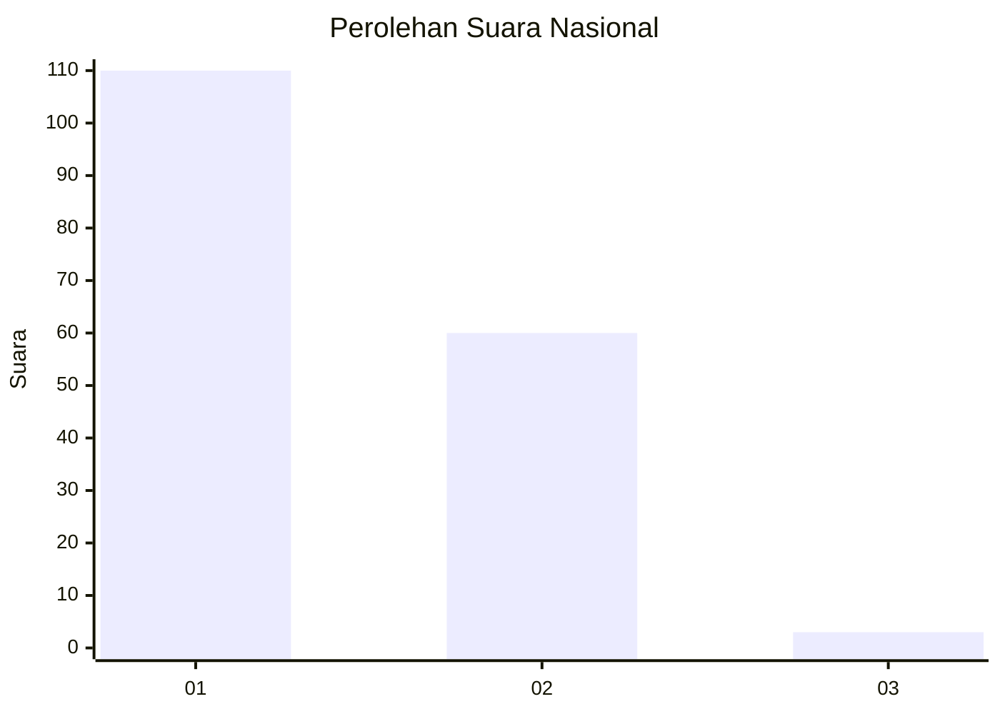
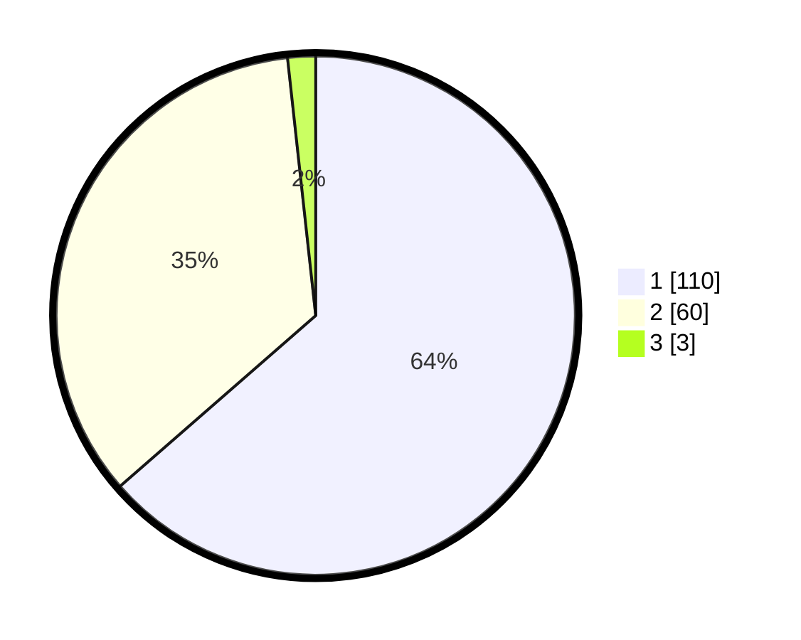

# Hasil

## Grafik

## Tabel

| No. | Nama Paslon    | Suara | Suara (raw) | Persentase |
|:--- |:-------------- | -----:| -----------:| ----------:|
| 1   | ANIES MUHAIMIN | 110   | [110][p-1]  | 63,58      |
| 2   | PRABOWO GIBRAN | 60    | [60][p-2]   | 34,68      |
| 3   | GANJAR MAHFUD  | 3     | [3][p-3]    | 1,73       |

[p-1]: https://github.com/gigit-pemilu/pemilu-2024/blob/main/pilpres/hitung-suara/sub/11-aceh/sub/04-aceh-tengah/sub/12-kute-panang/sub/2004-dedingin/sub/001-tps/sub/paslon-1.txt
[p-2]: https://github.com/gigit-pemilu/pemilu-2024/blob/main/pilpres/hitung-suara/sub/11-aceh/sub/04-aceh-tengah/sub/12-kute-panang/sub/2004-dedingin/sub/001-tps/sub/paslon-2.txt
[p-3]: https://github.com/gigit-pemilu/pemilu-2024/blob/main/pilpres/hitung-suara/sub/11-aceh/sub/04-aceh-tengah/sub/12-kute-panang/sub/2004-dedingin/sub/001-tps/sub/paslon-3.txt

## Foto C Plano

https://sirekap-obj-formc.kpu.go.id/2862/pemilu/ppwp/11/04/12/20/04/1104122004001-20240214-192354--2f740752-c778-4d1e-b816-231418b75f84.jpg

https://sirekap-obj-formc.kpu.go.id/2862/pemilu/ppwp/11/04/12/20/04/1104122004001-20240214-192752--3351781e-9152-4caa-b306-b3cc195d10d4.jpg

https://sirekap-obj-formc.kpu.go.id/2862/pemilu/ppwp/11/04/12/20/04/1104122004001-20240216-135555--41f70eb6-1ae1-40bc-8c21-f9658987f679.jpg

## Metadata

| Key        | Value               |
| ---------- | ------------------- |
| Time Stamp | 2024-02-16 14:00:34 |

## DATA PEMILIH TETAP

Jumlah pemilih dalam DPT: **173**.
 * L: **85**.
 * P: **88**.

## DATA PENGGUNA HAK PILIH

Jumlah pengguna hak pilih dalam DPT: **164**.
 * L: **81**.
 * P: **83**.

Jumlah pengguna hak pilih dalam DPTb: **11**.
 * L: **5**.
 * P: **6**.

Jumlah pengguna hak pilih dalam DPK: **2**.
 * L: **2**.
 * P: **0**.

Jumlah pengguna hak pilih: **177**.
 * L: **88**.
 * P: **89**.

## JUMLAH SUARA SAH DAN TIDAK SAH

JUMLAH SELURUH SUARA SAH: **173**.

JUMLAH SUARA TIDAK SAH: **4**.

JUMLAH SELURUH SUARA SAH DAN SUARA TIDAK SAH: **177**.

