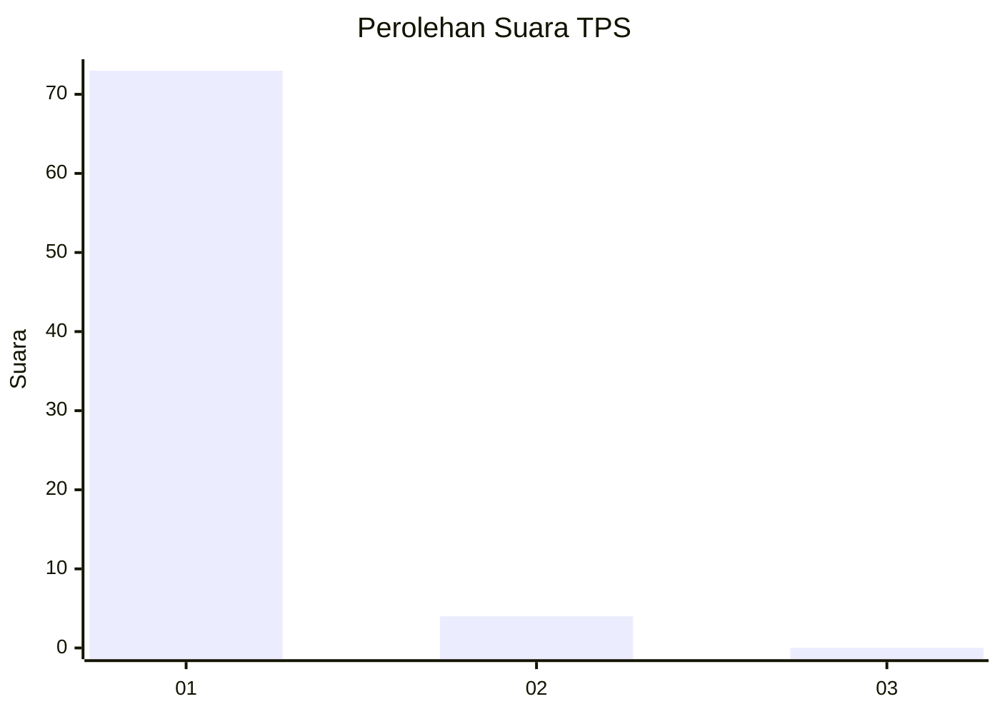
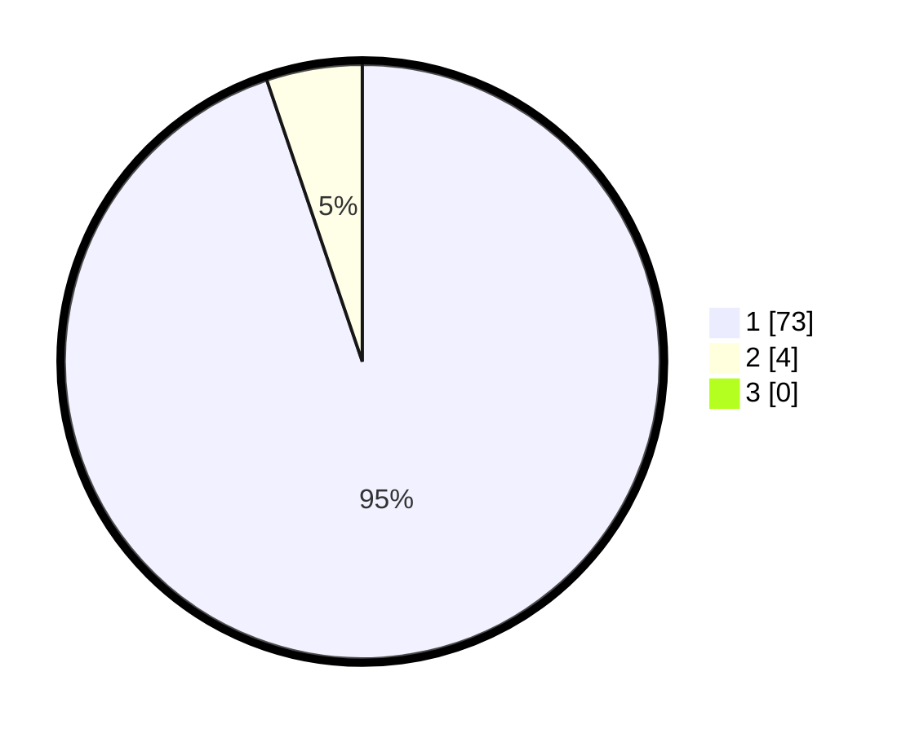

# Hasil

## Grafik

## Tabel

| No. | Nama Paslon    | Suara | Suara (raw) | Persentase |
|:--- |:-------------- | -----:| -----------:| ----------:|
| 1   | ANIES MUHAIMIN | 73    | [73][p-1]   | 94,81      |
| 2   | PRABOWO GIBRAN | 4     | [4][p-2]    | 5,19       |
| 3   | GANJAR MAHFUD  | 0     | [0][p-3]    | 0,00       |

[p-1]: https://github.com/gigit-pemilu/pemilu-2024-11-aceh/blob/main/pilpres/hitung-suara/sub/11-aceh/sub/04-aceh-tengah/sub/12-kute-panang/sub/2015-bukit-rata/sub/001-tps/sub/paslon-1.txt
[p-2]: https://github.com/gigit-pemilu/pemilu-2024-11-aceh/blob/main/pilpres/hitung-suara/sub/11-aceh/sub/04-aceh-tengah/sub/12-kute-panang/sub/2015-bukit-rata/sub/001-tps/sub/paslon-2.txt
[p-3]: https://github.com/gigit-pemilu/pemilu-2024-11-aceh/blob/main/pilpres/hitung-suara/sub/11-aceh/sub/04-aceh-tengah/sub/12-kute-panang/sub/2015-bukit-rata/sub/001-tps/sub/paslon-3.txt

## Foto C Plano

https://sirekap-obj-formc.kpu.go.id/1dd6/pemilu/ppwp/11/04/12/20/15/1104122015001-20240219-204631--3ee8aca0-6d76-4924-93c3-b74cb2aae950.jpg

https://sirekap-obj-formc.kpu.go.id/1dd6/pemilu/ppwp/11/04/12/20/15/1104122015001-20240219-204633--05903aa3-b54e-4ff6-8bd5-0ac8c567be51.jpg

https://sirekap-obj-formc.kpu.go.id/1dd6/pemilu/ppwp/11/04/12/20/15/1104122015001-20240219-204632--8a7fce47-fe60-4d51-99da-fb230de1cae1.jpg

## Metadata

| Key        | Value               |
| ---------- | ------------------- |
| Time Stamp | 2024-02-21 19:00:00 |

## DATA PEMILIH TETAP

Jumlah pemilih dalam DPT: **106**.
 * L: **60**.
 * P: **46**.

## DATA PENGGUNA HAK PILIH

Jumlah pengguna hak pilih dalam DPT: **81**.
 * L: **42**.
 * P: **39**.

Jumlah pengguna hak pilih dalam DPTb: **1**.
 * L: **1**.
 * P: **0**.

Jumlah pengguna hak pilih dalam DPK: **1**.
 * L: **0**.
 * P: **1**.

Jumlah pengguna hak pilih: **83**.
 * L: **43**.
 * P: **40**.

## JUMLAH SUARA SAH DAN TIDAK SAH

JUMLAH SELURUH SUARA SAH: **77**.

JUMLAH SUARA TIDAK SAH: **6**.

JUMLAH SELURUH SUARA SAH DAN SUARA TIDAK SAH: **83**.

