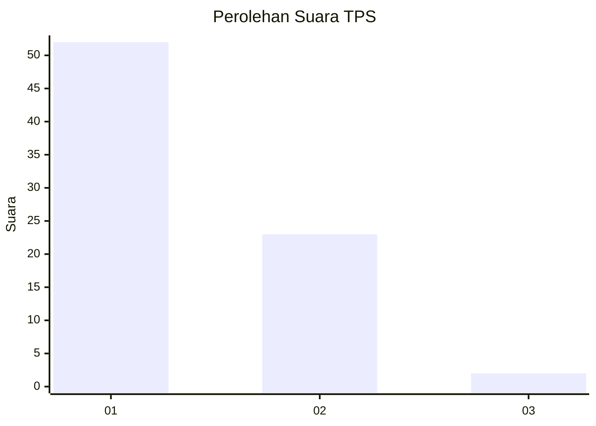
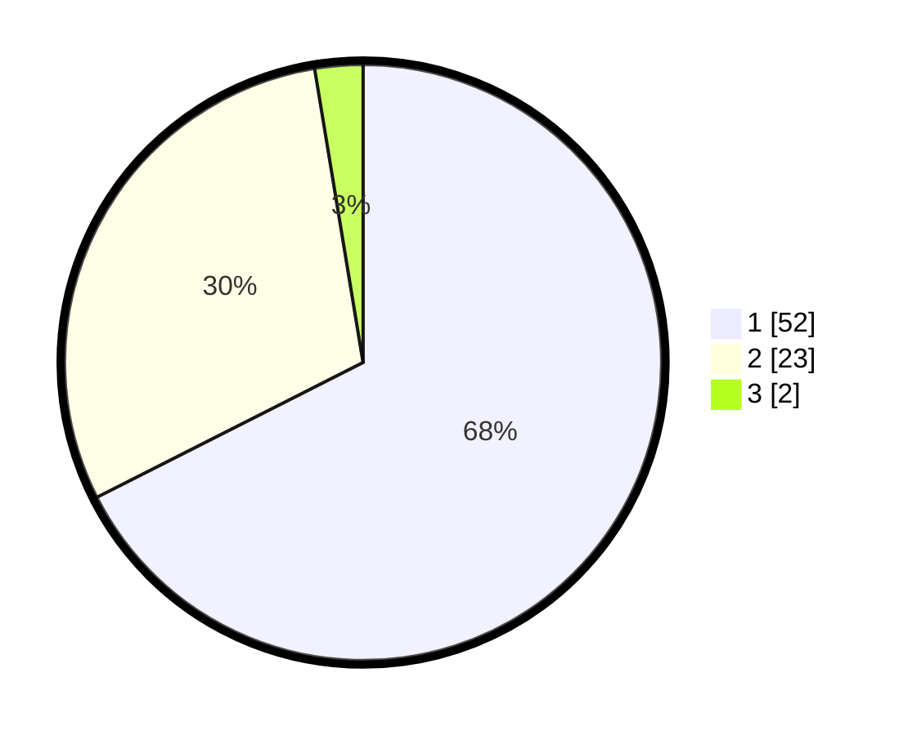

# Hasil

## Grafik

## Tabel

| No. | Nama Paslon    | Suara | Suara (raw) | Persentase |
|:--- |:-------------- | -----:| -----------:| ----------:|
| 1   | ANIES MUHAIMIN | 52    | [52][p-1]   | 67,53      |
| 2   | PRABOWO GIBRAN | 23    | [23][p-2]   | 29,87      |
| 3   | GANJAR MAHFUD  | 2     | [2][p-3]    | 2,60       |

[p-1]: https://github.com/gigit-pemilu/pemilu-2024-11-aceh/blob/main/pilpres/hitung-suara/sub/11-aceh/sub/04-aceh-tengah/sub/12-kute-panang/sub/2023-kala-nongkal/sub/001-tps/sub/paslon-1.txt
[p-2]: https://github.com/gigit-pemilu/pemilu-2024-11-aceh/blob/main/pilpres/hitung-suara/sub/11-aceh/sub/04-aceh-tengah/sub/12-kute-panang/sub/2023-kala-nongkal/sub/001-tps/sub/paslon-2.txt
[p-3]: https://github.com/gigit-pemilu/pemilu-2024-11-aceh/blob/main/pilpres/hitung-suara/sub/11-aceh/sub/04-aceh-tengah/sub/12-kute-panang/sub/2023-kala-nongkal/sub/001-tps/sub/paslon-3.txt

## Foto C Plano

https://sirekap-obj-formc.kpu.go.id/1457/pemilu/ppwp/11/04/12/20/23/1104122023001-20240214-191952--02a87049-11fc-4282-856a-19fcd70f2133.jpg

https://sirekap-obj-formc.kpu.go.id/1457/pemilu/ppwp/11/04/12/20/23/1104122023001-20240214-192120--fa89b55a-710a-4348-99f1-e1f9f21bc227.jpg

https://sirekap-obj-formc.kpu.go.id/1457/pemilu/ppwp/11/04/12/20/23/1104122023001-20240214-192313--280ff4ab-f641-44b7-9869-ed7334851942.jpg

## Metadata

| Key        | Value               |
| ---------- | ------------------- |
| Time Stamp | 2024-02-15 00:41:44 |

## DATA PEMILIH TETAP

Jumlah pemilih dalam DPT: **86**.
 * L: **43**.
 * P: **43**.

## DATA PENGGUNA HAK PILIH

Jumlah pengguna hak pilih dalam DPT: **77**.
 * L: **39**.
 * P: **38**.

Jumlah pengguna hak pilih dalam DPTb: **2**.
 * L: **1**.
 * P: **1**.

Jumlah pengguna hak pilih dalam DPK: **0**.
 * L: **0**.
 * P: **0**.

Jumlah pengguna hak pilih: **79**.
 * L: **40**.
 * P: **39**.

## JUMLAH SUARA SAH DAN TIDAK SAH

JUMLAH SELURUH SUARA SAH: **77**.

JUMLAH SUARA TIDAK SAH: **2**.

JUMLAH SELURUH SUARA SAH DAN SUARA TIDAK SAH: **79**.

