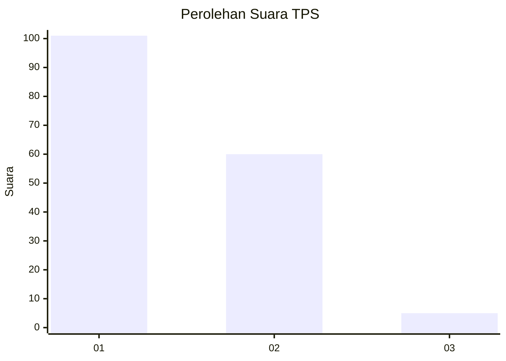
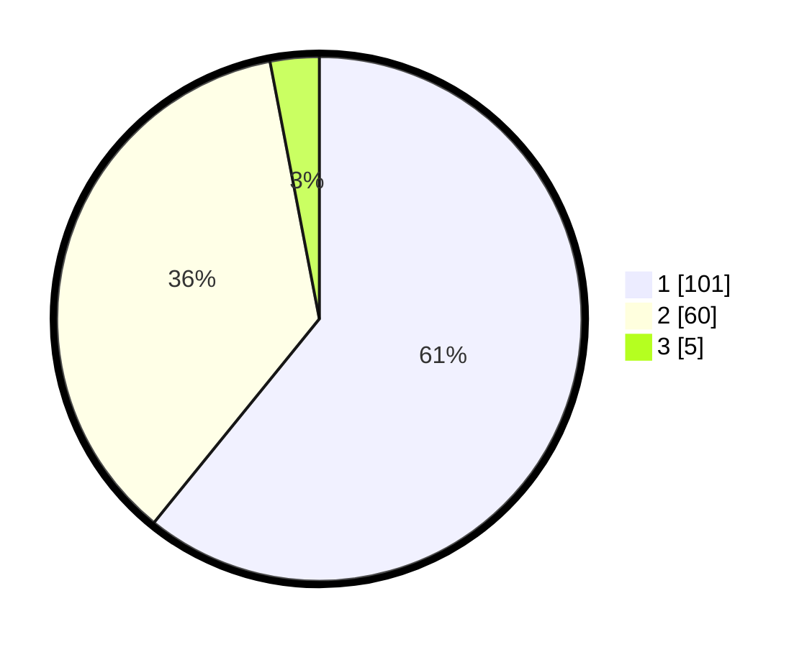

# Hasil

## Grafik

## Tabel

| No. | Nama Paslon    | Suara | Suara (raw) | Persentase |
|:--- |:-------------- | -----:| -----------:| ----------:|
| 1   | ANIES MUHAIMIN | 101   | [101][p-1]  | 60,84      |
| 2   | PRABOWO GIBRAN | 60    | [60][p-2]   | 36,14      |
| 3   | GANJAR MAHFUD  | 5     | [5][p-3]    | 3,01       |

[p-1]: https://github.com/gigit-pemilu/pemilu-2024-11-aceh/blob/main/pilpres/hitung-suara/sub/11-aceh/sub/04-aceh-tengah/sub/13-celala/sub/2001-arul-gading/sub/001-tps/sub/paslon-1.txt
[p-2]: https://github.com/gigit-pemilu/pemilu-2024-11-aceh/blob/main/pilpres/hitung-suara/sub/11-aceh/sub/04-aceh-tengah/sub/13-celala/sub/2001-arul-gading/sub/001-tps/sub/paslon-2.txt
[p-3]: https://github.com/gigit-pemilu/pemilu-2024-11-aceh/blob/main/pilpres/hitung-suara/sub/11-aceh/sub/04-aceh-tengah/sub/13-celala/sub/2001-arul-gading/sub/001-tps/sub/paslon-3.txt

## Foto C Plano

https://sirekap-obj-formc.kpu.go.id/0ee0/pemilu/ppwp/11/04/13/20/01/1104132001001-20240215-055859--7d5fc90c-4700-48c0-bfdb-c6854df1cf71.jpg

https://sirekap-obj-formc.kpu.go.id/0ee0/pemilu/ppwp/11/04/13/20/01/1104132001001-20240215-060533--2e6ed463-4676-4724-8491-46de278ac547.jpg

https://sirekap-obj-formc.kpu.go.id/0ee0/pemilu/ppwp/11/04/13/20/01/1104132001001-20240215-060655--ed0901c8-1723-4b97-b527-077a694b4ef3.jpg

## Metadata

| Key        | Value               |
| ---------- | ------------------- |
| Time Stamp | 2024-02-16 05:00:26 |

## DATA PEMILIH TETAP

Jumlah pemilih dalam DPT: **172**.
 * L: **94**.
 * P: **78**.

## DATA PENGGUNA HAK PILIH

Jumlah pengguna hak pilih dalam DPT: **168**.
 * L: **90**.
 * P: **78**.

Jumlah pengguna hak pilih dalam DPTb: **6**.
 * L: **2**.
 * P: **4**.

Jumlah pengguna hak pilih dalam DPK: **0**.
 * L: **0**.
 * P: **0**.

Jumlah pengguna hak pilih: **174**.
 * L: **92**.
 * P: **82**.

## JUMLAH SUARA SAH DAN TIDAK SAH

JUMLAH SELURUH SUARA SAH: **166**.

JUMLAH SUARA TIDAK SAH: **8**.

JUMLAH SELURUH SUARA SAH DAN SUARA TIDAK SAH: **174**.

